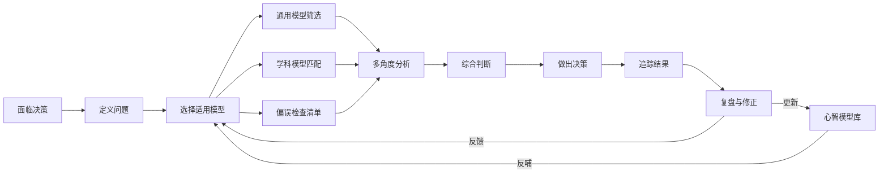
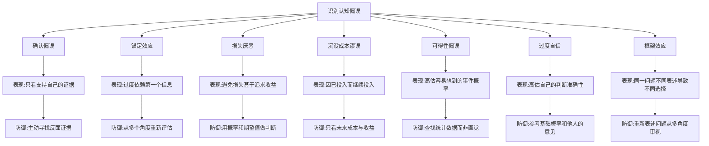

# 《思考的框架》知识图谱

## 知识图谱概述

本篇图谱基于沙恩·帕里什《思考的框架》（The Great Mental Models）系列的核心内容构建，涵盖心智模型的基本理念、跨学科思维工具、认知偏误及决策框架等关键知识维度。图谱旨在帮助读者建立完整的心智模型体系，打造属于自己的多元思维工具箱。

---

## Mermaid 图表一：心智模型分类树

```mermaid
graph TD
    A["心智模型 Mental Models"] --> B["通用思维模型"]
    A --> C["自然科学模型"]
    A --> D["生命系统模型"]
    A --> E["心理与行为模型"]
    A --> F["系统与决策模型"]

    B --> B1["第一性原理 First Principles"]
    B --> B2["逆向思维 Inversion"]
    B --> B3["二阶思维 Second-Order Thinking"]
    B --> B4["概率思维 Probabilistic Thinking"]
    B --> B5["奥卡姆剃刀 Occam Razor"]

    C --> C1["临界质量 Critical Mass"]
    C --> C2["杠杆原理 Leverage"]
    C --> C3["激活能 Activation Energy"]
    C --> C4["熵增定律 Entropy"]
    C --> C5["惯性定律 Inertia"]

    D --> D1["自然选择 Natural Selection"]
    D --> D2["生态位 Niche"]
    D --> D3["免疫系统 Immune System"]
    D --> D4["红皇后假说 Red Queen"]
    D --> D5["进化适应 Adaptation"]

    E --> E1["确认偏误 Confirmation Bias"]
    E --> E2["锚定效应 Anchoring"]
    E --> E3["损失厌恶 Loss Aversion"]
    E --> E4["沉没成本 Sunk Cost"]
    E --> E5["可得性偏误 Availability"]

    F --> F1["反馈回路 Feedback Loops"]
    F --> F2["地图非疆域 Map vs Territory"]
    F --> F3["能力圈 Circle of Competence"]
    F --> F4["边际效用 Marginal Utility"]
    F --> F5["机会成本 Opportunity Cost"]
```

---

## Mermaid 图表二：心智模型决策流程网络图

---

## Mermaid 图表三：认知偏误防御路径图

---

## Mermaid 图表四：跨学科思维迁移路径图

```mermaid
graph TD
    A["原始学科"] --> B1["物理学"]
    A --> B2["化学"]
    A --> B3["生物学"]
    A --> B4["心理学"]
    A --> B5["经济学"]
    A --> B6["数学与统计学"]

    B1 --> C1["惯性 -> 组织变革阻力"]
    B1 --> C2["杠杆 -> 决策杠杆点"]
    B1 --> C3["临界质量 -> 网络效应爆发"]

    B2 --> C4["激活能 -> 行动启动困难"]
    B2 --> C5["催化剂 -> 加速变化的因素"]
    B2 --> C6["相变 -> 质变的关键节点"]

    B3 --> C7["自然选择 -> 市场竞争筛选"]
    B3 --> C8["生态位 -> 差异化定位"]
    B3 --> C9["免疫系统 -> 组织纠错机制"]

    B4 --> C10["确认偏误 -> 信息筛选偏差"]
    B4 --> C11["锚定效应 -> 初始信息影响"]
    B4 --> C12["损失厌恶 -> 维持现状倾向"]

    B5 --> C13["机会成本 -> 选择的真实代价"]
    B5 --> C14["边际效用 -> 递增递减规律"]
    B5 --> C15["激励响应 -> 行为驱动因素"]

    B6 --> C16["概率 -> 不确定性量化"]
    B6 --> C17["回归均值 -> 极端后趋于平均"]
    B6 --> C18["复利 -> 积累效应"]
```

---

## 关键术语表

| 术语 | 英文 | 说明 |
|------|------|------|
| 心智模型 | Mental Model | 理解世界运转方式的简化思维框架 |
| 第一性原理 | First Principles | 回归基本事实，从头推理 |
| 逆向思维 | Inversion | 从"如何失败"出发来思考"如何成功" |
| 二阶思维 | Second-Order Thinking | 考虑行动的后果的后果 |
| 能力圈 | Circle of Competence | 清楚自己知道什么、不知道什么 |
| 地图非疆域 | Map is not Territory | 模型是对现实的简化，不等于现实本身 |
| 确认偏误 | Confirmation Bias | 倾向于寻找证实自己观点的证据 |
| 损失厌恶 | Loss Aversion | 失去的痛苦大于获得的快乐 |
| 熵增定律 | Law of Entropy | 封闭系统趋向无序，维持秩序需要持续投入 |
| 红皇后假说 | Red Queen Hypothesis | 必须不停奔跑才能保持在原地 |

---

## 图谱说明

本知识图谱从四个维度呈现《思考的框架》的核心知识体系：

1. **分类树**：展示心智模型按学科来源的知识层级结构，从通用模型到各学科专有模型
2. **决策流程网络图**：揭示心智模型在实际决策中的应用流程和反馈循环
3. **认知偏误防御路径图**：列举七种常见认知偏误及其对应的防御策略
4. **跨学科思维迁移路径图**：展示各学科核心模型如何迁移应用到商业与生活决策中

读者可结合图谱快速建立跨学科思维框架，在面临复杂决策时有效调用多元心智模型。
