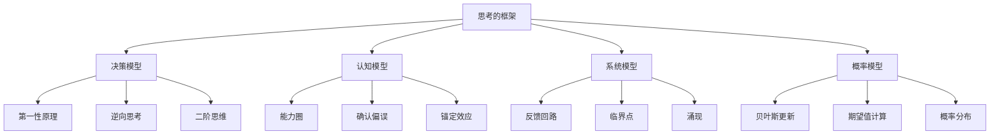
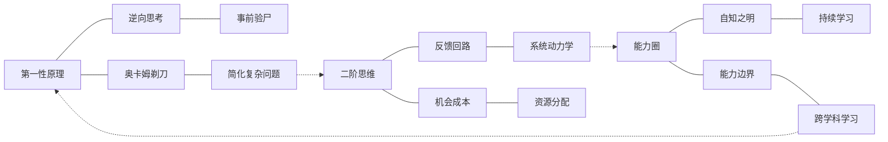
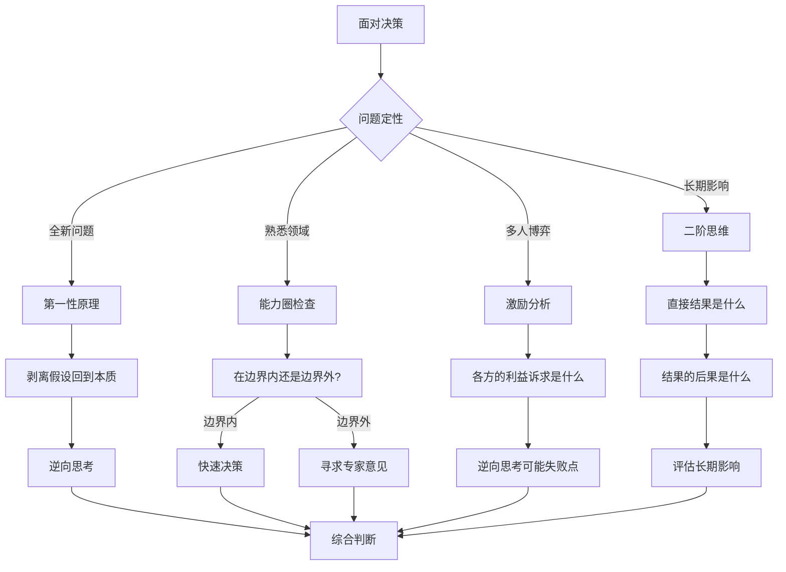
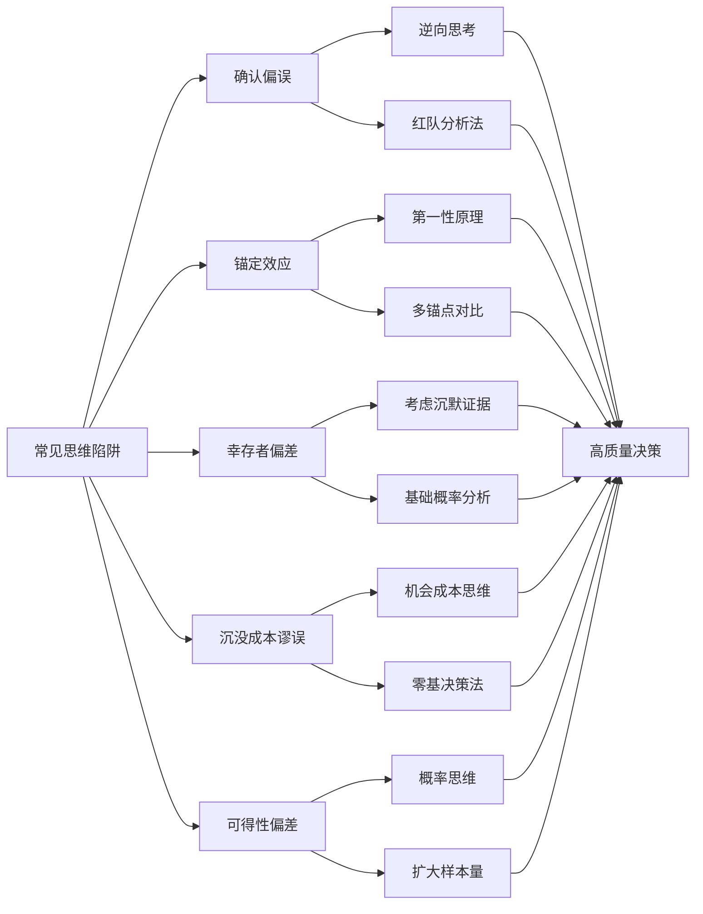

# 02-知识图谱图片描述 - 《思考的框架》

---

## 图一：思维模型体系树（Tree Diagram）

展示《思考的框架》中核心思维模型的层级分类关系。

**图片说明：** 以树状结构呈现思维模型的四大类别及各自子模型。决策模型帮助做出更好选择，认知模型识别思维陷阱，系统模型理解复杂关系，概率模型处理不确定性。

---

## 图二：思维模型协同网络（Network Diagram）

展示不同思维模型之间如何相互关联、协同工作。

**图片说明：** 网络图揭示了思维模型之间的协同关系。第一性原理与逆向思考互补，二阶思维与反馈回路相连，能力圈与跨学科学习相互支撑。实线表示强关联，虚线表示跨类别桥接。

---

## 图三：决策思考路径图（Path Diagram）

展示面对一个复杂决策时，如何逐步调用不同的思维框架。

**图片说明：** 路径图提供了面对实际决策时的思考流程。核心原则是"先定性，后选模，再综合"。避免凭直觉仓促决策，也避免用单一框架套所有问题。

---

## 图四：思维陷阱识别图（Graph Diagram）

展示常见的认知偏差及其对应的思维框架解药。

**图片说明：** 识别图将常见认知偏差与对应的思维框架解药一一映射。每个陷阱都有针对性的工具应对，形成"陷阱-解药-高质量决策"的闭环。

---

## 图片使用建议

- 图一适合作为文章开头的"思维地图"，帮助读者建立全局框架认知
- 图二适合在讲解模型协同效应时使用，展现知识的网络化特征
- 图三适合作为"决策指南"，指导读者在实际场景中应用
- 图四适合放在文末，作为识别和避免思维陷阱的速查工具
