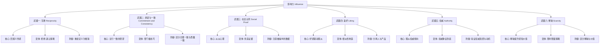
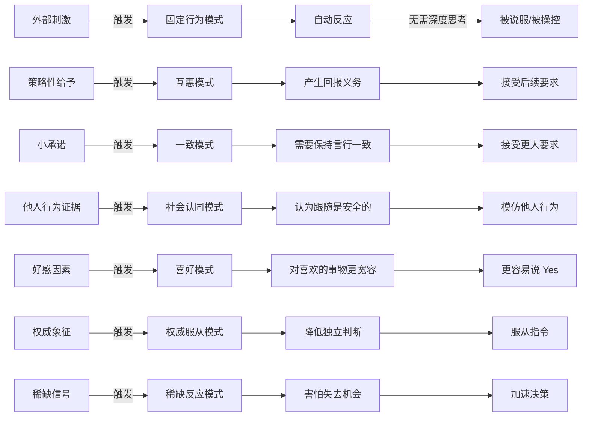
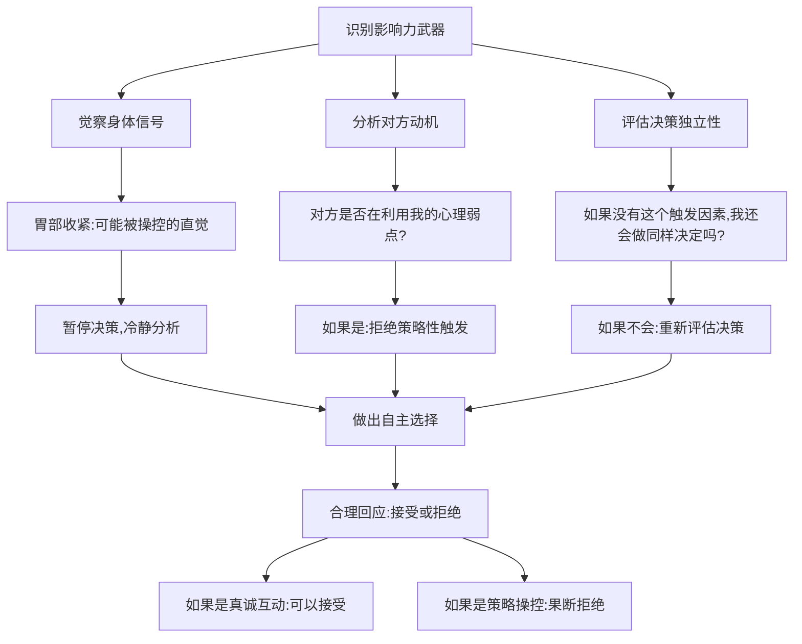

# 《影响力》知识图谱

## 知识图谱概述

本篇图谱基于罗伯特·西奥迪尼《影响力》（Influence: The Psychology of Persuasion）的核心内容构建，涵盖六大说服原理、心理机制、商业应用及防御策略等关键知识维度。图谱旨在帮助读者系统掌握影响力的底层逻辑，建立识别和抵御操控的认知防线。

---

## Mermaid 图表一：六大影响力武器分类树

---

## Mermaid 图表二：影响力作用机制网络图

---

## Mermaid 图表三：防御策略路径图

---

## Mermaid 图表四：影响力武器应用场景网络图

```mermaid
graph TD
    A["影响力武器"] --> B["消费场景"]
    A --> C["职场场景"]
    A --> D["社交场景"]
    A --> E["投资场景"]

    B --> B1["免费试用 互惠"]
    B --> B2["好评返现 承诺一致"]
    B --> B3["热销爆款 社会认同"]
    B --> B4["主播推荐 喜好+权威"]
    B --> B5["限时折扣 稀缺"]

    C --> C1["请客后谈合作 互惠"]
    C --> C2["公开承诺目标 承诺一致"]
    C --> C3["大家都加班 社会认同"]
    C --> C4["领导认可 喜好"]
    C --> C5["专家报告 权威"]

    D --> D1["人情往来 互惠"]
    D --> D2["当众表态后难改口 承诺一致"]
    D --> D3["朋友圈跟风 社会认同"]
    D --> D4["朋友推荐 喜好"]
    D --> D5["KOL 种草 喜好+权威"]

    E --> E1["分析师推荐 权威"]
    E --> E2["内部消息 稀缺"]
    E --> E3["散户涌入 社会认同"]
    E --> E4["基金经理背书 权威+喜好"]
    E --> E5["认购额度有限 稀缺"]
```

---

## 关键术语表

| 术语 | 英文 | 说明 |
|------|------|------|
| 互惠 | Reciprocity | 接受他人恩惠后产生的回报义务感 |
| 承诺与一致 | Commitment and Consistency | 一旦做出选择就有压力保持言行一致 |
| 社会认同 | Social Proof | 在不确定时观察他人行为并模仿 |
| 喜好 | Liking | 更容易被自己喜欢的人说服 |
| 权威 | Authority | 倾向于服从权威人物的指令 |
| 稀缺 | Scarcity | 稀缺的物品被认为更有价值 |
| 登门槛技巧 | Foot-in-the-Door | 先获取小承诺再获取大承诺 |
| 拒绝-退让策略 | Rejection-Then-Retreat | 先提大要求被拒后提小要求 |
| 固定行为模式 | Fixed-Action Pattern | 由特定触发因素激活的自动化反应 |
| 认知失调 | Cognitive Dissonance | 信念与行为不一致时的心理不适 |

---

## 图谱说明

本知识图谱从四个维度呈现《影响力》的核心知识体系：

1. **分类树**：展示六大影响力武器的核心逻辑、变体策略及对应防御方法
2. **作用机制网络图**：揭示外部刺激如何触发固定行为模式并导致自动反应
3. **防御策略路径图**：提供从觉察、分析到自主决策的完整防御流程
4. **应用场景网络图**：展示六大武器在消费、职场、社交、投资等场景中的具体应用

读者可结合图谱快速识别日常生活中的影响力套路，建立"识别-分析-防御"的三级认知防线。
