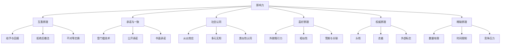
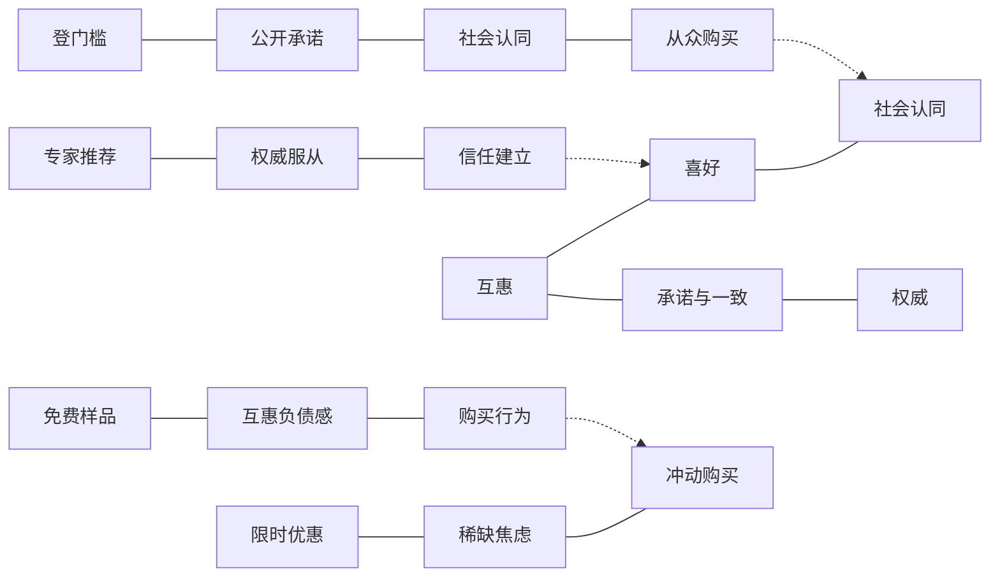
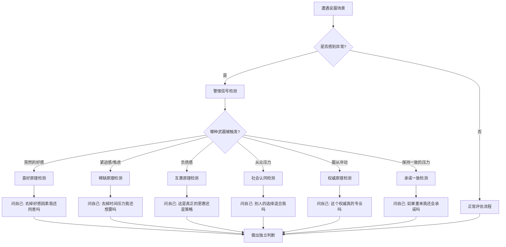
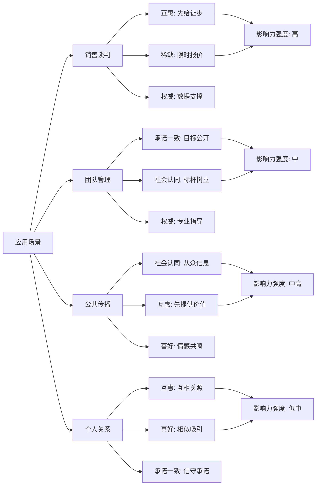

# 02-知识图谱图片描述 - 《影响力》

---

## 图一：六大影响力武器体系树（Tree Diagram）

展示《影响力》中六种影响力武器的层级分类关系及核心要素。

**图片说明：** 以树状结构呈现六大影响力武器及各自的子技术。每种武器都是一个独立的心理触发机制，下面包含具体的应用场景和技术手段。

---

## 图二：影响力武器协同网络（Network Diagram）

展示不同影响力武器如何在实际场景中被组合使用。

**图片说明：** 网络图揭示了影响力武器在真实场景中的组合应用模式。实线表示武器之间的关联，虚线表示跨场景的行为传导路径。顶级说服者往往同时使用多种武器。

---

## 图三：影响力攻防路径图（Path Diagram）

展示从遭遇影响力武器到识别防御的完整思考路径。

**图片说明：** 路径图提供了面对说服场景时的防御流程。核心是"觉察异常、识别武器、独立判断"三步法。每个武器都有对应的自问清单，帮助恢复理性思考。

---

## 图四：影响力使用场景矩阵（Graph Diagram）

展示六大影响力武器在不同场景中的适用性和强度。

**图片说明：** 矩阵图展示了不同场景中各影响力武器的使用方式和强度差异。销售谈判中影响力武器最强，个人关系中相对温和。理解场景差异有助于合理使用和有效防御。

---

## 图片使用建议

- 图一适合作为文章开头的"武器图谱"，帮助读者建立全局认知
- 图二适合在讲解武器组合使用时呈现，展现真实场景中的协同效应
- 图三适合作为"防御指南"，指导读者识别和应对被操纵的情况
- 图四适合放在文末，作为不同场景下影响力应用的参考矩阵
