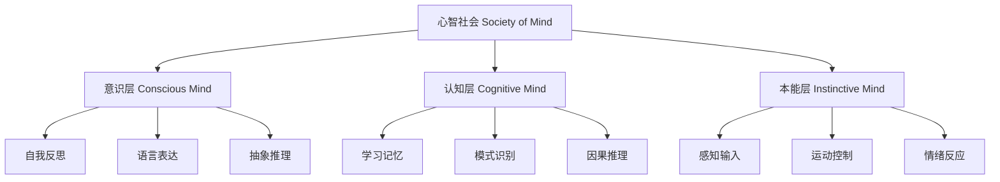
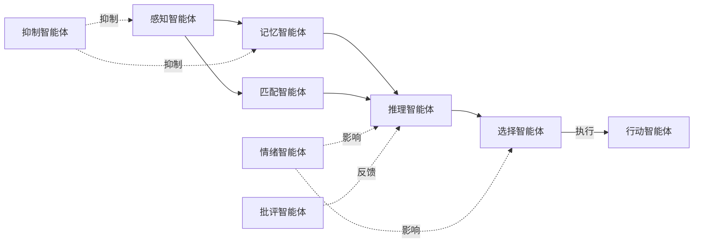
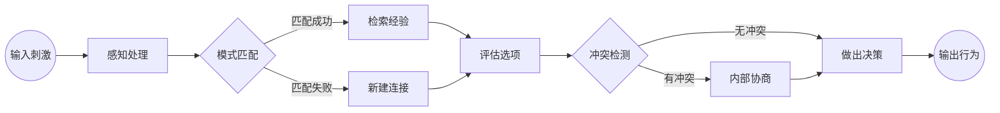
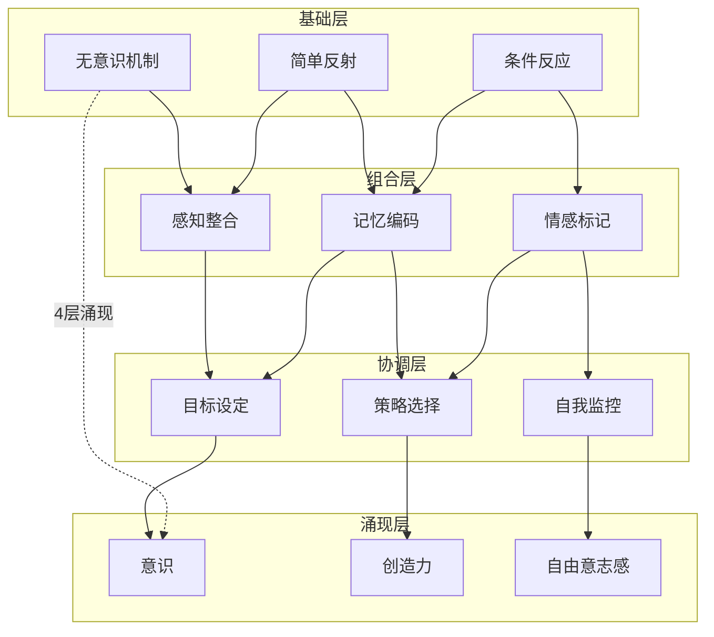

# 《心智社会》知识图谱图片描述

本文档包含4张Mermaid知识图谱，用于可视化《心智社会》的核心概念体系。

---

## 图一：心智层级结构图（Tree Diagram）

展示明斯基心智理论中的层级架构，从底层无意识机制到高层意识思维的递进关系。

**设计说明**：树形结构，自上而下展现心智的三个层级及其子模块，配色建议从深蓝渐变到浅蓝。

---

## 图二：智能体协作网络图（Network Diagram）

展示不同类型智能体之间的协作、竞争和抑制关系，体现"心智即社会"的核心隐喻。

**设计说明**：网状结构，实线表示协作关系，虚线表示影响或抑制关系，中心节点为推理智能体。

---

## 图三：思维过程路径图（Path Diagram）

展示一个具体思维决策过程中，信号如何在不同智能体之间传递和转化。

**设计说明**：从左到右的流程图，菱形节点表示判断分支，圆角矩形表示处理步骤。

---

## 图四：智能体涌现关系图（Graph Diagram）

展示从简单组件到复杂心智能力的涌现过程，体现"整体大于部分之和"的核心思想。

**设计说明**：四层结构的涌现图，使用subgraph分组，从下到上展示从简单机制到高级心智能力的涌现过程。
