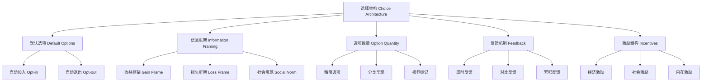
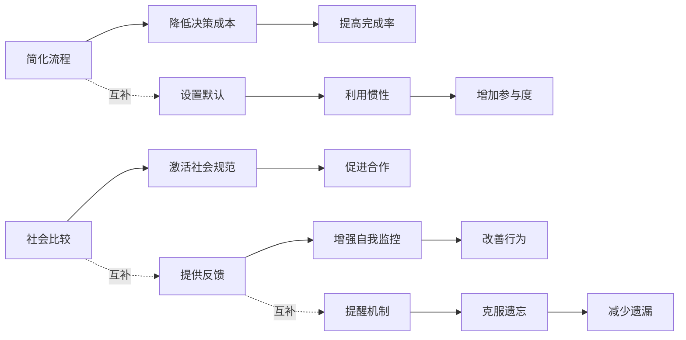
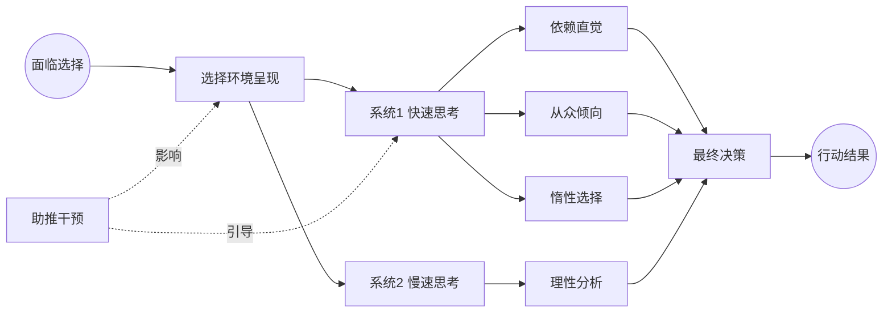
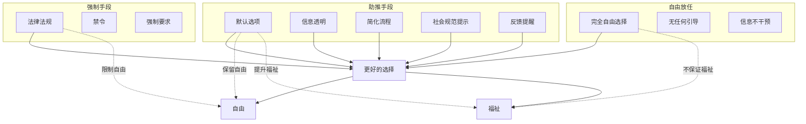

# 《助推》知识图谱图片描述

本文档包含4张Mermaid知识图谱，用于可视化《助推》的核心概念体系。

---

## 图一：选择架构要素树（Tree Diagram）

展示构成选择架构的各个要素及其层级关系。

**设计说明**：树形结构，自上而下展示选择架构的五大要素及其子类别，配色建议从深蓝到浅绿的渐变。

---

## 图二：助推策略网络图（Network Diagram）

展示不同助推策略之间的关联关系和适用场景。

**设计说明**：网状结构，左侧为策略层，中间为机制层，右侧为结果层，虚线表示策略间的互补关系。

---

## 图三：决策影响路径图（Path Diagram）

展示助推如何通过影响认知路径来改变最终决策。

**设计说明**：从左到右的决策流程图，展示助推干预如何在不同阶段影响决策路径。

---

## 图四：自由家长制平衡图（Graph Diagram）

展示自由家长制的核心理念——在尊重自由与引导向善之间寻找平衡。

**设计说明**：对比展示三种治理手段（强制、助推、放任）与自由和福祉之间的关系，突出助推手段的优势。
