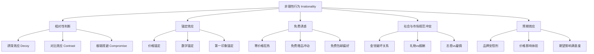
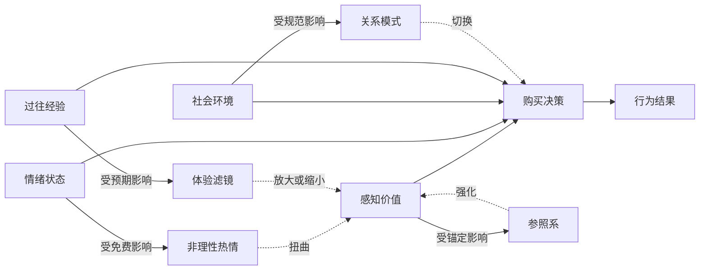
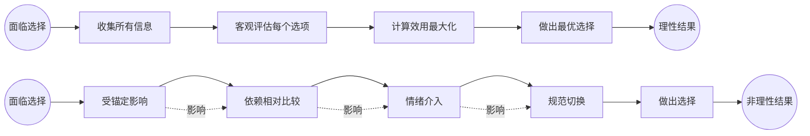
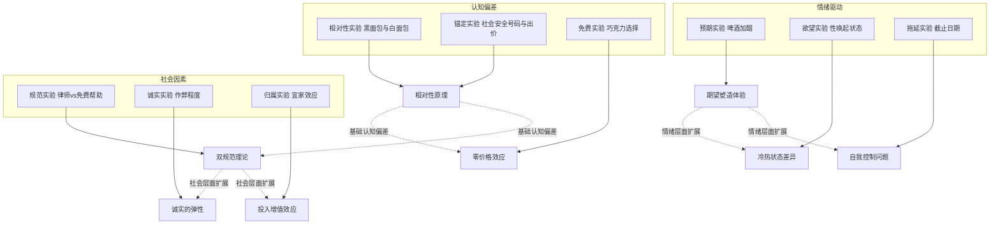

# 《怪诞行为学》知识图谱图片描述

本文档包含4张Mermaid知识图谱，用于可视化《怪诞行为学》的核心概念体系。

---

## 图一：非理性行为分类树（Tree Diagram）

展示人类非理性行为的主要类型及其具体表现。

**设计说明**：树形结构，自上而下展示六大非理性行为类型及其子类，配色建议从深紫到浅紫的渐变。

---

## 图二：行为影响因素网络图（Network Diagram）

展示影响人类决策的各种因素之间的交互关系。

**设计说明**：网状结构，中心为购买决策，展示各影响因素之间的双向作用关系。

---

## 图三：理性决策vs非理性决策路径图（Path Diagram）

对比理想中的理性决策路径与实际的非理性决策路径。

**设计说明**：上下两条并行路径，上方为理想理性路径，下方为实际非理性路径，用虚线连接各步骤体现因果链。

---

## 图四：行为经济学实验关系图（Graph Diagram）

展示《怪诞行为学》中经典实验之间的理论关联和递进关系。

**设计说明**：三组实验按认知偏差、社会因素、情绪驱动分类，通过subgraph分组，右侧展示各实验对应的理论原理。
