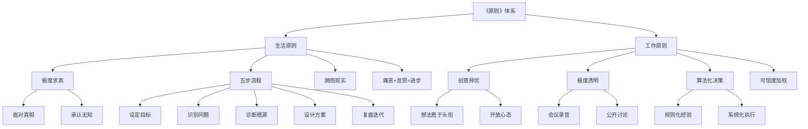
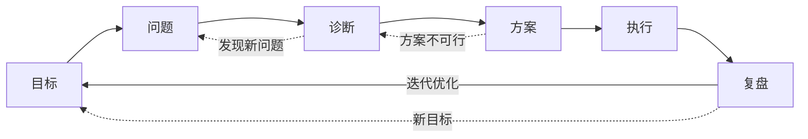
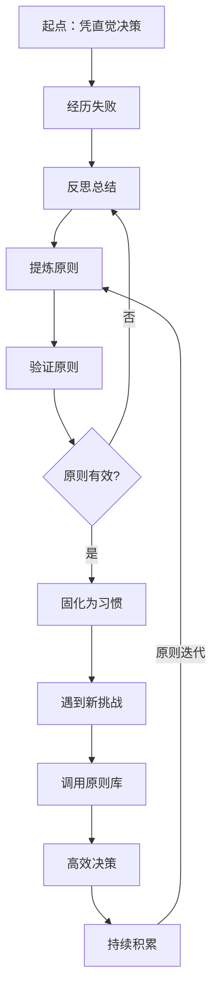
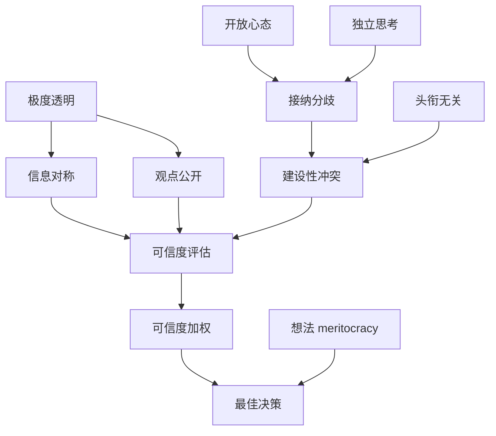

# 《原则》知识图谱图片描述

本文档描述《原则》知识图谱的四个 Mermaid 图示，用于公众号排版时生成配图。

---

## 图一：原则体系树状图（tree）

展示达利欧原则体系的层级结构：从总原则到生活原则再到工作原则的完整分层。

描述说明：
- 根节点为《原则》体系总览
- 第二层分为"生活原则"和"工作原则"两大分支
- 第三层列出各分支的核心模块
- 第四层展开关键方法论的具体要素
- 用于展示原则体系的完整架构

---

## 图二：五步流程网络图（network）

展示五步流程中各步骤之间的循环关系与反馈机制。

描述说明：
- 主流程从左到右依次展示五个步骤
- 实线箭头表示主流程推进方向
- 虚线箭头表示反馈回路和逆向跳转
- "复盘"节点回连到"目标"，形成闭环
- 用于展示五步流程的迭代本质

---

## 图三：个人成长路径图（path）

展示一个人从"无原则"到"原则驱动"的成长路径。

描述说明：
- 从"凭直觉决策"的起点出发
- 经过失败-反思-提炼-验证的循环
- 有效原则固化为习惯
- 遇到新挑战时调用原则库
- 形成持续迭代的成长飞轮

---

## 图四：创意择优关系图（graph）

展示创意择优机制中各要素之间的关系与互动。

描述说明：
- 左侧展示"极度透明"如何促成信息对称和观点公开
- 中间展示"可信度加权"的评估机制
- 右侧展示"开放心态"和"建设性冲突"的促进作用
- 最终汇聚到"最佳决策"这一目标
- 用于展示创意择优的运作逻辑
