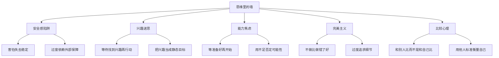
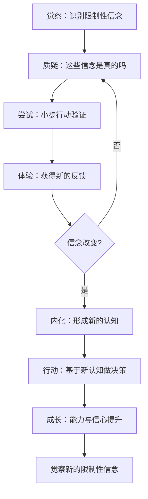
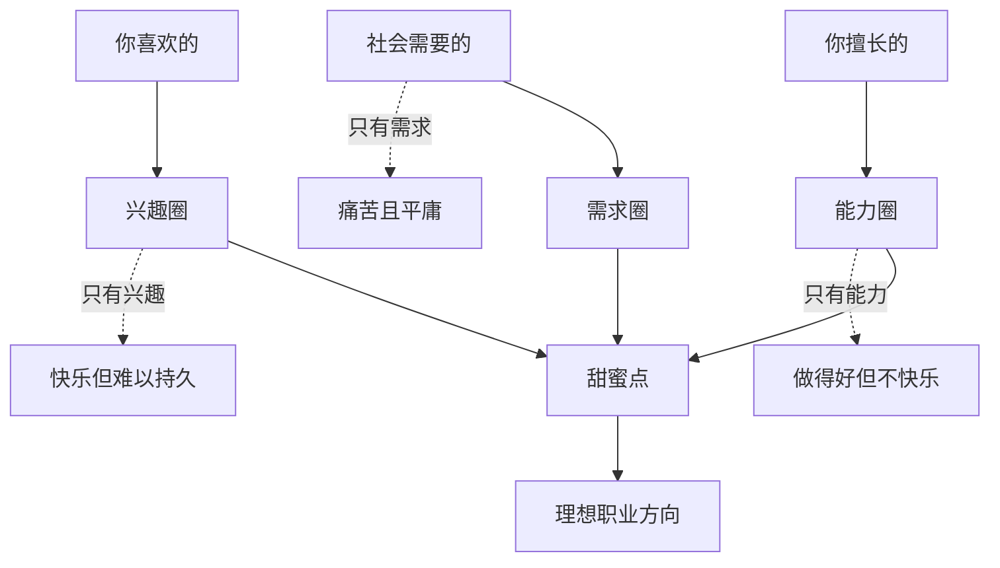
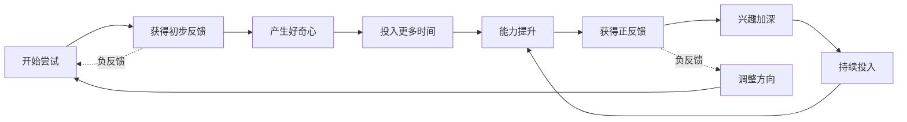

# 《拆掉思维里的墙》知识图谱图片描述

本文档描述《拆掉思维里的墙》知识图谱的四个 Mermaid 图示，用于公众号排版时生成配图。

---

## 图一：自我设限类型树状图（tree）

展示书中提到的各种自我设限思维的分类体系。

描述说明：
- 根节点为"思维里的墙"总览
- 第二层分为五种主要的自我设限类型
- 第三层展开每种类型的典型表现
- 用于帮助读者识别自己的思维墙

---

## 图二：认知突破路径图（path）

展示从"自我设限"到"认知突破"的完整转变路径。

描述说明：
- 从"觉察"限制性信念开始
- 经过"质疑-尝试-体验"的验证循环
- 信念改变后内化为新认知
- 基于新认知行动带来成长
- 形成持续突破的正向飞轮

---

## 图三：职业甜蜜点关系图（graph）

展示职业选择中"甜蜜点"模型的三要素及其关系。

描述说明：
- 三个独立圆圈分别代表能力、兴趣和需求
- 三者的交集是"甜蜜点"
- 虚线箭头展示只有单一要素时的状态
- 用于直观展示职业选择的核心逻辑

---

## 图四：兴趣培养循环图（network）

展示兴趣从无到有的动态培养过程。

描述说明：
- 主循环展示兴趣培养的增强回路
- 从"开始尝试"到"持续投入"形成正向循环
- 能力提升和正反馈是兴趣加深的核心驱动力
- 虚线箭头展示负反馈时的调整路径
- 用于展示"兴趣是养出来的"这一核心观点
