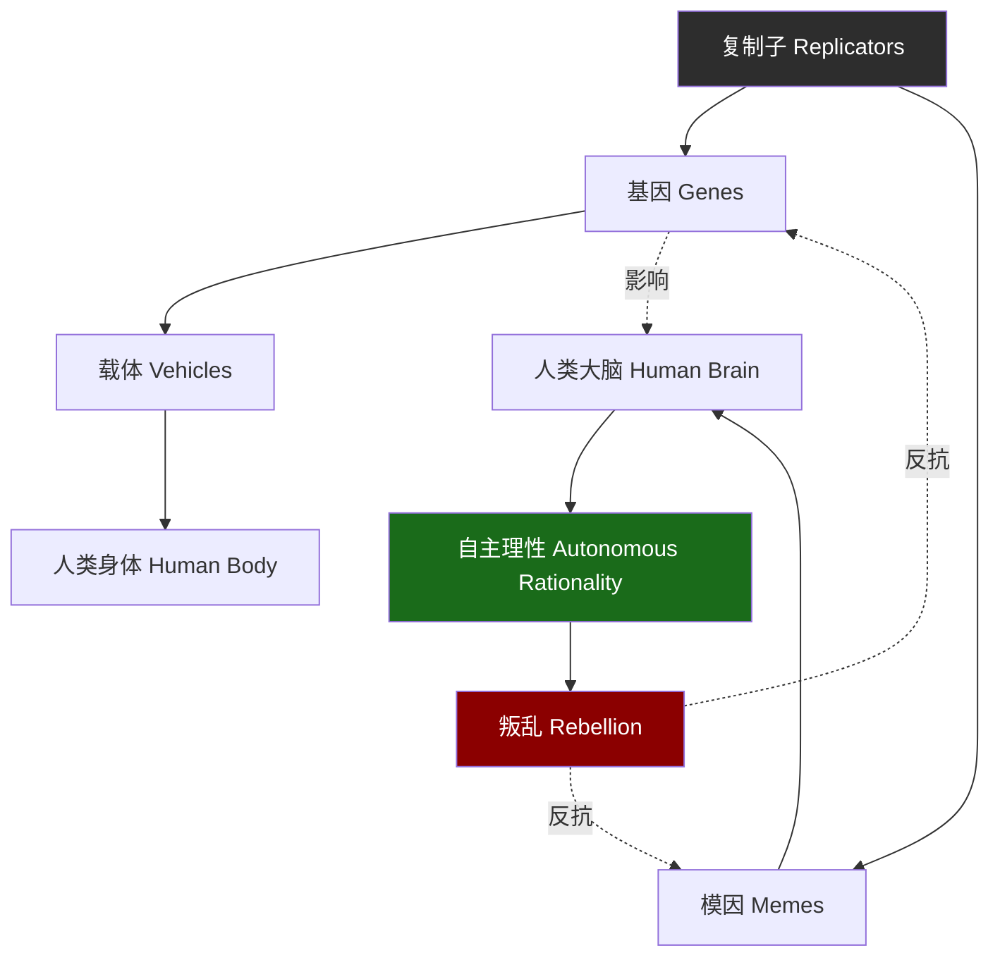
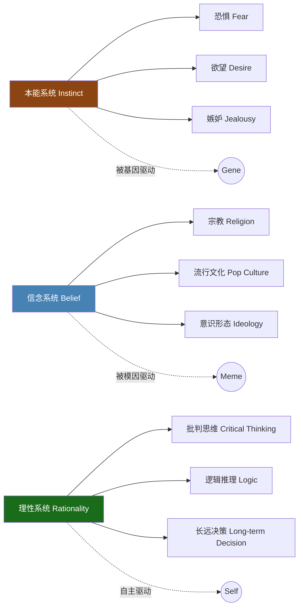
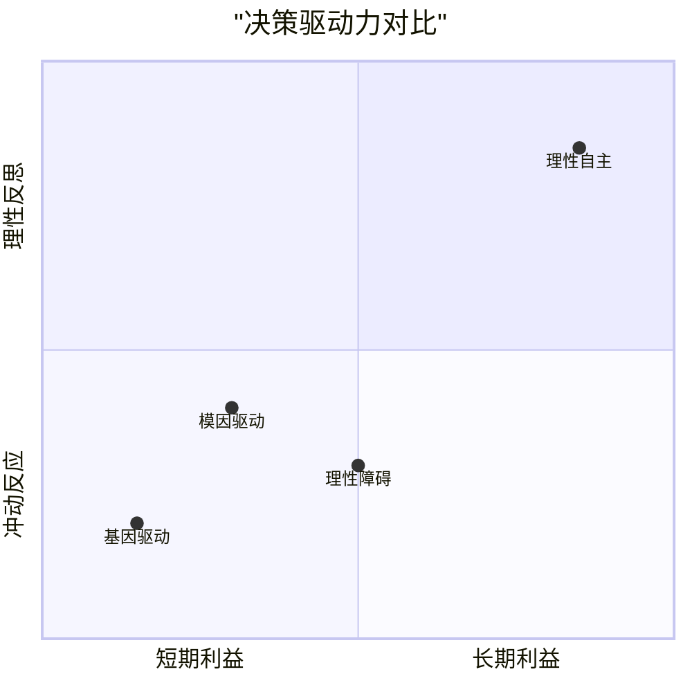

# 《机器人叛乱》知识图谱图片描述

## 图一：复制子-载体层级结构树

展示基因、模因与人类之间的层级控制关系。

**说明**：树状结构图，顶部为"复制子"，分为"基因"和"模因"两个分支，分别指向"人类身体"和"人类大脑"。"人类大脑"延伸出"自主理性"，最终指向"叛乱"，叛乱用红色箭头回指基因和模因，象征反抗。

---

## 图二：大脑三层次网络图

展示认知科学视角下人类大脑的三层驱动系统。

**说明**：网络图呈现三层并列结构，每层向下展开具体表现。底部标注各自的驱动力来源，用不同颜色区分：棕色=本能（基因），蓝色=信念（模因），绿色=理性（自主）。

---

## 图三：机器人叛乱路径图

展示从"载体"到"主人"的转变路径。

**说明**：从左到右的线性路径图，展示从"沉睡的载体"到"理性自主"的五个阶段，最后是一个持续循环的"持续警惕"节点。颜色从灰色渐变为绿色，象征觉醒过程。

---

## 图四：理性决策对比图

展示基因/模因驱动与理性驱动的决策差异。

**说明**：四象限散点图，横轴从"短期利益"到"长期利益"，纵轴从"冲动反应"到"理性反思"。四个点分别标注"基因驱动"（左下）、"模因驱动"（中下偏左）、"理性障碍"（中间偏下）、"理性自主"（右上）。展示不同决策模式在两个维度上的分布。
