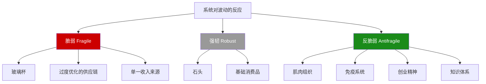
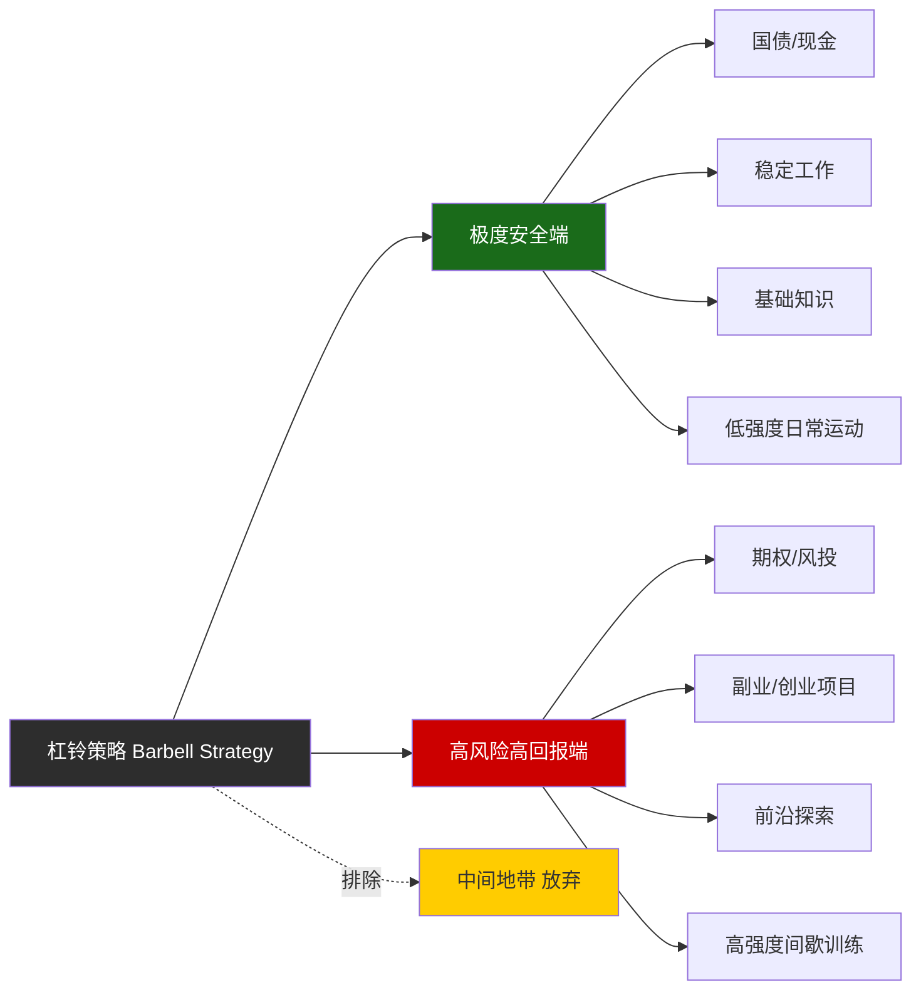
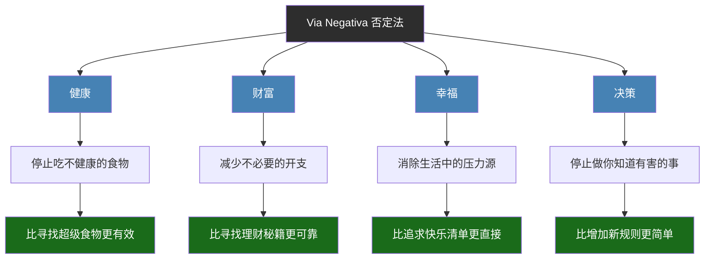
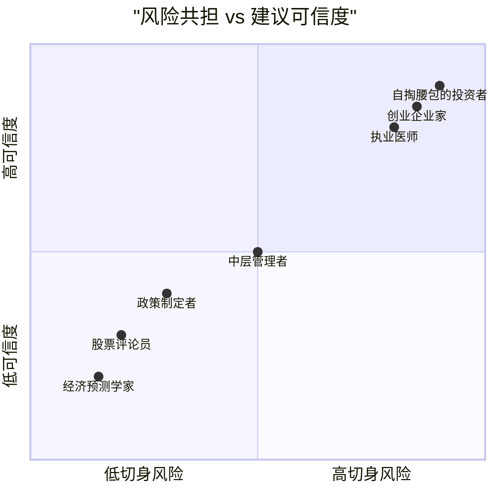

# 《反脆弱》知识图谱图片描述

## 图一：脆弱-强韧-反脆弱三元分类树

展示塔勒布的核心三元框架及其具体例子。

**说明**：树状结构图，顶部为"系统对波动的反应"，分为三个分支：脆弱（红色）、强韧（灰色）、反脆弱（绿色）。每个分支下展开具体例子。颜色对比鲜明，一目了然。

---

## 图二：杠铃策略网络图

展示杠铃策略在各个领域的应用。

**说明**：网络图以"杠铃策略"为中心，向左连接"极度安全端"（绿色），向右连接"高风险高回报端"（红色），中间用虚线连接"放弃"的中间地带（黄色）。两端各展开投资、职业、学习、健康四个领域的具体应用。

---

## 图三：否定法路径图

展示Via Negativa在不同场景中的应用路径。

**说明**：从上到下的路径图，顶部为"否定法"，分四个分支到具体场景。每个场景再展开具体的减法行动和效果。蓝色表示应用场景，绿色表示积极结果。

---

## 图四：风险共散点图

展示不同角色的风险共担程度与其建议可信度的关系。

**说明**：四象限散点图，横轴从"低切身风险"到"高切身风险"，纵轴从"低可信度"到"高可信度"。七个点分布在从左下到右上的对角线上，清晰展示风险共担与可信度的正相关关系。
