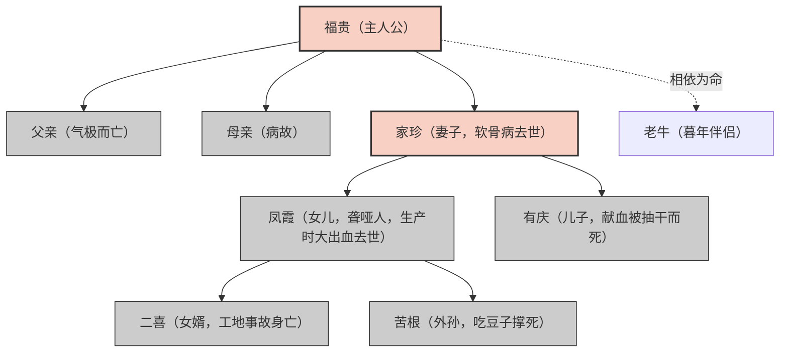
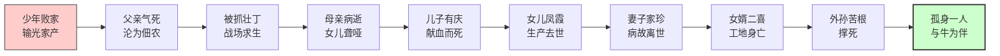
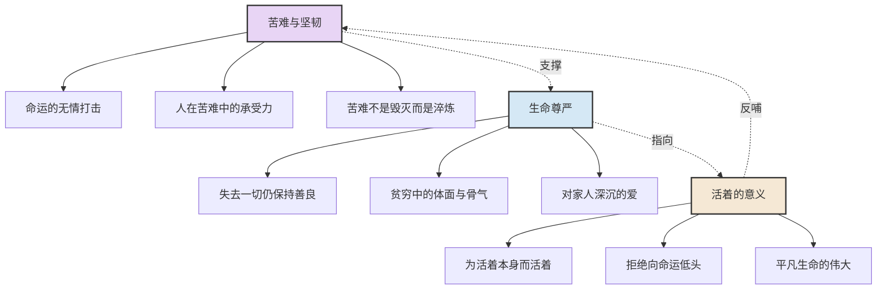
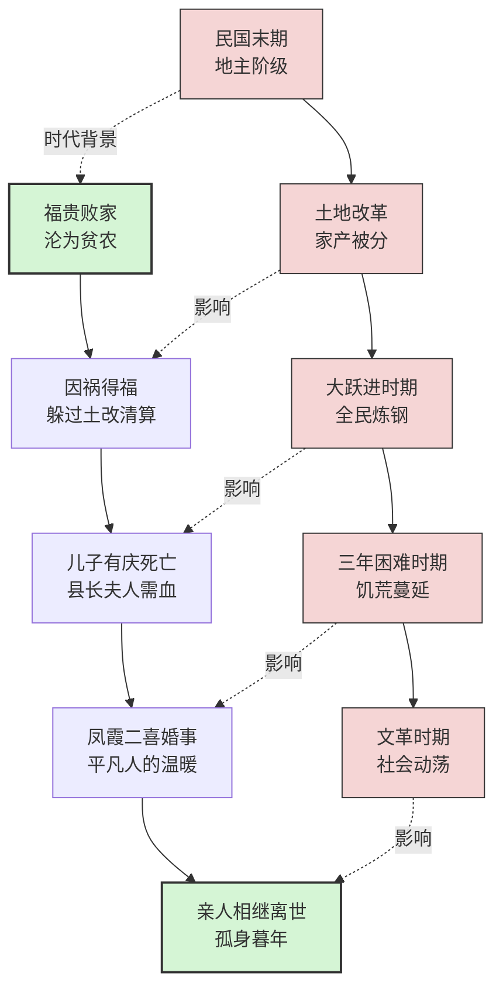

# 《活着》知识图谱图片描述

## 图一：福贵家族人物关系树形图

**图表类型：** tree graph

**描述：** 以福贵为中心，展示家族成员的血缘与婚姻关系，标注每个人物的结局。

---

## 图二：福贵人生苦难时间线

**图表类型：** path/flow chart

**描述：** 按时间顺序展示福贵一生中经历的重大变故，形成一条从富裕到赤贫再到孤身一人的命运轨迹。

---

## 图三：《活着》核心主题网络图

**图表类型：** network/mind map

**描述：** 展示小说的三大核心主题及其子主题之间的关联关系。

---

## 图四：社会变迁与个人命运交织图

**图表类型：** graph with cross-connections

**描述：** 展示中国近现代社会重大历史事件与福贵个人命运的对应关系，体现大时代下小人物的悲欢。

