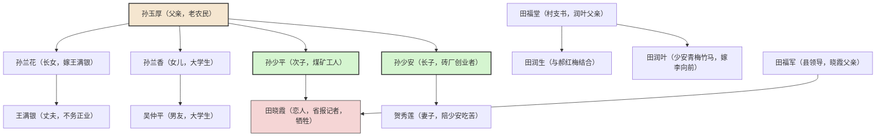
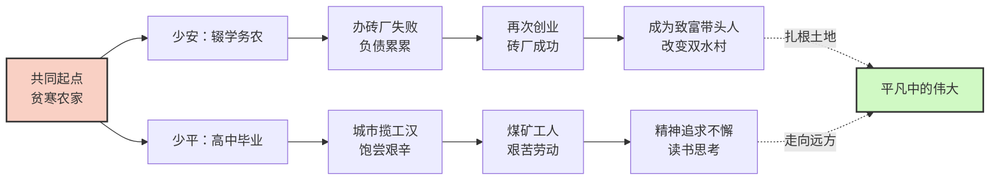
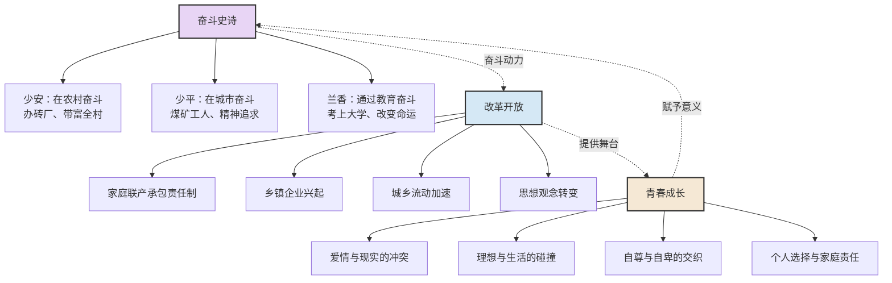
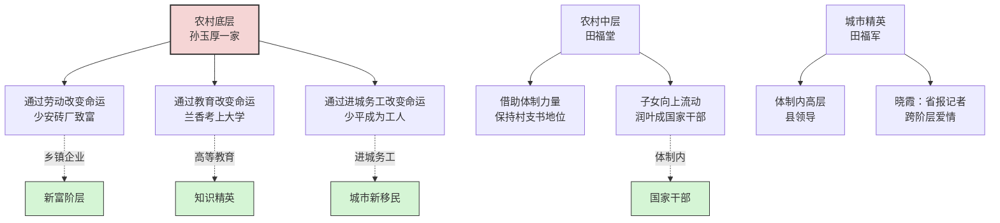

# 《平凡的世界》知识图谱图片描述

## 图一：孙氏家族人物关系树形图

**图表类型：** tree graph

**描述：** 以孙玉厚一家为核心，展示主要人物的血缘关系和社会关系，标注每个人的命运走向。

---

## 图二：少安少平人生路径对比图

**图表类型：** dual path comparison

**描述：** 对比孙少安和孙少平两兄弟不同的人生轨迹，一个扎根农村，一个走向城市，展现两种不同的奋斗路径。

---

## 图三：奋斗史诗主题网络图

**图表类型：** network/mind map

**描述：** 展示小说的三大核心主题及其关联，体现奋斗、时代、青春成长之间的内在逻辑。

---

## 图四：社会阶层流动与人物命运图

**图表类型：** graph with cross-connections

**描述：** 展示改革开放背景下不同人物的阶层流动轨迹，体现大时代给普通人带来的命运转折。

