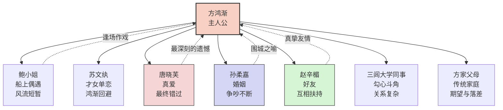
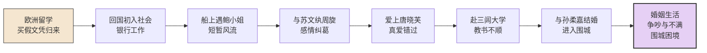
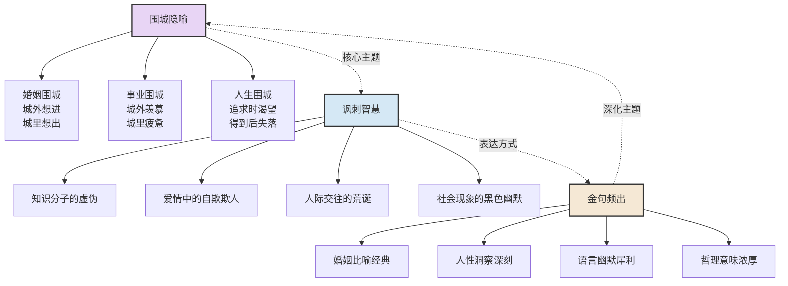
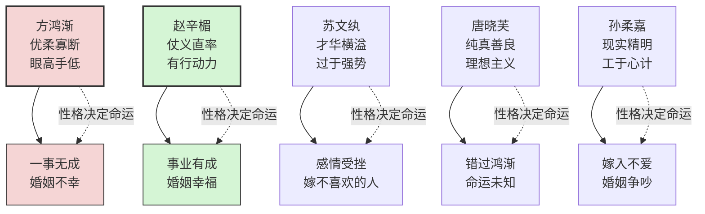

# 《围城》知识图谱图片描述

## 图一：方鸿渐人物关系网络图

**图表类型：** network graph

**描述：** 以方鸿渐为中心，展示他与各个人物之间的关系类型（爱情、友情、同事、家人），标注关系的性质和结局。

---

## 图二：方鸿渐人生路径图

**图表类型：** path/flow chart

**描述：** 按时间顺序展示方鸿渐从留学到回国、从恋爱到结婚的人生轨迹，体现"围城"主题的不断重复。

---

## 图三：围城主题网络图

**图表类型：** network/mind map

**描述：** 展示"围城"隐喻在小说中的三个维度——婚姻、事业、人生，以及它们之间的内在联系。

---

## 图四：人物性格与命运对照图

**图表类型：** graph with cross-connections

**描述：** 对比主要人物的性格特点与其最终命运，揭示性格与命运之间的因果关系。

