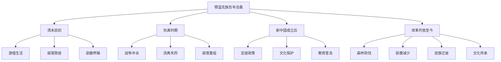
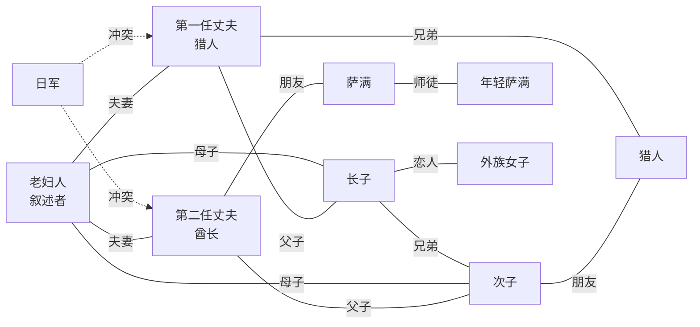
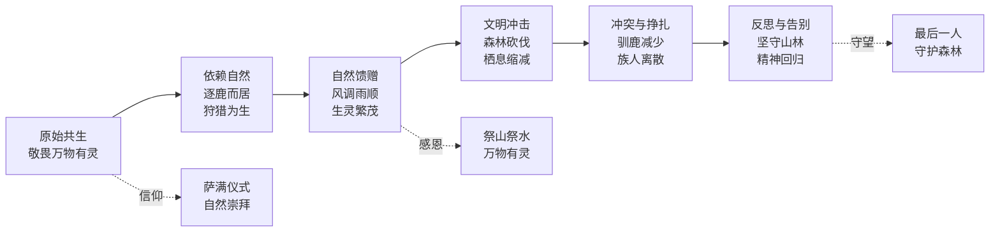
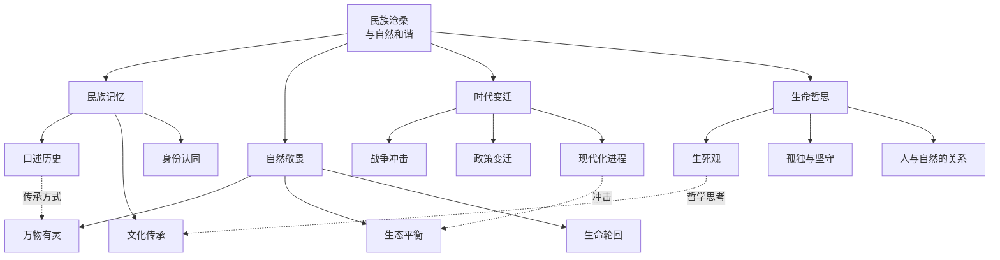

# 知识图谱图片描述

## 图一：鄂温克族百年历史脉络树状图

**图形类型**：树状图（Tree Diagram）

**用途**：展示《额尔古纳河右岸》中鄂温克族百年历史的时代脉络与关键节点。

**结构说明**：
- 根节点为"鄂温克族百年沧桑"
- 第一层分支为四个时代：清末民初、伪满时期、新中国成立后、改革开放至今
- 每个时代节点下延伸出具体的历史事件与生活变迁
- 叶子节点标注对应年代族人的生活状态与命运转折

**视觉建议**：
- 采用纵向树状结构，从上到下代表时间推进
- 根节点使用深色背景，分支节点使用渐变色
- 每个节点配以简短文字说明（不超过8个字）
- 整体色调以森林绿、大地棕为主，呼应自然主题

**Mermaid 代码**：

---

## 图二：人物关系网络图

**图形类型**：网络图（Network Diagram）

**用途**：呈现小说中核心人物之间的血缘、婚姻与情感关系。

**结构说明**：
- 中心节点为叙述者"老妇人"（酋长之妻）
- 周围节点包括：历任酋长、家族成员、部落萨满、猎人等
- 连线标注关系类型：夫妻、父子、兄弟、师徒、敌对等
- 使用不同颜色区分不同家族或阵营

**视觉建议**：
- 采用放射状布局，中心人物居中
- 连线使用不同颜色表示不同关系类型
- 人物节点配以身份标签
- 整体风格简洁，避免过于复杂

**Mermaid 代码**：

---

## 图三：人与自然共生路径图

**图形类型**：路径图（Path Diagram）

**用途**：描绘鄂温克族人与自然共生关系的演变轨迹。

**结构说明**：
- 起点为"原始森林中的和谐共生"
- 中间经过多个阶段：敬畏自然、依赖自然、与自然冲突、反思与告别
- 终点为"精神层面的永恒回归"
- 每个阶段配有简短说明和关键意象

**视觉建议**：
- 采用横向路径布局，从左到右代表关系演变
- 使用渐变色背景，从绿色逐渐过渡到灰色
- 每个阶段配以图标或符号
- 整体传达出一种从丰盈到失落的情感变化

**Mermaid 代码**：

---

## 图四：主题思想关联图

**图形类型**：关联图（Mind Map / Graph）

**用途**：梳理小说的核心主题及其相互关联。

**结构说明**：
- 中心主题为"民族沧桑与自然和谐"
- 四个主分支：民族记忆、自然敬畏、时代变迁、生命哲思
- 每个主分支下有三个子主题
- 子主题之间可存在交叉关联

**视觉建议**：
- 采用中心辐射状布局
- 中心节点使用醒目的颜色
- 四个主分支使用不同颜色区分
- 子主题使用与主分支相同的色系
- 整体风格庄重、有文学感

**Mermaid 代码**：

