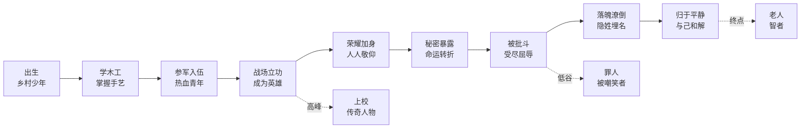
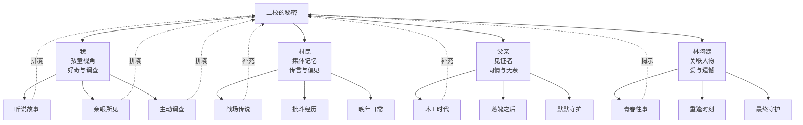
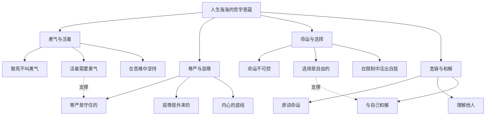
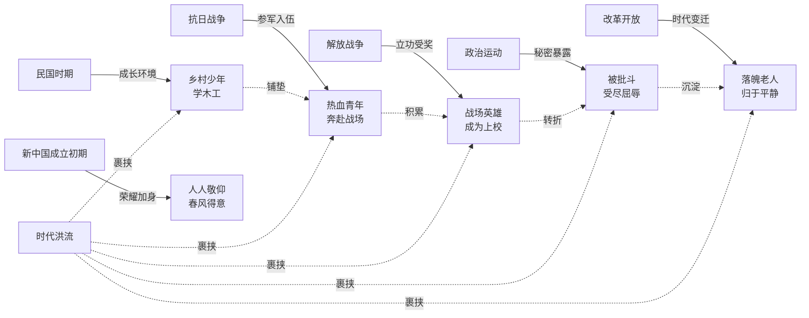

# 知识图谱图片描述

## 图一："上校"人生轨迹路径图

**图形类型**：路径图（Path Diagram）

**用途**：展现"上校"从出生到晚年的人生轨迹，突出其命运的起伏跌宕。

**结构说明**：
- 起点为"出生"，终点为"晚年归于平静"
- 中间经过多个关键节点：学木工、参军、立功、秘密暴露、被批斗、落魄、回归
- 每个节点标注年代背景和事件简述
- 使用上升和下降的箭头表示命运的起落

**视觉建议**：
- 采用波浪形路径布局，模拟海浪的起伏
- 上升阶段使用暖色调，下降阶段使用冷色调
- 关键节点使用醒目的标记
- 整体传达出"人生海海"的意象

**Mermaid 代码**：

---

## 图二：叙事视角关系图

**图形类型**：网络图（Network Diagram）

**用途**：呈现小说中多条叙事线索与人物视角的交织关系。

**结构说明**：
- 中心节点为"上校的秘密"，是全书的核心悬念
- 第一层为不同的叙事视角："我"、村民、父亲、林阿姨等
- 每个视角节点连接到它所知道的"上校"信息片段
- 信息片段最终汇聚到"上校"本人，形成完整拼图

**视觉建议**：
- 采用放射状布局，中心秘密居中
- 不同叙事视角使用不同颜色
- 信息片段使用半透明节点
- 整体呈现"拼图"效果

**Mermaid 代码**：

---

## 图三：主题思想树状图

**图形类型**：树状图（Tree Diagram）

**用途**：梳理《人生海海》的核心主题及其分支思想。

**结构说明**：
- 根节点为"人生海海"的哲学意蕴
- 四个主分支：勇气与活着、尊严与屈辱、命运与选择、宽容与和解
- 每个主分支下有三个子主题
- 子主题配以小说中的具体情节支撑

**视觉建议**：
- 采用纵向树状结构
- 根节点使用海洋蓝
- 四个主分支使用不同颜色区分
- 整体风格沉稳、有思想深度

**Mermaid 代码**：

---

## 图四：时代与人物命运关联图

**图形类型**：关联图（Graph Diagram）

**用途**：展现不同时代背景对"上校"命运的影响。

**结构说明**：
- 左侧为时代节点：民国、抗日战争、解放战争、新中国成立、政治运动、改革开放
- 右侧为人物状态节点：热血青年、战场英雄、被批斗者、落魄老人
- 中间用箭头连接时代与人物状态，标注影响关系
- 展示时代洪流与个人命运的交织

**视觉建议**：
- 采用左右对照布局
- 左侧时代节点使用灰色调，体现历史的厚重
- 右侧人物状态节点使用人物色彩
- 连接箭头使用不同粗细表示影响程度
- 整体传达出个人在时代中的渺小与坚韧

**Mermaid 代码**：

