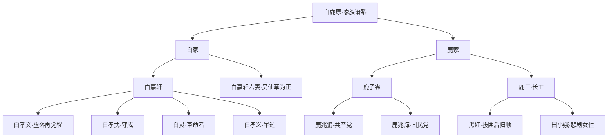
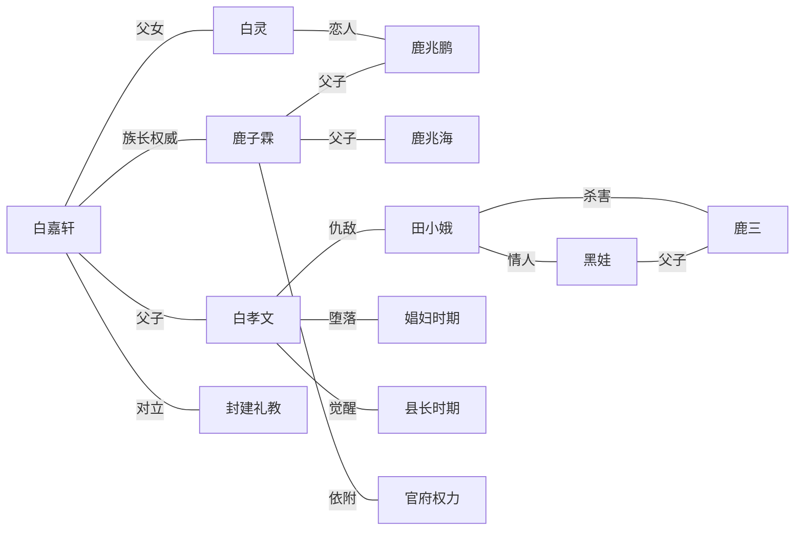
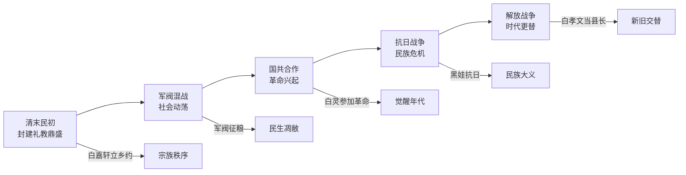
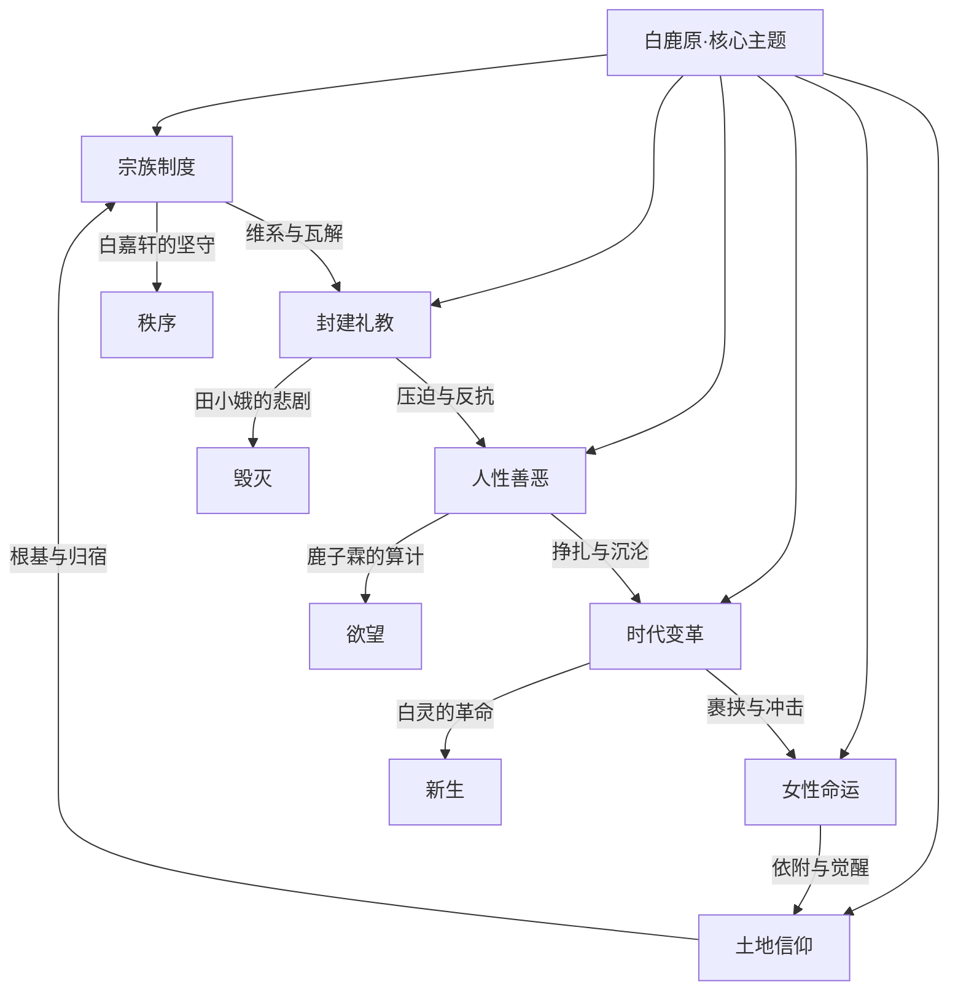

# 白鹿原 · 知识图谱图片描述

---

## 图一：白鹿家族谱系树

**图表类型**：树状图（tree）

**描述**：展示白、鹿两大家族三代人的血缘关系，核心人物包括白嘉轩、鹿子霖及其子女，标注人物关系与命运走向。

**渲染要求**：使用自上而下的树状布局，白家节点使用暖色系，鹿家节点使用冷色系，关键人物加粗标注。

---

## 图二：人物关系网络图

**图表类型**：网络图（network）

**描述**：以白嘉轩和鹿子霖为核心，展示白鹿原上主要人物之间的复杂关系网络，包括血缘、婚姻、仇恨、同盟等多种关系类型。

**渲染要求**：核心人物居中，关系线用不同颜色区分类型，仇恨关系用红色虚线，血缘关系用蓝色实线，情感关系用粉色曲线。

---

## 图三：时代变迁路径图

**图表类型**：路径图（path）

**描述**：以时间线为轴，展示《白鹿原》中白鹿村经历的五个重要历史时期，以及每个时期的标志性事件和人物命运变化。

**渲染要求**：时间线从左到右水平展开，每个时期用色块标注，下方标注对应的事件节点。整体风格庄重，色调偏暖黄。

---

## 图四：核心主题概念图

**图表类型**：概念图（graph）

**描述**：提炼《白鹿原》的六大核心主题及其相互关联，展示陈忠实如何通过人物命运和情节冲突来表达对乡土中国的深刻思考。

**渲染要求**：中心主题置于顶部，六个子主题环绕分布，子主题之间的关联用弧形箭头连接。整体风格学术感强，配色沉稳。
