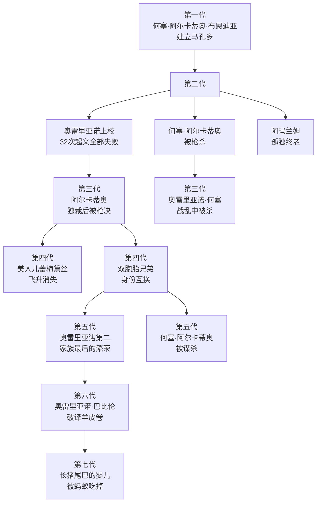
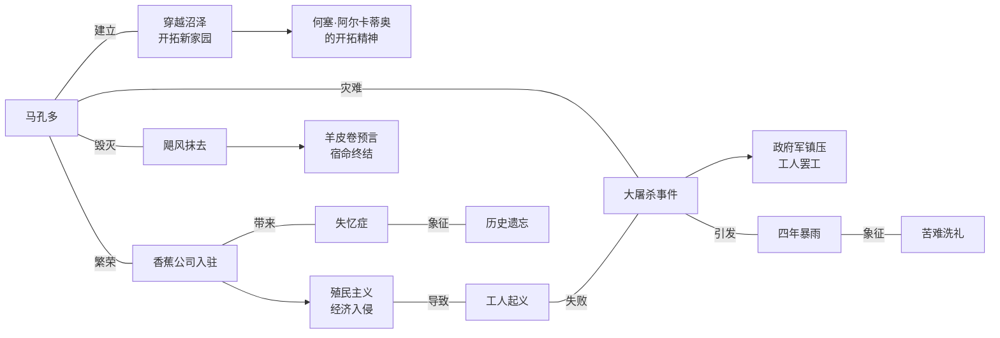
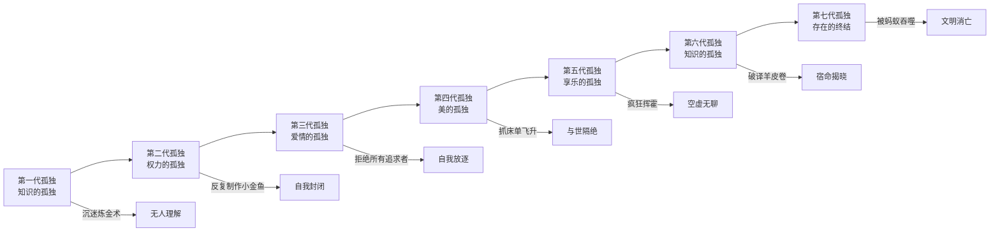
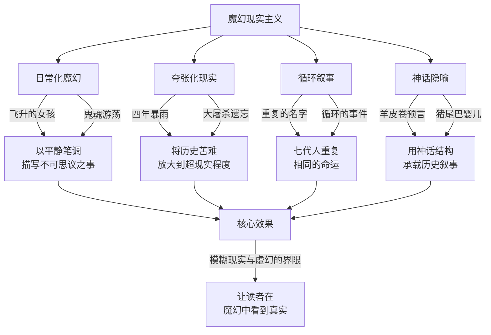

# 百年孤独 · 知识图谱图片描述

---

## 图一：布恩迪亚家族七代谱系树

**图表类型**：树状图（tree）

**描述**：展示布恩迪亚家族七代人的血缘关系，标注每代人的核心特征与命运结局，呈现家族内部重复命名的循环模式。

**渲染要求**：自上而下布局，每代使用不同渐变色，标注关键人物命运关键词。整体风格带有神秘感，可使用深色调。

---

## 图二：马孔多兴衰网络图

**图表类型**：网络图（network）

**描述**：以马孔多小镇为核心节点，展示影响其百年命运的关键事件和外部力量之间的关联网络。

**渲染要求**：马孔多居中，事件节点环绕分布。外部入侵力量用红色系标注，内部发展用绿色系，灾难事件用暗色调。

---

## 图三：孤独主题演进路径图

**图表类型**：路径图（path）

**描述**：展示"孤独"这一核心主题在七代人中的不同表现形式，以及从个人孤独到家族孤独再到文明孤独的演进过程。

**渲染要求**：水平时间线展开，上方标注每代人的孤独类型，下方标注具体表现。整体色调从明亮渐变为暗沉，象征走向终结。

---

## 图四：魔幻现实主义手法解析图

**图表类型**：概念图（graph）

**描述**：解析《百年孤独》中魔幻现实主义的核心手法，展示马尔克斯如何将超自然元素与现实叙事融为一体。

**渲染要求**：中心主题置于顶部，四大手法向下展开，每个手法附有两个小说中的具体例证，最终汇聚到核心效果。
