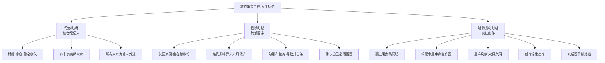
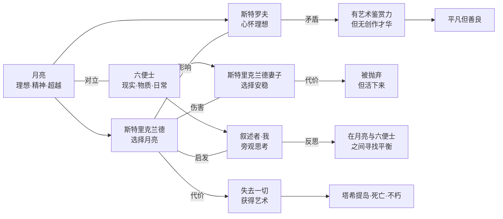
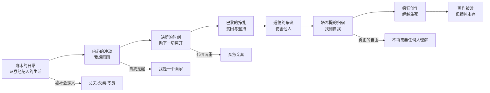
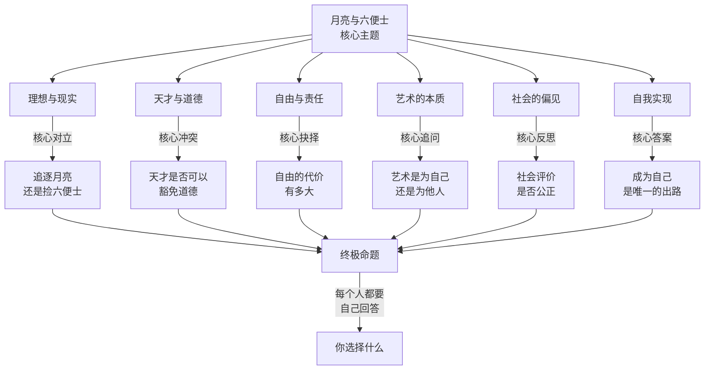

# 月亮与六便士 · 知识图谱图片描述

---

## 图一：斯特里克兰德人生轨迹树

**图表类型**：树状图（tree）

**描述**：展示斯特里克兰德从伦敦到巴黎再到塔希提岛的人生轨迹，标注每个阶段的关键事件、身份转变和内心状态。

**渲染要求**：三段式布局，从左到右展示三个生命阶段。伦敦用灰色调，巴黎用冷蓝色调，塔希提用暖黄色调，象征从世俗走向自由。

---

## 图二：理想与现实冲突网络图

**图表类型**：网络图（network）

**描述**：以"月亮与六便士"为核心对立，展示小说中各个角色在理想与现实之间的不同选择，以及由此产生的命运差异。

**渲染要求**：核心对立置于顶部，各角色分布于下方。选择月亮的人物用暖色系，选择六便士的人物用冷色系，关系线用不同颜色标注。

---

## 图三：追寻理想的路径图

**图表类型**：路径图（path）

**描述**：以斯特里克兰德的视角，展示从"世俗生活"到"艺术自由"的心路历程和关键转折点。

**渲染要求**：水平路径展开，上方标注每个阶段的内心状态，下方标注对应的代价或获得。整体色调从暗淡逐渐变为明亮。

---

## 图四：核心主题概念图

**图表类型**：概念图（graph）

**描述**：提炼《月亮与六便士》的六大核心主题，展示毛姆如何通过斯特里克兰德的故事探讨人性、艺术和自由的深层含义。

**渲染要求**：中心主题置于顶部，六大主题环绕分布，最终汇聚到"终极命题"。整体风格具有哲学思辨感，配色沉稳大气。
