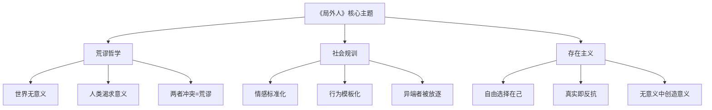
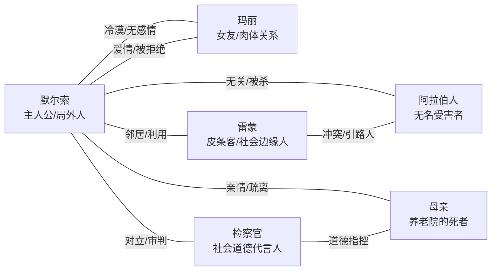
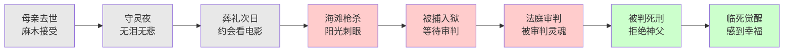
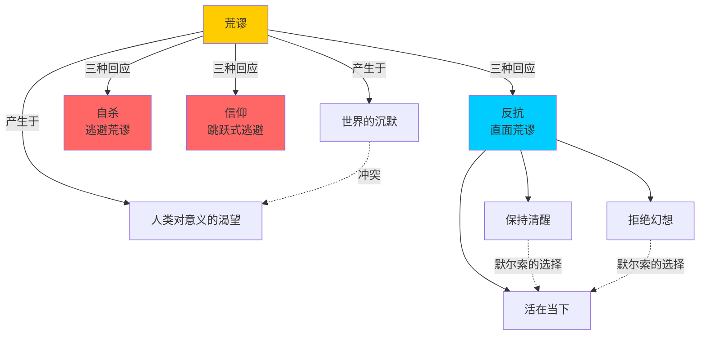

# 《局外人》知识图谱图片描述

## 图一：主题树状图（Tree Diagram）

展示《局外人》核心主题的分层结构。

**设计说明：** 从上至下，三层结构。顶层为书名，中间层为三大主题（荒谬哲学、社会规训、存在主义），底层为各主题的具体展开。整体呈现树状，背景用冷色调，体现小说的冷静基调。

---

## 图二：人物关系网络图（Network Diagram）

展示小说中人物之间的关系及其象征意义。

**设计说明：** 以默尔索为中心节点，五条边连接五个关键人物。每条边标注关系性质。检察官与母亲之间有间接联系（检察官用母亲之死攻击默尔索）。雷蒙与阿拉伯人有直接冲突。背景用网格状暗纹，体现社会网络对人物的围困。

---

## 图三：叙事时间路径图（Path Diagram）

展示小说两部分的叙事走向，以及默尔索心理状态的转变。

**设计说明：** 从左至右的单线叙事路径。前半部分（灰色）表现默尔索的麻木与无感，中间部分（红色）代表暴力与审判的转折，结尾部分（绿色）象征觉醒与释然。颜色渐变体现心理状态的三层变化。

---

## 图四：荒谬哲学概念关系图（Concept Graph）

展示加缪荒谬哲学的核心概念及其内在关联。

**设计说明：** 以"荒谬"为核心节点，向上追溯其来源（世界的沉默 vs 人类对意义的渴望），向下展开三种回应方式。自杀与信仰用红色标注（加缪认为都是逃避），反抗用蓝色标注（加缪推崇的态度）。默尔索最终选择了反抗之路。背景用抽象几何图形，体现哲学思辨感。
