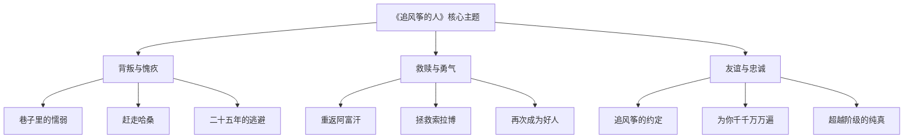
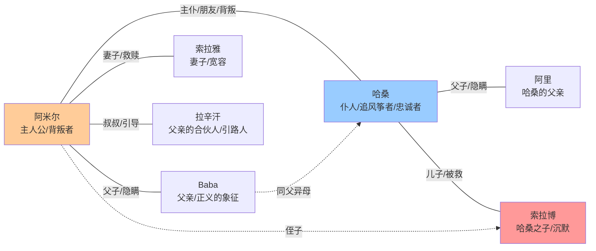
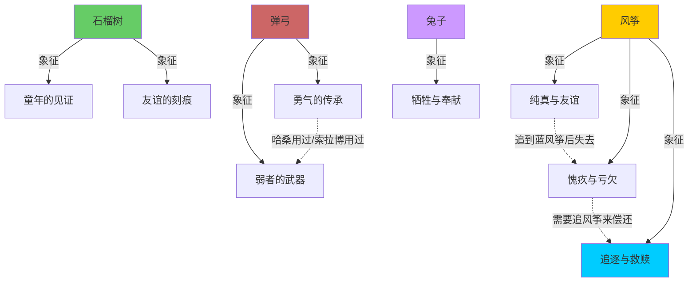

# 《追风筝的人》知识图谱图片描述

## 图一：故事主题树状图（Tree Diagram）

展示小说核心主题的层级关系。

**设计说明：** 从上至下三层结构。顶层为书名，中间层为三大主题（背叛与愧疚、救赎与勇气、友谊与忠诚），底层为各主题的具体情节支撑。整体用暖色调，体现小说的情感温度。背景可以加入隐约的风筝轮廓。

---

## 图二：人物关系网络图（Network Diagram）

展示核心人物之间的复杂关系。

**设计说明：** 以阿米尔和哈桑的双核心结构展开。实线表示已知关系，虚线表示隐藏的血缘关系（Baba是哈桑的亲生父亲）。阿米尔与索拉博之间是救赎关系。拉辛汗是引导者。颜色区分角色阵营：阿米尔用暖色，哈桑用冷色，索拉博用红色（象征需要被拯救的纯真）。

---

## 图三：叙事时间路径图（Path Diagram）

展示小说的三段式叙事结构。

```mermaid
graph LR
    A["童年时期\n喀布尔/无忧无虑"] --> B["冬天风筝比赛\n蓝风筝/背叛发生"]
    B --> C["陷害与分离\n哈桑离开/阿米尔内疚"]
    C --> D["移居美国\n新生活/旧伤口"]
    D --> E["拉辛汗来电\n再次成为好人的路"]
    E --> F["重返阿富汗\n战火中的故土"]
    F --> G["寻找索拉博\n发现真相"]
    G --> H["拯救与逃亡\n新的开始"]
    H --> I["为索拉博追风筝\n轮回与救赎"]
    
    style A fill:#ccffcc
    style B fill:#ffcc99
    style C fill:#ff9999
    style D fill:#cccccc
    style E fill:#ffcc00
    style F fill:#ff6666
    style G fill:#ff9999
    style H fill:#ffcc99
    style I fill:#99ccff
```

**设计说明：** 从左至右的单线叙事路径。颜色变化体现情感温度：绿色（童年的快乐）到橙色（背叛的酝酿）到红色（分离的痛苦）到灰色（美国生活的麻木）到黄色（转折点的出现）再到红色（战火中的危险）最后到蓝色（救赎的完成）。结尾回到蓝色，呼应开头哈桑的忠诚之色，暗示轮回。

---

## 图四：核心意象关系图（Concept Graph）

展示小说中关键意象及其象征含义。

**设计说明：** 五大核心意象各自展开象征含义。风筝是最核心的意象，用黄色标注。救赎（蓝色）是风筝象征的最终指向。弹弓是勇气的传承（哈桑曾用弹弓保护阿米尔，索拉博后来也用弹弓保护了自己）。石榴树刻着"阿米尔和哈桑，喀布尔的苏丹"。兔子象征哈桑的牺牲（他被迫说出自己偷了东西）。整体呈现概念之间的关联网络。
