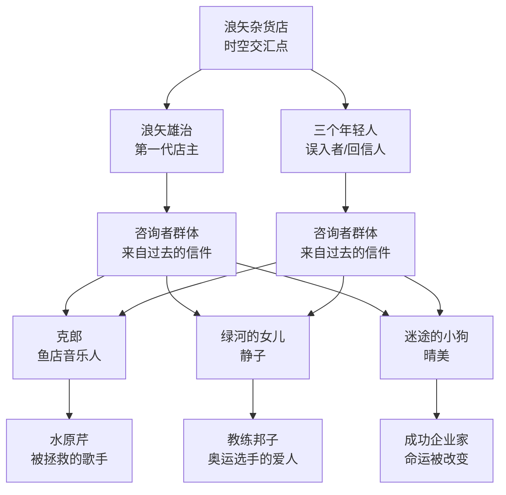
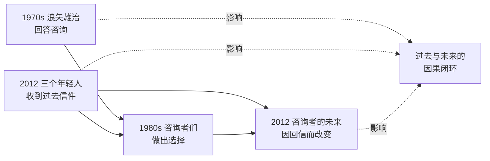
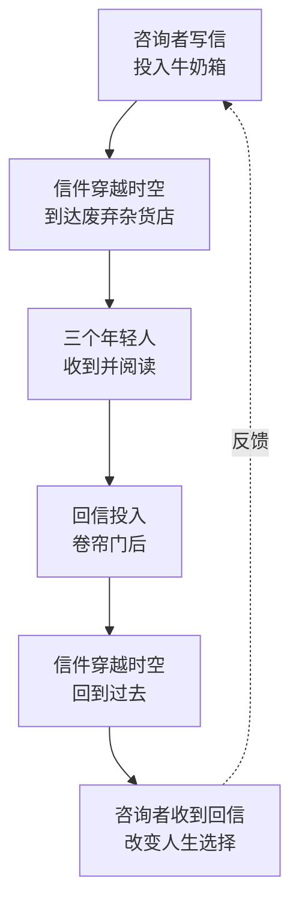
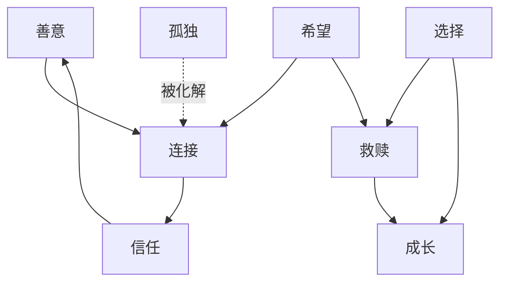

# 知识图谱图片描述：《解忧杂货店》

## 图一：人物关系树状图（Tree Diagram）

展示浪矢杂货店连接的所有人物及其关系层级。

描述：以浪矢杂货店为根节点，向下展开为两代回信人（浪矢雄治与三个年轻人），再连接到各自的咨询者，最后延伸到被影响的第三方人物。整体呈树状结构，清晰展示人物之间的传承关系。

## 图二：时空网络图（Network Diagram）

展示不同时间线中人物之间的交叉影响网络。

描述：以时间为横向轴线，展示过去（1970年代浪矢雄治）、中间节点（1980年代咨询者们的选择）、未来（2012年三个年轻人）之间的网络连接。虚线表示因果闭环，突出时空交错的核心设定。

## 图三：信件传递路径图（Path Diagram）

展示信件在时空中传递的完整路径。

描述：以单向路径为主，展示信件从咨询者投出、穿越时空、被年轻人收到、回信、再穿越回过去、最终影响咨询者的完整循环。末尾的反馈箭头形成闭环，强调因果循环的主题。

## 图四：主题情感关系图（Graph Diagram）

展示书中核心主题与情感要素之间的关联。

描述：以"连接"为核心节点，展示善意、希望、孤独等情感要素如何围绕"连接"产生互动。箭头表示因果关系或转化关系，整体构成一个有向图，揭示书中深层的情感逻辑。
