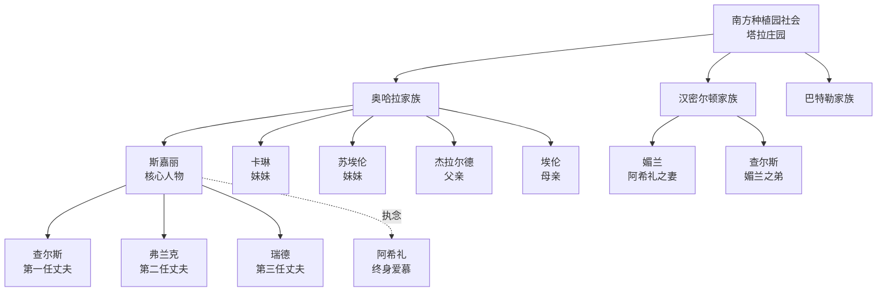
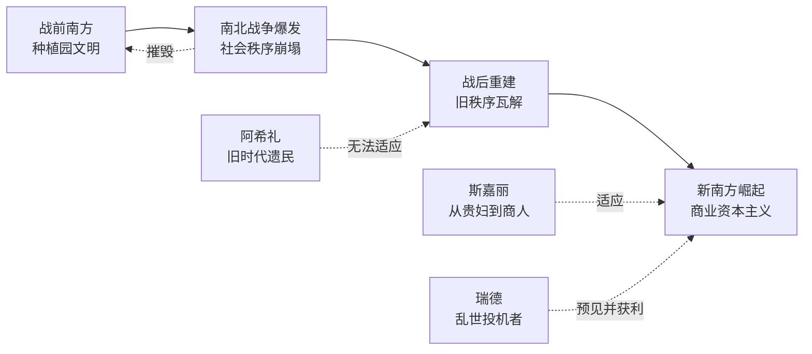
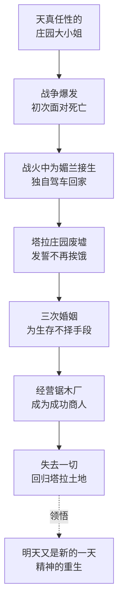
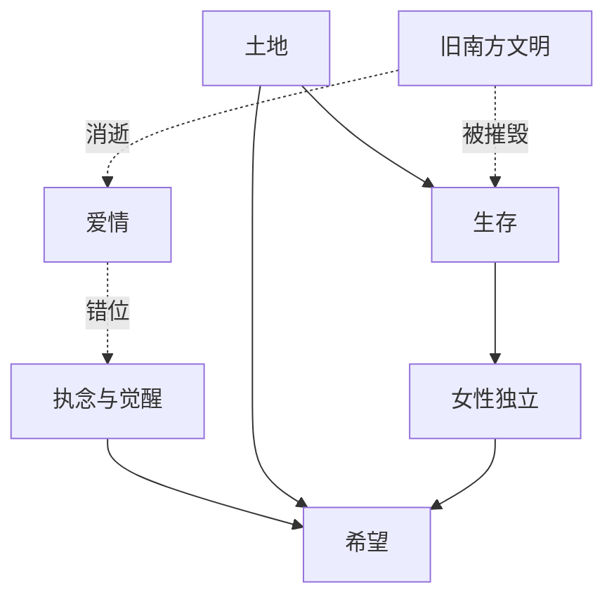

# 知识图谱图片描述：《飘》

## 图一：人物关系树状图（Tree Diagram）

展示《飘》中核心人物及其家族、情感关系层级。

描述：以南方种植园社会为根节点，向下展开三大家族。奥哈拉家族为核心，展示斯嘉丽与家族成员及三任丈夫的关系。虚线标注斯嘉丽对阿希礼的执念，点明情感主线的错位。

## 图二：时代变迁网络图（Network Diagram）

展示南北战争前后南方社会的结构变化与人物命运交织。

描述：以时间为横向轴线，展示南方社会从战前到战后的四个阶段。三个人物以不同方式应对时代变迁：斯嘉丽适应新世界，阿希礼无法适应，瑞德预见并获利。箭头标明各自与时代的关系。

## 图三：斯嘉丽成长路径图（Path Diagram）

展示斯嘉丽从天真少女到坚韧女性的成长轨迹。

描述：以单向路径展示斯嘉丽的成长轨迹，每个节点代表她人生中的关键转折点。从依赖他人的少女到独立生存的女性，最终在失去一切后回归土地，完成精神层面的重生。

## 图四：核心主题关系图（Graph Diagram）

展示《飘》的核心主题及其内在关联。

描述：以"生存"和"希望"为核心节点，展示各主题之间的关系。土地是生存的基础，旧南方文明的消逝引发爱情错位，执念的觉醒通向希望。女性独立是生存的延伸。整体揭示书中最深层的主题逻辑。
