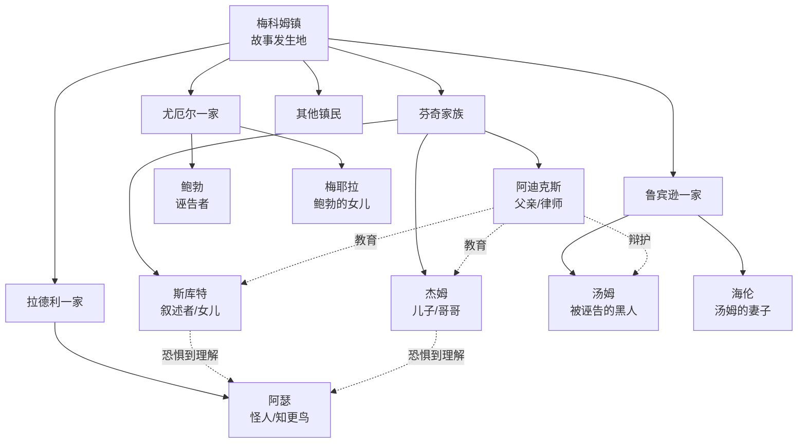
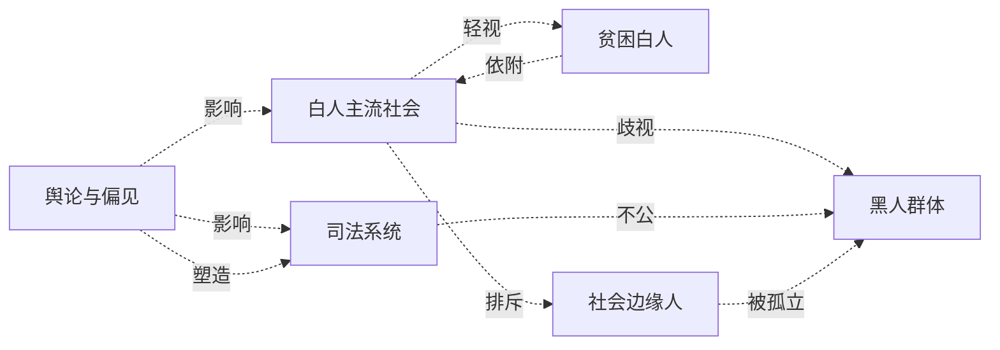
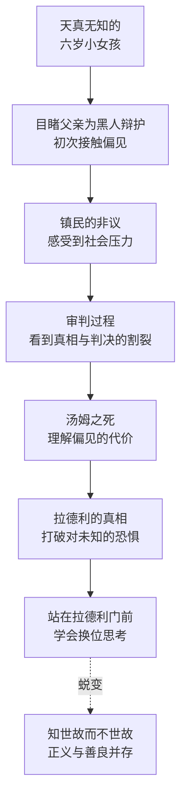
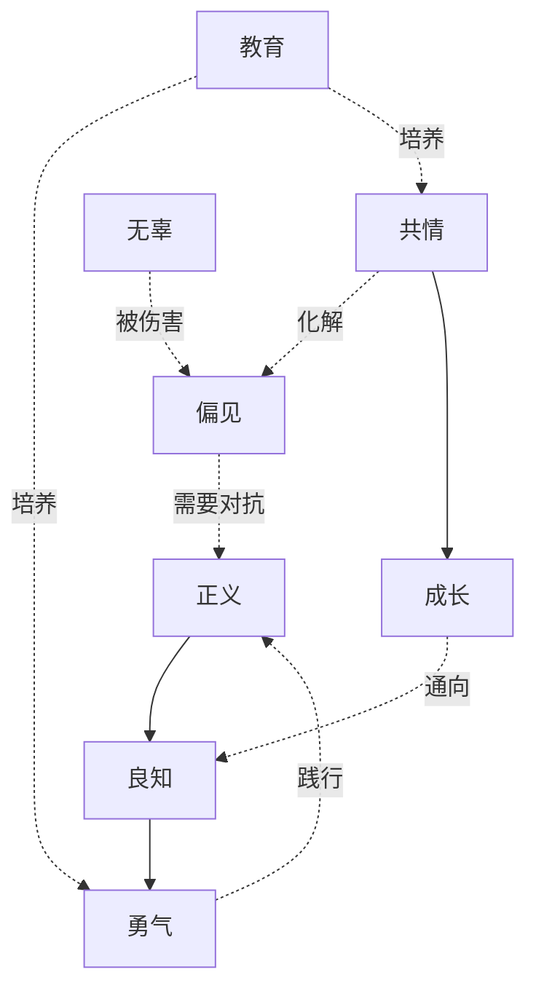

# 知识图谱图片描述：《杀死一只知更鸟》

## 图一：人物关系树状图（Tree Diagram）

展示芬奇家族与梅科姆镇主要人物的关系层级。

描述：以梅科姆镇为根节点，向下展开五个家族/群体。芬奇家族为核心，展示阿迪克斯与子女的关系。关键关系用箭头标注：阿迪克斯为汤姆辩护，孩子们从恐惧到理解阿瑟。揭示人物之间的冲突与连接。

## 图二：社会偏见网络图（Network Diagram）

展示梅科姆镇社会结构中的偏见与对立关系。

描述：以社会群体为节点，展示梅科姆镇中的偏见网络。白人主流社会对黑人、贫困白人和边缘人的歧视构成核心冲突。舆论偏见影响司法系统的不公判决，揭示系统性偏见的运作机制。

## 图三：斯库特成长路径图（Path Diagram）

展示斯库特从天真孩童到理解正义的成长轨迹。

描述：以单向路径展示斯库特的成长轨迹，每个节点代表她认知升级的关键时刻。从对偏见一无所知到亲眼目睹不公，最终学会换位思考。末尾的蜕变箭头指向精神层面的成熟。

## 图四：核心主题关系图（Graph Diagram）

展示《杀死一只知更鸟》的核心主题及其内在关联。

描述：以"正义"和"良知"为核心节点，展示各主题之间的关系。偏见需要正义来对抗，共情能化解偏见，教育是培养勇气和共情的途径，成长通向良知。整体揭示书中关于道德成长的主题逻辑。
