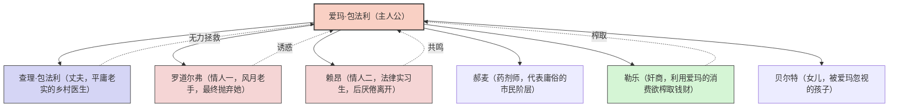
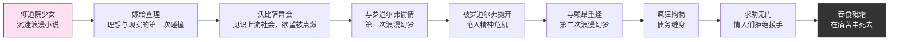
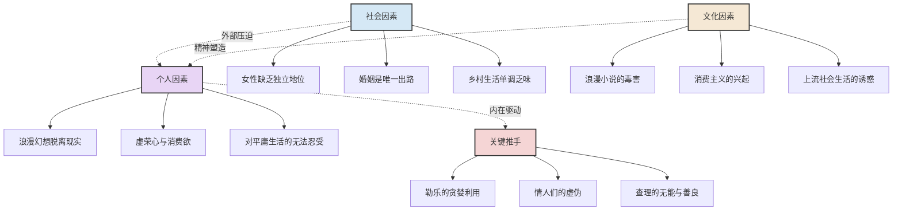
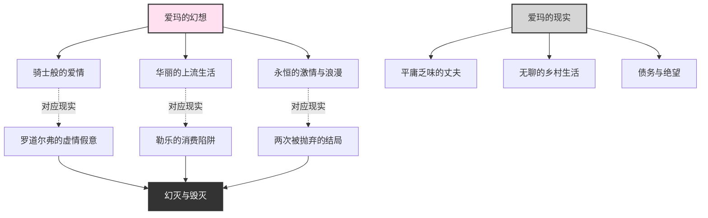

# 《包法利夫人》知识图谱图片描述

## 图一：爱玛人物关系树形图

**图表类型：** tree graph

**描述：** 以爱玛为中心，展示她与丈夫、情人们、债主等人物的关系网络，标注每个人物在爱玛命运中的角色。

---

## 图二：爱玛幻灭时间线

**图表类型：** path/flow chart

**描述：** 按时间顺序展示爱玛从少女到死亡的完整命运轨迹，形成一条从幻想到毁灭的人生路径。

---

## 图三：爱玛毁灭因素网络图

**图表类型：** network/mind map

**描述：** 展示导致爱玛悲剧的多重因素，包括个人性格、社会环境、文化影响之间的交织关系。

---

## 图四：浪漫幻想与现实对比图

**图表类型：** graph with cross-connections

**描述：** 对比爱玛心中的浪漫幻想与她面对的现实，展示两者之间的巨大鸿沟。

