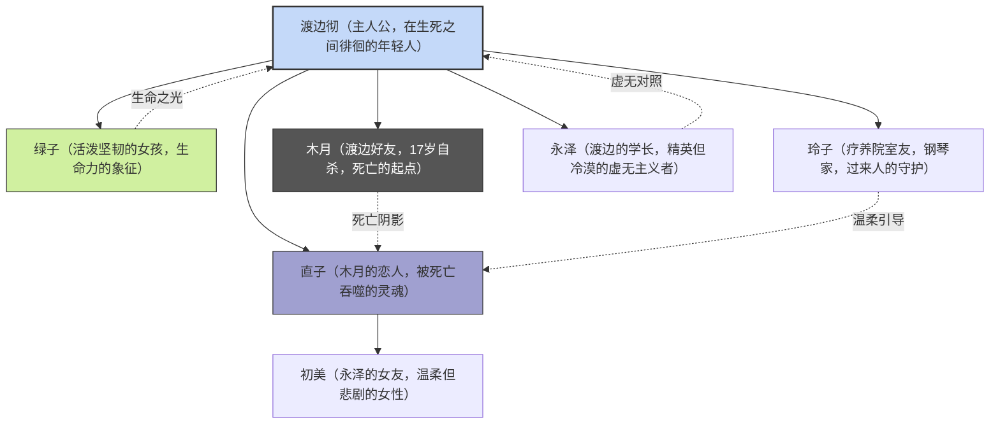
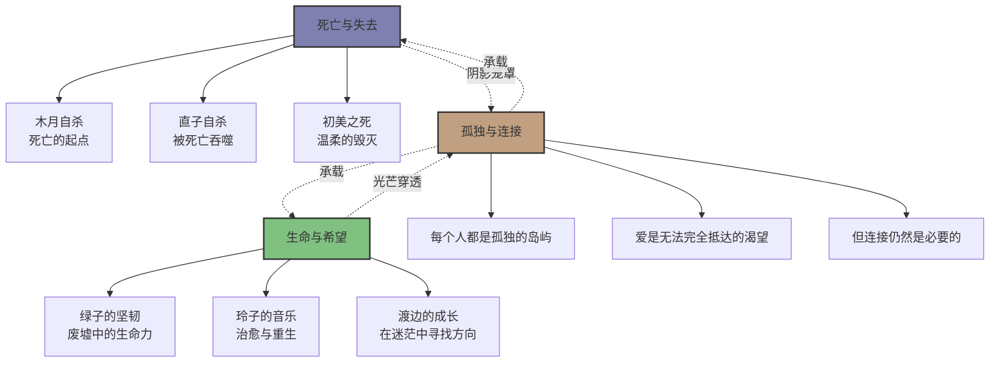
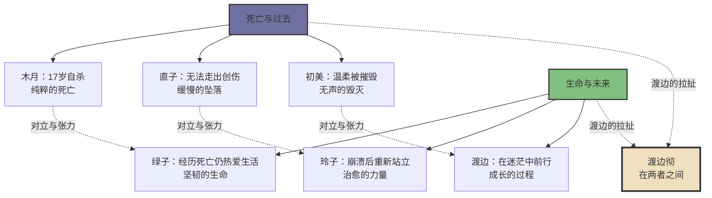

# 《挪威的森林》知识图谱图片描述

## 图一：主要人物关系树形图

**图表类型：** tree graph

**描述：** 以渡边为中心，展示小说中主要人物的关系网络，标注每个人物的命运走向和象征意义。

---

## 图二：渡边的内心挣扎时间线

**图表类型：** path/flow chart

**描述：** 按时间顺序展示渡边从木月之死到最终面对自己内心的情感轨迹。

---

## 图三：生死主题网络图

**图表类型：** network/mind map

**描述：** 展示小说的核心主题——生与死、孤独与连接、过去与未来之间的交织关系。

---

## 图四：人物象征对比图

**图表类型：** graph with cross-connections

**描述：** 对比小说中代表"死亡/过去"与"生命/未来"的人物群像，展示两者之间的张力。

