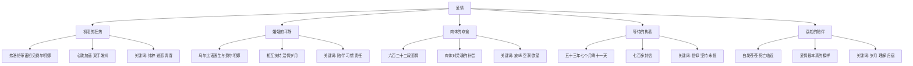
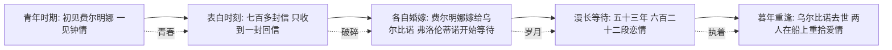
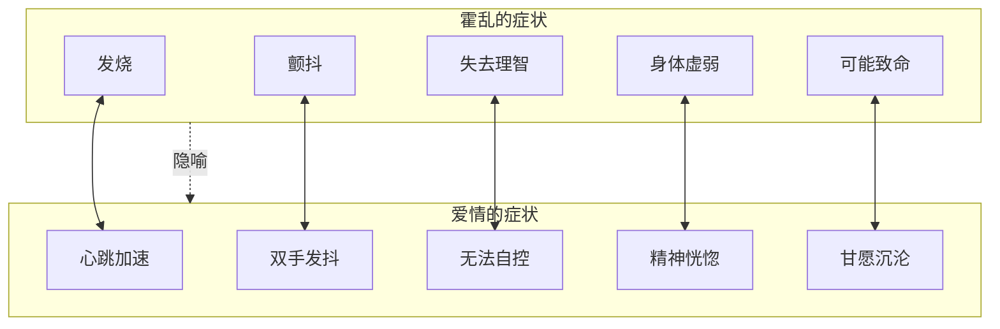

# 知识图谱图片描述

## 图一：爱情形态树状图

**图表类型**：tree（树状图）

**用途**：展示《霍乱时期的爱情》中五种爱情形态的层级关系

**描述**：以"爱情"为根节点，向下展开五个分支，分别对应书中五种核心爱情形态。每个分支包含代表人物、特征描述和关键词。整体呈自上而下的树状结构，根节点居中，子节点逐层展开。

**配色建议**：根节点使用深红色（#8B0000），五个分支分别使用不同深浅的暖色调，体现爱情的温度变化。

**Mermaid 代码**：



---

## 图二：人物关系网络图

**图表类型**：network（网络关系图）

**用途**：呈现三位核心人物之间错综复杂的情感关联

**描述**：以弗洛伦蒂诺、费尔明娜、乌尔比诺医生为三个核心节点，用不同类型的连线表示他们之间的关系。弗洛伦蒂诺与费尔明娜之间是"跨越半个世纪的爱恋"，费尔明娜与乌尔比诺之间是"二十五年的婚姻"，弗洛伦蒂诺与乌尔比诺之间是"无形的对立"。

**配色建议**：弗洛伦蒂诺用蓝色系，费尔明娜用红色系，乌尔比诺医生用绿色系。连线使用不同颜色区分关系类型。

**Mermaid 代码**：

```mermaid
graph LR
    F[弗洛伦蒂诺·阿里萨]
    G[费尔明娜·达萨]
    U[乌尔比诺医生]
    F -- 跨越半个世纪的爱恋 --> G
    G -- 二十五年的婚姻 --> U
    F -- 无形的情敌对立 --> U
    G -- 少女时期的初恋 --> F
    U -- 社会地位与安全感 --> G
    F -- 六百二十二段恋情 -- 填补内心 --> FSelf[内心的空洞]
    G -- 暮年回归爱情 --> F
```

---

## 图三：时间线路径图

**图表类型**：path（时间路径图）

**用途**：梳理弗洛伦蒂诺五十三年等待的关键时间节点

**描述**：从左至右的时间轴线，标记五个关键节点：初恋相遇、表白被拒、各自婚嫁、乌尔比诺去世、暮年重逢。每个节点标注年份和核心事件，形成一条蜿蜒向前的人生路径。

**配色建议**：时间轴使用渐变色，从青春的亮色过渡到暮年的暗色，体现时光流逝。关键节点用圆形标记，配以简短文字。

**Mermaid 代码**：



---

## 图四：霍乱与爱情隐喻对照图

**图表类型**：graph（对照图）

**用途**：揭示书名中"霍乱"与"爱情"的深层隐喻关系

**描述**：左右两列对比结构。左侧为"霍乱的症状"，右侧为"爱情的症状"。中间用双向箭头连接，表明两者的对应关系。底部总结核心隐喻：爱情如霍乱，让人失控，却又让人甘愿沉沦。

**配色建议**：左侧使用冷色调（蓝灰色），右侧使用暖色调（橙红色），中间的连接线使用金色，象征两者之间的深层关联。

**Mermaid 代码**：


