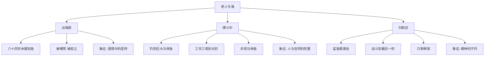
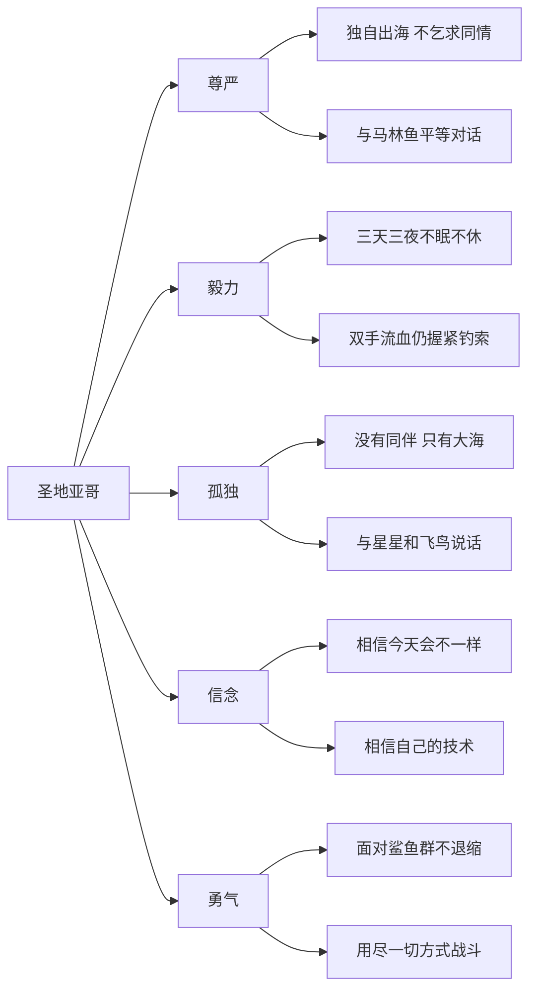
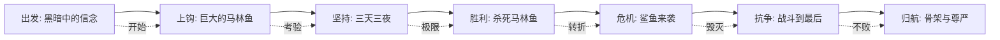
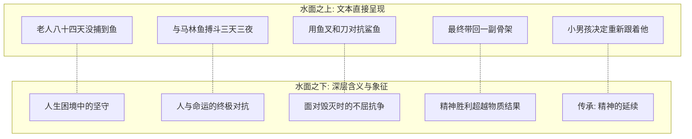

# 知识图谱图片描述

## 图一：故事结构树状图

**图表类型**：tree（树状图）

**用途**：展示《老人与海》的核心叙事结构

**描述**：以"老人与海"为根节点，向下展开为三个叙事阶段：出海前、搏斗中、归航后。每个阶段再展开为关键事件和象征意义。整体呈自上而下的树状结构，体现故事的时间推进和主题深化。

**配色建议**：根节点使用深蓝色（#003366），象征海洋。三个主分支分别使用浅蓝、金黄、暗红，代表出发、抗争与悲壮。

**Mermaid 代码**：

---

## 图二：人物精神力量网络图

**图表类型**：network（网络关系图）

**用途**：呈现圣地亚哥精神世界的多维构成

**描述**：以"圣地亚哥"为核心节点，向外连接五种精神力量：尊严、毅力、孤独、信念、勇气。每种精神力量再连接到具体行为表现，形成网状结构，展示人物内心的丰富层次。

**配色建议**：圣地亚哥使用深褐色（#5C4033），象征沉稳与沧桑。五种精神力量使用不同色调，形成视觉区分。

**Mermaid 代码**：

---

## 图三：抗争路径图

**图表类型**：path（路径图）

**用途**：梳理圣地亚哥从出海到归航的完整抗争路径

**描述**：从左至右的路径，标记七个关键节点。每个节点代表一次挑战与回应。路径线由细变粗再变细，象征力量的积蓄、爆发与消耗。最终节点虽指向"失败"的结果，但标注"精神胜利"的反转。

**配色建议**：路径使用渐变色，从深蓝到暗红再到灰色，象征从出发到战斗再到残骸的过程。关键节点用圆形标记，配以简短有力的文字。

**Mermaid 代码**：

---

## 图四：冰山理论对照图

**图表类型**：graph（对照图）

**用途**：揭示海明威"冰山理论"在本书中的体现

**描述**：上下对比结构。上方为"水面之上：文本直接呈现的内容"，列出具体情节。下方为"水面之下：深层含义与象征"，列出对应的隐喻。中间用一条波浪线分隔，象征水面。左右对应关系用虚线连接。

**配色建议**：水上部分使用浅蓝色背景，水下部分使用深蓝色背景。对应关系用金色虚线连接，突出冰山理论的核心概念。

**Mermaid 代码**：

