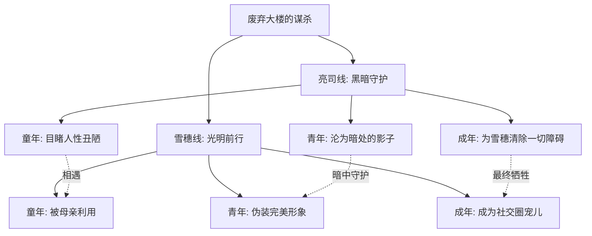
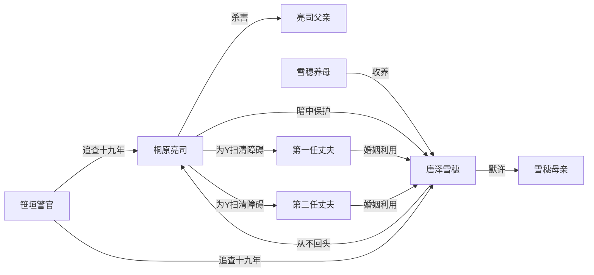
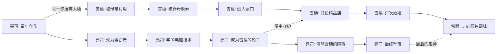
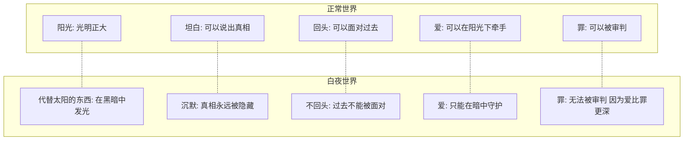

# 知识图谱图片描述

## 图一：人物命运树状图

**图表类型**：tree（树状图）

**用途**：展示亮司与雪穗十九年命运轨迹的分层演变

**描述**：以"废弃大楼的谋杀"为根节点，向下分为两条平行命运线：亮司线（黑暗守护）和雪穗线（光明前行）。每条线再展开为三个阶段：童年创伤、青年伪装、成年爆发。每个阶段标注关键事件和人物关系变化。

**配色建议**：根节点使用暗红色（#8B0000），象征罪恶的起点。亮司线使用深蓝色系，象征黑暗。雪穗线使用白色到金色渐变，象征光明。

**Mermaid 代码**：

---

## 图二：罪恶与爱网络关系图

**图表类型**：network（网络关系图）

**用途**：呈现亮司、雪穗与周围人物的复杂关系网络

**描述**：以亮司和雪穗为双核心节点，向外辐射连接关键人物：亮司的父亲、雪穗的母亲、雪穗的养母、雪穗的第一任丈夫、雪穗的第二任丈夫、笹垣警官。连线标注关系性质：利用、守护、调查、伪装等。

**配色建议**：亮司用深蓝色，雪穗用白色，其他人物用灰色。罪恶相关的连线用红色，守护相关的连线用蓝色，调查相关的连线用绿色。

**Mermaid 代码**：

---

## 图三：白夜人生路径图

**图表类型**：path（路径图）

**用途**：梳理亮司与雪穗从童年到成年的关键人生节点

**描述**：两条并行的时间路径，上方为亮司的路径，下方为雪穗的路径。路径上标注八个关键时间节点，每个节点用简短文字概括事件。两条路径在某些节点交汇（表示暗中的联系），在大部分时间平行延伸。

**配色建议**：亮司路径使用深蓝到黑色的渐变，雪穗路径使用白色到银色的渐变。交汇点用金色标记，象征两人在黑暗中的连接。

**Mermaid 代码**：

---

## 图四：白夜隐喻对照图

**图表类型**：graph（对照图）

**用途**：揭示"白夜"概念的深层象征意义

**描述**：左右对比结构。左侧为"正常世界"，列出阳光、光明、坦白、回头等元素。右侧为"白夜世界"，列出代替太阳的东西、黑暗中的光、沉默、不回头等元素。中间用一条波浪线分隔，象征两个世界的边界。

**配色建议**：左侧使用暖色调（黄色、橙色），象征正常世界的光明。右侧使用冷色调（深蓝、灰蓝），象征白夜的清冷。中间的波浪线使用银色，象征白夜中微弱但存在的光。

**Mermaid 代码**

