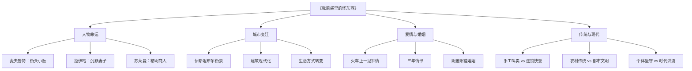
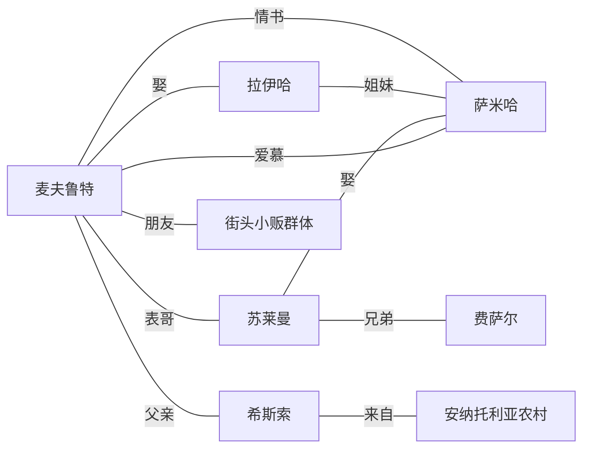
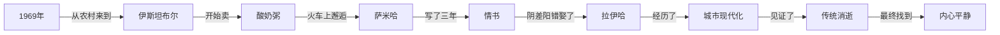
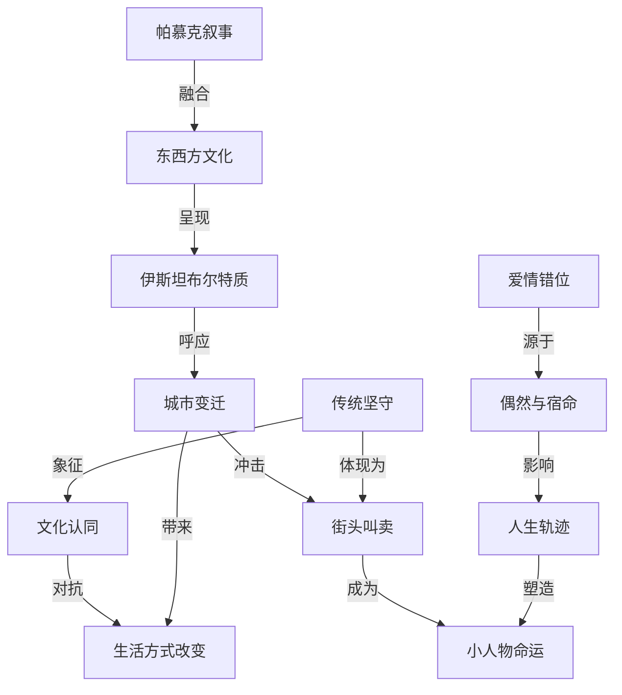

# 知识图谱图片描述

以下四幅知识图谱从不同维度解构《我脑袋里的怪东西》的核心要素，帮助读者快速把握小说的思想脉络与叙事结构。每幅图都对应一个分析视角，四图叠加即可形成对作品的立体认知。

## 图一：主题关系树状图

本图从四大主题维度出发，逐层展开小说的核心议题。主题树从《我脑袋里的怪东西》这一中心节点出发，分为人物命运、城市变迁、爱情与婚姻、传统与现代四个主枝，每个主枝下又细分三个子节点，形成完整的主题分析框架。

## 图二：人物关系网络图

人物关系网络图展示了小说中核心角色之间的复杂联系。麦夫鲁特处于网络中心，通过婚姻、爱情、血缘等多重关系与其他角色相连。特别值得注意的是拉伊哈与萨米哈的姐妹关系，正是这层关系导致了麦夫鲁特的情书被阴差阳错地送错了人。

## 图三：时间线路径图

时间线路径图梳理了麦夫鲁特从1969年从农村来到伊斯坦布尔，到最终找到内心平静的完整人生轨迹。这条时间线不是简单的年代罗列，而是以关键事件为节点，勾勒出一个人如何在时代变迁中走过半生。每个节点之间的连接词揭示了事件的因果与转折关系。

## 图四：核心概念关系图

核心概念关系图是四幅图中最具思想深度的一幅。它将传统坚守、城市变迁、爱情错位和帕慕克叙事四个概念节点相互关联，揭示了小说深层的思想结构。传统坚守与城市变迁之间的对抗关系，爱情错位与小人物命运之间的塑造关系，以及帕慕克叙事对东西方文化融合的呈现，共同构成了这部小说的思想内核。

