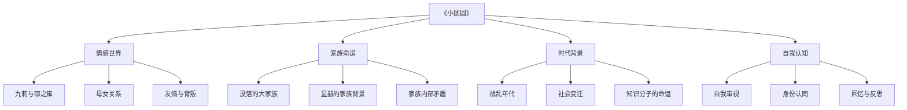
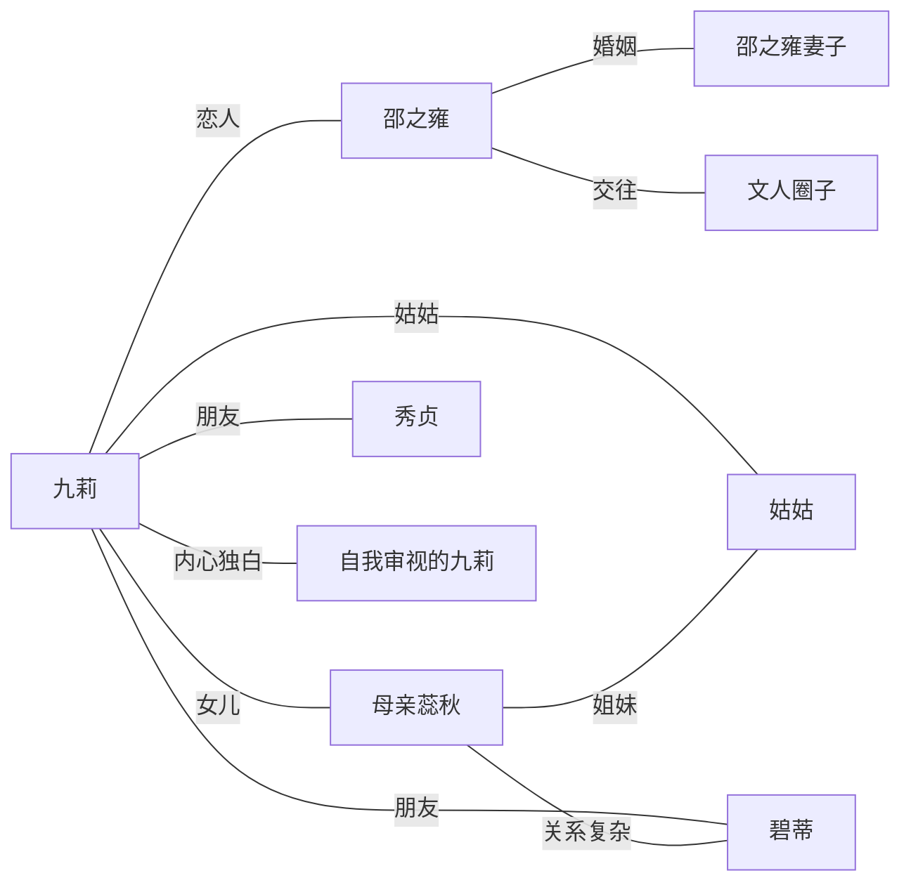
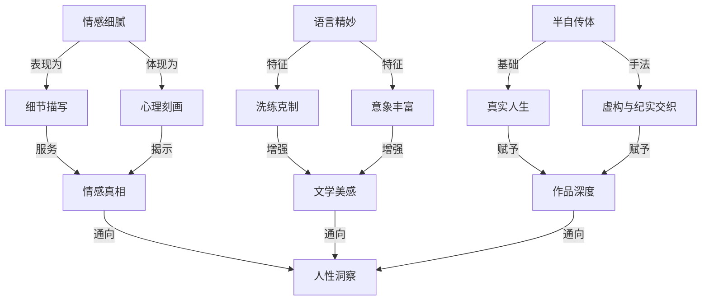

# 知识图谱图片描述

以下四幅知识图谱从不同维度解构《小团圆》的核心要素，帮助读者快速把握小说的思想脉络与叙事结构。每幅图都对应一个分析视角，四图叠加即可形成对作品的立体认知。

## 图一：主题关系树状图

本图从四大主题维度出发，逐层展开小说的核心议题。主题树从《小团圆》这一中心节点出发，分为情感世界、家族命运、时代背景和自我认知四个主枝，每个主枝下又细分三个子节点，形成完整的主题分析框架。

## 图二：人物关系网络图

人物关系网络图展示了小说中核心角色之间的复杂联系。九莉处于网络中心，通过恋人关系与邵之雍相连，通过血缘关系与母亲和姑姑相连，同时通过友情与其他角色相连。特别值得注意的是母亲蕊秋与九莉之间复杂的母女关系，这是影响九莉情感走向的重要因素。

## 图三：时间线路径图

时间线路径图梳理了九莉从显赫家族出身，到童年冷漠、恋爱波折，再到晚年回首与反思的完整人生轨迹。这条时间线不是简单的年代罗列，而是以关键情感事件为节点，勾勒出一个人在时代洪流中走过的一生。

## 图四：核心概念关系图

核心概念关系图是四幅图中最具思想深度的一幅。它将情感细腻、语言精妙、半自传体和人性洞察四个概念节点相互关联，揭示了张爱玲文学创作的深层逻辑。情感细腻通过细节描写和心理刻画通向人性洞察，语言精妙通过洗练克制和丰富意象增强文学美感，半自传体通过真实人生和虚构交织赋予作品深度。

