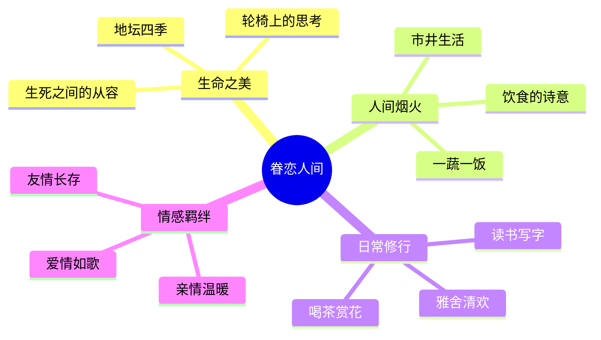
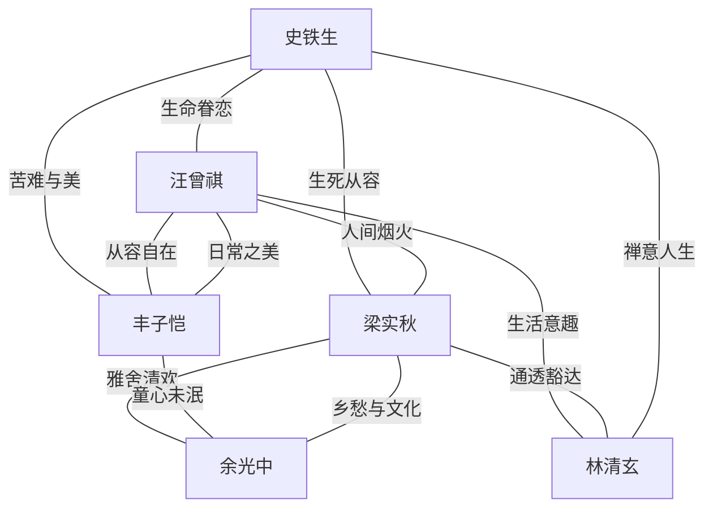
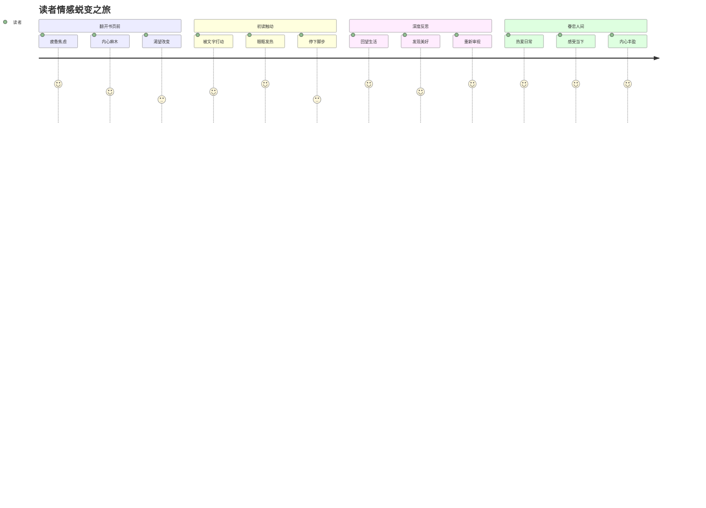
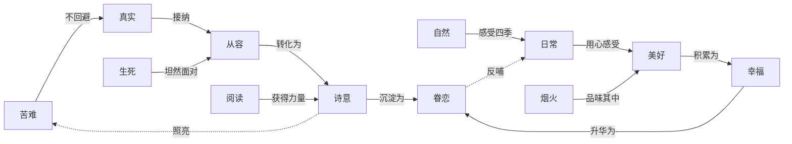

# 02-知识图谱图片描述.md

## 图片一：主题树状图（Mind Tree）

**图表类型**: 树状结构图 (Tree Diagram)

**设计说明**: 以"眷恋人间"为核心主题，向下展开四大分支，呈现散文集的情感结构。整体色调温暖，使用橙黄色系。

**视觉风格**:
- 中心节点使用橙色实心圆，文字白色
- 一级分支使用不同深浅的暖色调
- 二级节点使用浅黄色背景
- 连接线使用渐变色，从中心向外逐渐变浅
- 整体布局对称，四个方向均匀分布

---

## 图片二：情感关系网络图（Emotion Network）

**图表类型**: 力导向网络图 (Network Graph)

**设计说明**: 以书中六位散文名家为节点，以他们共同表达的情感主题为连线，展现散文集中多维度的情感共振网络。

**视觉风格**:
- 六个名家节点使用不同颜色的六边形
- 连线使用细实线，标注情感主题关键词
- 节点大小根据文章数量调整
- 整体呈现网状结构，体现思想的交织与共鸣
- 背景使用淡雅的米白色

---

## 图片三：阅读体验路径图（Reading Journey Path）

**图表类型**: 路径流程图 (Path Flow)

**设计说明**: 描绘读者从翻开书页到内心被治愈的完整情感旅程，用路径图展现"厌倦→触动→反思→眷恋"的心理变化过程。

**视觉风格**:
- 四个阶段使用渐变色，从灰蓝色过渡到暖橙色
- 每个阶段的柱状高度代表情感强度
- 使用箭头连接各阶段，表示不可逆的成长
- 底部添加时间轴，暗示这是一个渐进的过程
- 整体风格简洁温暖

---

## 图片四：核心概念关联图（Concept Graph）

**图表类型**: 概念关联图 (Concept Map)

**设计说明**: 将书中反复出现的核心概念进行关联展示，揭示散文集内在的哲学逻辑和情感线索。

**视觉风格**:
- 概念节点使用圆角矩形，按色系分组
- 实线箭头表示直接关联，虚线表示反馈回路
- 左侧为"起点概念"使用冷色调
- 右侧为"终点概念"使用暖色调
- 中间过渡区域使用渐变色
- 整体从左到右呈现"从苦到甜"的视觉流动
