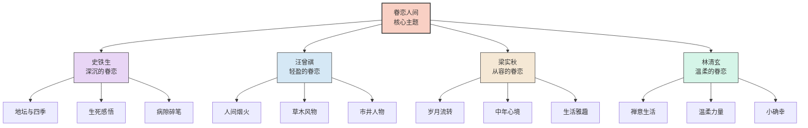
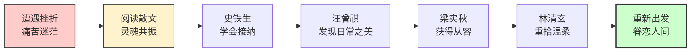
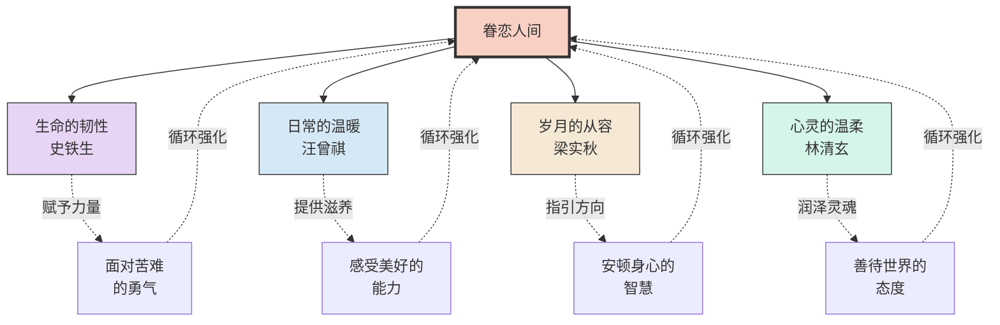
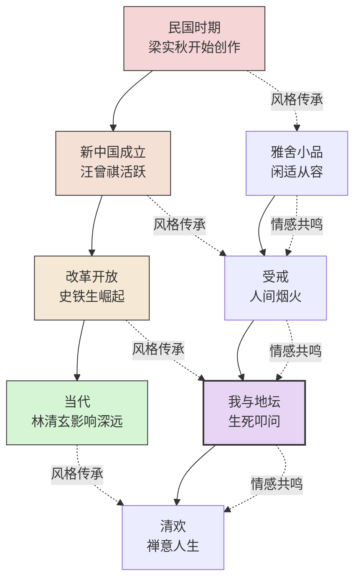

# 《我从未如此眷恋人间》知识图谱图片描述

## 图一：作家与主题关联树形图

**图表类型：** tree graph

**描述：** 以"眷恋人间"为核心主题，展示四位代表性作家及其各自的散文风格和核心意象。

---

## 图二：从苦难到眷恋的心灵路径

**图表类型：** path/flow chart

**描述：** 展示一个普通人经历苦难后，如何通过文学的治愈力量，重新发现人间的美好，最终走向眷恋的心路历程。

---

## 图三：眷恋人间的多维支撑网络

**图表类型：** network/mind map

**描述：** 展示"眷恋人间"这一情感是由哪些维度共同支撑的，各维度之间的关联关系。

---

## 图四：散文经典的时间与情感交织图

**图表类型：** graph with cross-connections

**描述：** 展示不同时代作家散文创作的时间线，以及他们作品中对人间眷恋之情的不同表达方式。

