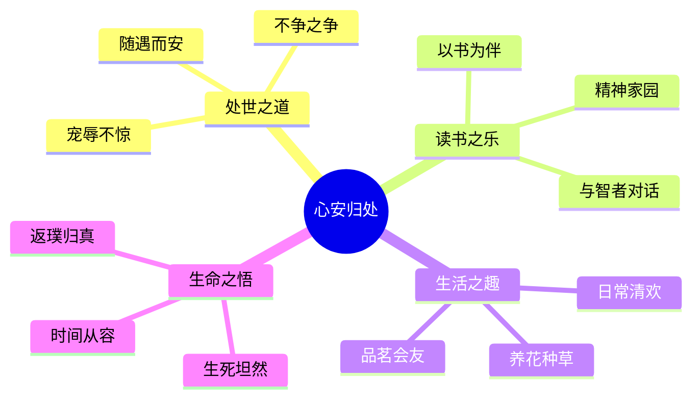
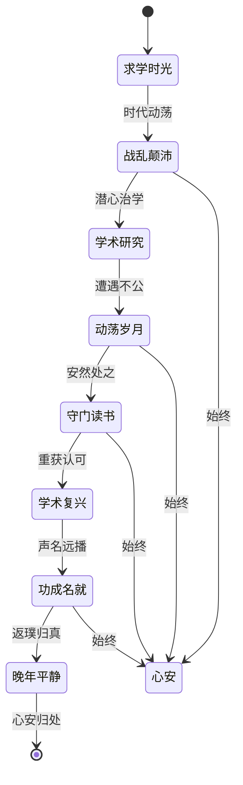
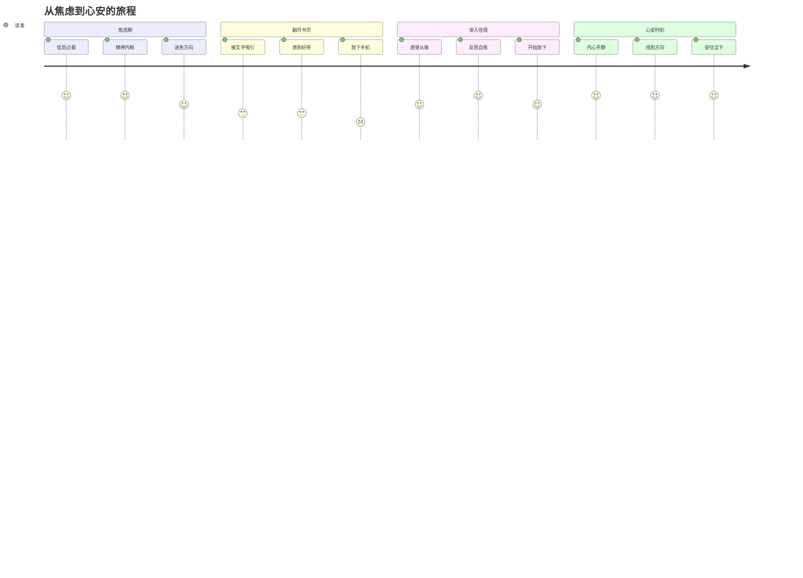
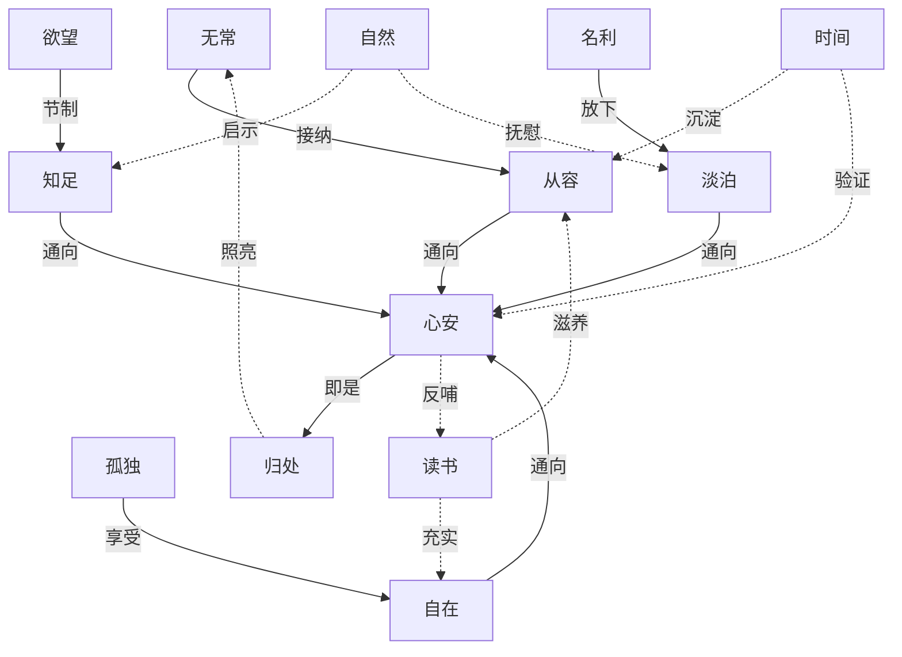

# 02-知识图谱图片描述.md

## 图片一：主题树状图（Mind Tree）

**图表类型**: 树状结构图 (Tree Diagram)

**设计说明**: 以"心安"为核心，向下展开季羡林散文中关于内心平静的四大修习路径。整体色调清雅，使用青绿色系，传达宁静致远的意境。

**视觉风格**:
- 中心节点使用青色实心圆，文字白色
- 一级分支使用不同深浅的青绿色
- 二级节点使用淡青色背景，圆角矩形
- 连接线使用淡墨色，带有毛笔质感
- 整体布局呈放射状，四周均匀分布
- 背景使用宣纸纹理

---

## 图片二：心境变化网络图（State Network）

**图表类型**: 状态转换网络图 (State Transition Network)

**设计说明**: 展现季羡林一生在不同境遇下保持心安的状态转换，揭示"心安"如何在各种人生起伏中得以维系。

**视觉风格**:
- 人生阶段节点使用方形，心安节点使用圆形
- 主线使用深色实线，心安连接线使用浅色虚线
- 节点按时间从左到右排列
- 每个节点添加简短描述文字
- 背景使用淡雅的水墨山水纹理
- 整体呈现时间轴与心境轴的交织

---

## 图片三：读者心路历程图（Healing Journey Path）

**图表类型**: 心路历程路径图 (Journey Path)

**设计说明**: 描绘现代读者从焦虑不安到心安平静的转变过程，展现季羡林散文的治愈力量如何逐步渗透读者内心。

**视觉风格**:
- 四个阶段使用渐变色，从焦躁的橙红色过渡到平静的青蓝色
- 柱状高度代表焦虑或平静的程度
- 底部添加"焦虑值→平静值"的渐变指示条
- 使用平滑曲线连接各阶段，暗示转变是渐进的
- 整体风格从紧张到舒缓的视觉变化

---

## 图片四：核心理念关联图（Philosophy Graph）

**图表类型**: 理念关联图 (Philosophical Concept Map)

**设计说明**: 将季羡林散文中反复出现的人生哲学理念进行关联展示，揭示"心安即是归处"的完整思想体系。

**视觉风格**:
- 左侧"人生课题"节点使用灰色冷色调
- 中间"修习方式"节点使用青绿色过渡色
- 右侧"心安归处"节点使用温暖的金黄色
- 实线箭头表示直接推导，虚线表示滋养关系
- 整体从左到右形成"问题→修习→答案"的视觉流动
- 背景使用淡雅的书法笔触纹理
