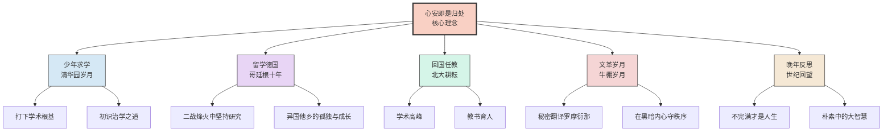
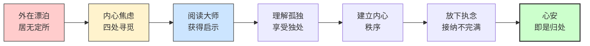
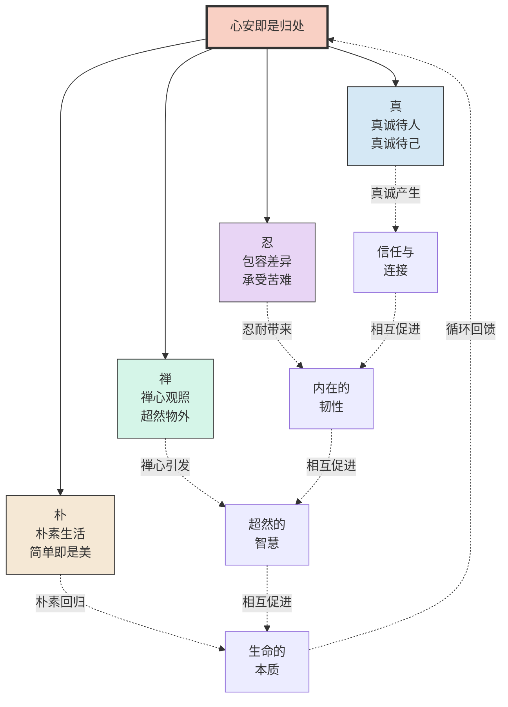
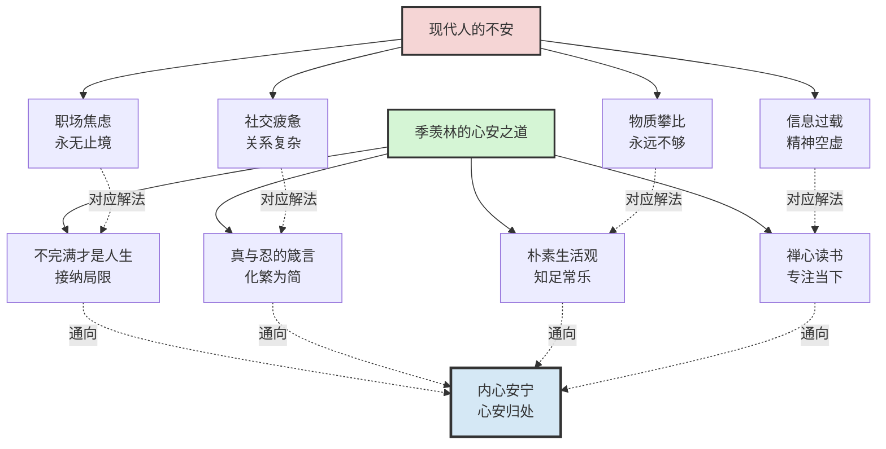

# 《心安即是归处》知识图谱图片描述

## 图一：季羡林人生阶段与心安体悟树形图

**图表类型：** tree graph

**描述：** 以"心安即是归处"为核心理念，展示季羡林先生不同人生阶段的经历及其对应的心安体悟。

---

## 图二：从漂泊到心安的心灵旅程

**图表类型：** path/flow chart

**描述：** 展示一个人从外在漂泊、内心焦虑，逐步通过季羡林的人生智慧，走向内心安宁的完整路径。

---

## 图三：心安的内在支撑网络

**图表类型：** network/mind map

**描述：** 展示"心安即是归处"这一哲学理念的多维支撑体系，包括真、忍、禅、朴四大支柱及其相互关系。

---

## 图四：不安与心安的对比映射图

**图表类型：** graph with cross-connections

**描述：** 对比展示现代人的各种焦虑状态与季羡林给出的心安解法之间的对应关系。

