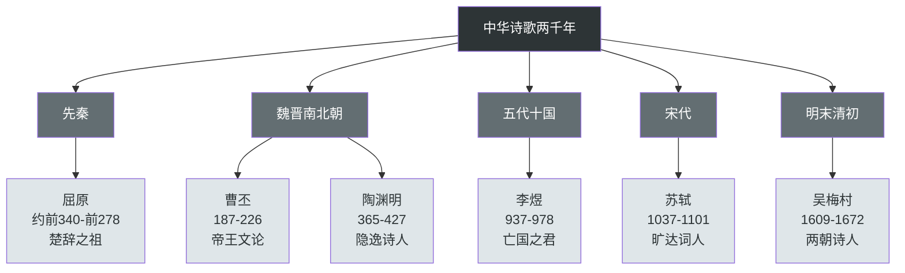
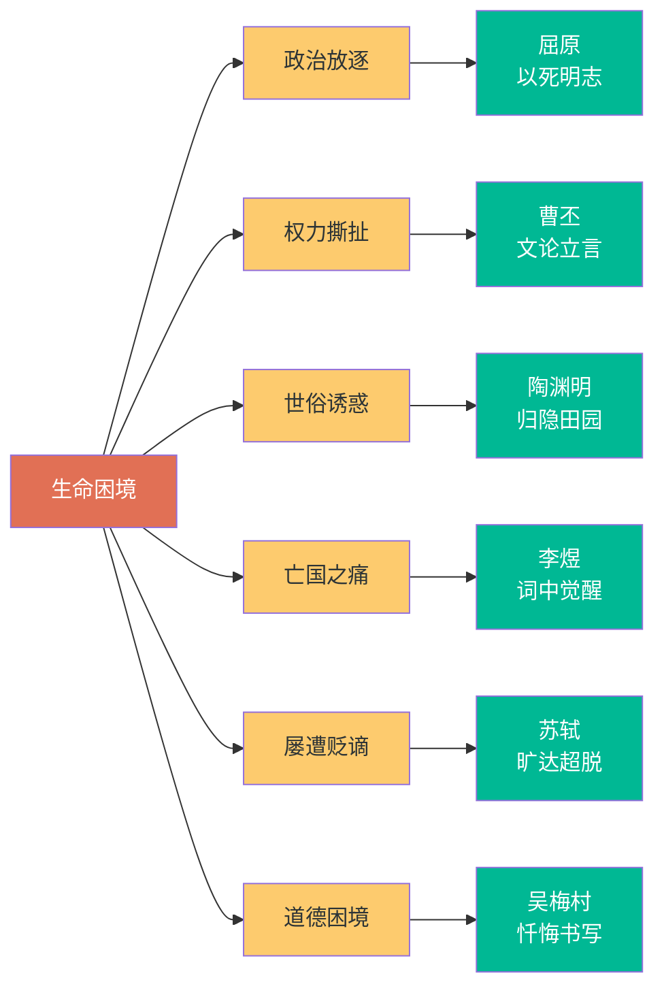
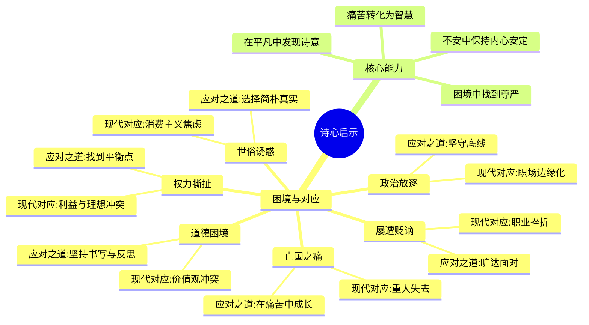

# 02 | 知识图谱图片描述

本文档为《九诗心》系列知识图谱提供4张Mermaid图的文字描述与代码。

---

## 图一：九位诗人的时间脉络树

### 图片说明

以树形图展示九位诗人所处的历史朝代与时间顺序，帮助读者建立宏观的时间框架。

从先秦的屈原，到魏晋的曹丕、陶渊明，再到唐宋的李煜、苏轼，最后到明末清初的吴梅村，呈现中国诗歌两千年的发展脉络。

### Mermaid 代码

---

## 图二：诗心类型与生命困境的关系网络

### 图片说明

以网络图展示九位诗人各自面临的核心困境，以及他们以诗心回应的方式。

每种困境对应一种诗心类型，形成"困境-回应"的映射关系，帮助读者理解诗人如何将生命痛苦转化为文学力量。

### Mermaid 代码

---

## 图三：从痛苦到澄明的生命转化路径

### 图片说明

以路径图展示一位诗人从遭遇苦难，到以诗心回应，最终达成生命转化的完整过程。

这条路径是九位诗人共同经历的心路历程，也是本书的核心逻辑主线。

### Mermaid 代码

---

## 图四：诗心对现代人的启示图谱

### 图片说明

以思维导图展示《九诗心》中九位诗人的生命智慧，如何映射到现代人的职场与生活中。

每一类古代困境，都能在当代找到对应场景；每一种诗心回应，都能转化为现代人的应对策略。

### Mermaid 代码

---

## 使用建议

- 图一适合放在文章开篇，建立时间框架感。
- 图二适合放在诗人介绍部分，帮助读者理解每位诗人的独特处境。
- 图三适合放在核心思想部分，展示全书的逻辑主线。
- 图四适合放在行动挑战部分，引导读者将古诗智慧转化为现代生活实践。
