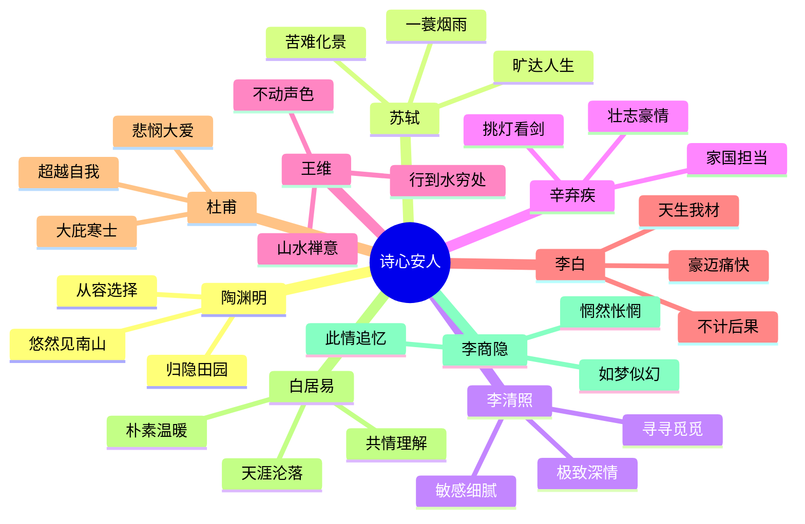
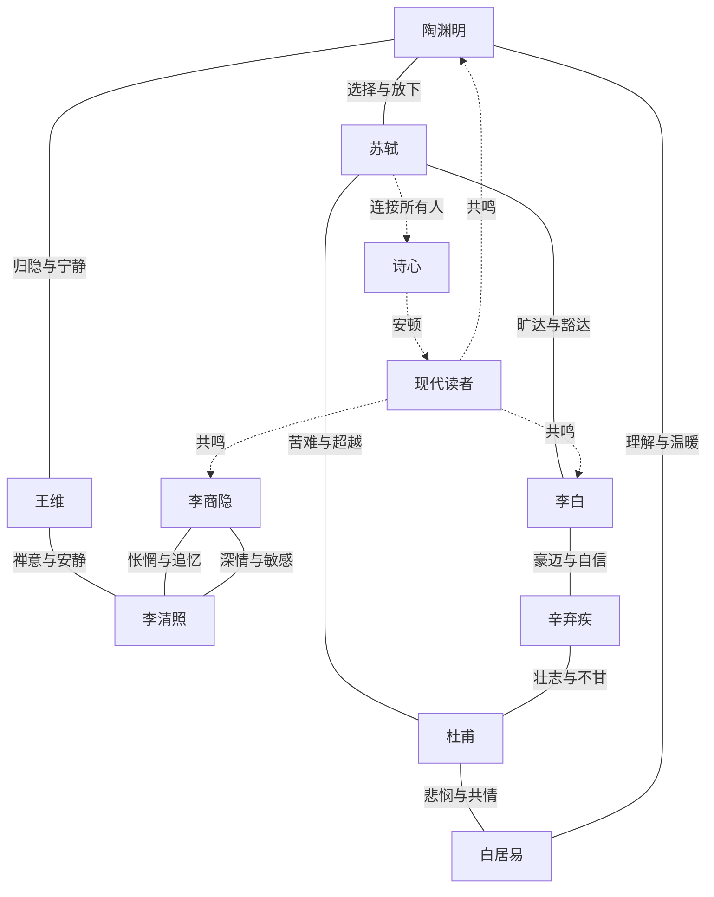
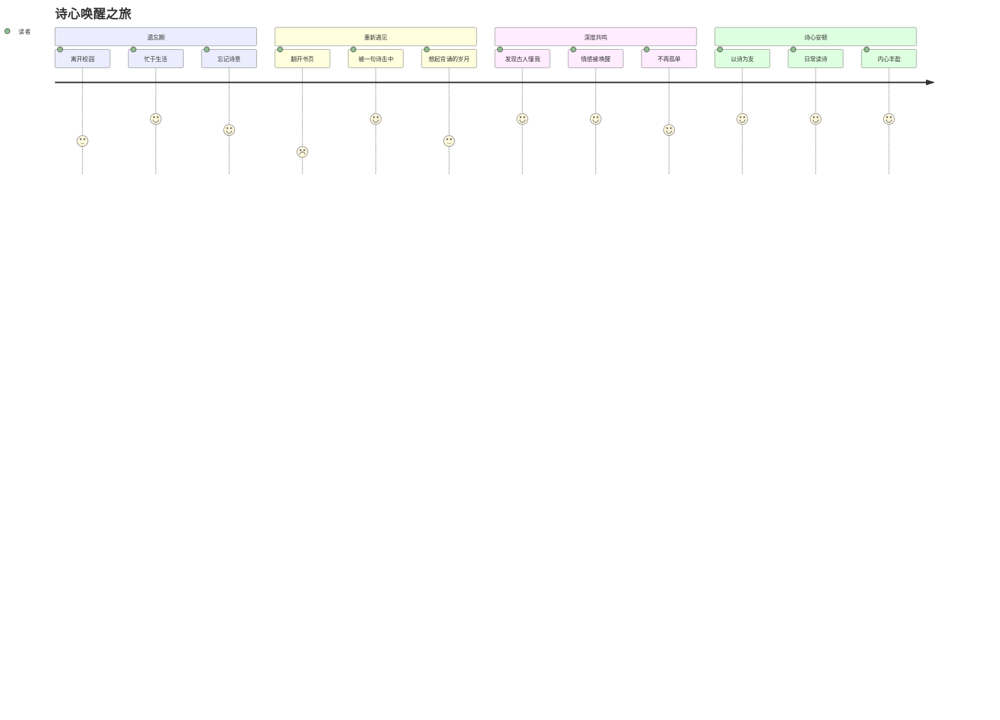
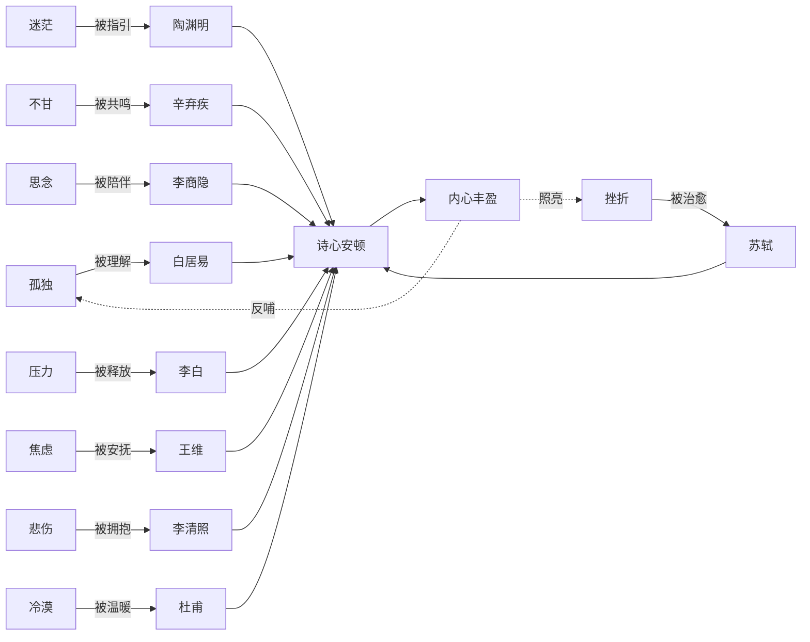

# 02-知识图谱图片描述.md

## 图片一：主题树状图（Mind Tree）

**图表类型**: 树状结构图 (Tree Diagram)

**设计说明**: 以"诗心"为核心，向下展开九位诗人各自代表的生命姿态，呈现古典诗词与现代人心的连接图谱。整体色调雅致，使用古典中国画的青绿山水色系。

**视觉风格**:
- 中心节点使用深青色圆形，文字为白色
- 九个诗人节点按情感色调排列：从冷色（忧思）到暖色（旷达）
- 二级节点使用浅色标签，与主色调呼应
- 连接线使用淡墨色，带有毛笔书写质感
- 背景使用宣纸纹理，边缘添加淡雅水墨晕染
- 整体布局采用九宫格式放射状排列

---

## 图片二：诗人精神共振网络图（Resonance Network）

**图表类型**: 情感共振网络图 (Emotional Resonance Network)

**设计说明**: 以九位诗人为节点，以他们共有的情感体验为连线，展现不同诗人之间超越时空的精神共鸣。

**视觉风格**:
- 九位诗人使用九种不同颜色的六边形节点
- 情感连线使用细实线，标注关键词
- 中心"诗心"节点使用金色圆形
- 现代读者节点使用半透明的现代人剪影
- 实线表示诗人之间的共鸣，虚线表示诗心与读者的连接
- 背景使用淡雅的星空纹理，象征跨越时空的对话

---

## 图片三：诗心唤醒路径图（Awakening Journey Path）

**图表类型**: 读者觉醒路径图 (Awakening Path)

**设计说明**: 描绘现代读者从遗忘诗词到被诗心唤醒、最终获得内心安顿的完整过程。

**视觉风格**:
- 四个阶段使用渐变色，从灰暗的遗忘色过渡到明亮的诗意色
- 柱状高度代表"诗意感受力"的强度
- 底部添加"遗忘→遇见→共鸣→安顿"的文字轴
- 使用诗意化的图标装饰各阶段节点
- 整体风格从冷到暖，从暗到明

---

## 图片四：诗心生命体验关联图（Life Experience Graph）

**图表类型**: 生命体验关联图 (Life Experience Map)

**设计说明**: 将九位诗人所代表的生命体验与现代人的情感需求进行映射，揭示古典诗词跨越千年的治愈力量。

**视觉风格**:
- 左侧现代情感使用灰色冷色调圆角矩形
- 中间诗人节点使用对应情感的暖色调六边形
- 右侧汇聚节点使用金色圆形
- 实线箭头表示"被理解/治愈/指引"的关系
- 虚线表示反哺和照亮的反馈回路
- 整体从左到右呈现"情感需求→诗人共鸣→内心安顿"的视觉流动
- 背景使用淡雅的古诗词文字水印
