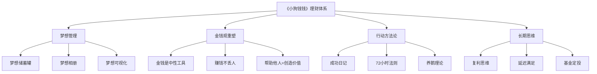
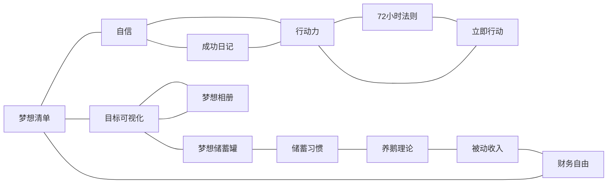
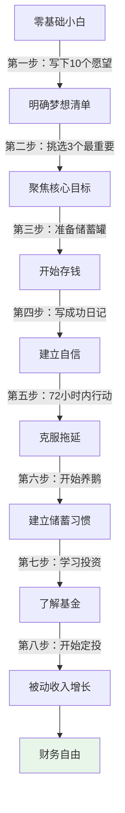
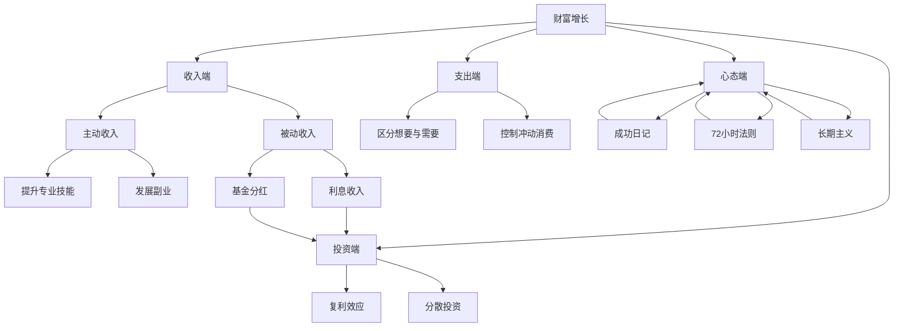

# 《小狗钱钱》知识图谱图片描述

---

## 图一：理财知识体系树（Tree Diagram）

展示《小狗钱钱》的完整知识层级结构，从核心思想到具体方法。

**说明**：根节点为全书核心，向下分为四大模块——梦想管理、金钱观重塑、行动方法论、长期思维，每个模块包含 3 个子方法。

---

## 图二：核心概念关系网络（Network Diagram）

展示书中关键概念之间的关联关系，揭示理财思维的内在逻辑。

**说明**：从"梦想清单"出发，通过自信、行动力、储蓄习惯等多个节点，最终指向"财务自由"，形成一个闭环系统。

---

## 图三：从新手到理财达人的成长路径（Path Diagram）

展示读者按照书中方法逐步进阶的完整路径。

**说明**：共 9 个阶段，从零基础到财务自由，每一步都是下一步的基础。关键转折点在于从"存钱"到"投资"的跨越。

---

## 图四：财富增长要素关系图（Graph Diagram）

展示影响个人财富增长的核心要素及其相互作用。

**说明**：财富增长受四大维度影响——收入、支出、投资、心态。其中"心态端"是基础，"投资端"是加速器，"收入端"和"支出端"是日常操作面。

---

## 设计建议

### 配色方案

- 主色调：暖金色（象征财富）+ 浅米色（象征温暖）
- 辅助色：绿色（象征成长）+ 蓝色（象征信任）
- 强调色：橙色（用于关键节点高亮）

### 排版要点

- 图一（Tree）适合纵向展示，突出层级感
- 图二（Network）适合横向展开，展示关联性
- 图三（Path）适合纵向流程图，强调先后顺序
- 图四（Graph）适合多维度展示，可用不同颜色区分四大模块

### 图片尺寸

建议生成 1080×1920 像素（竖屏）或 1080×1080 像素（方图），适配手机阅读。
