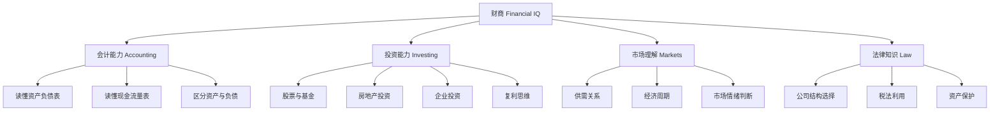
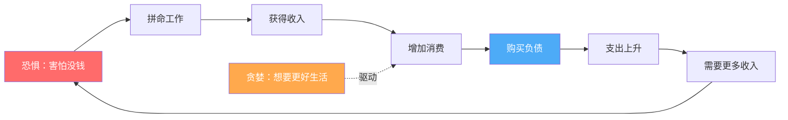
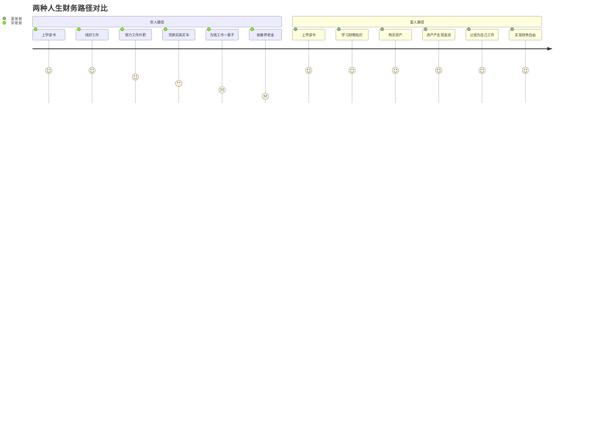
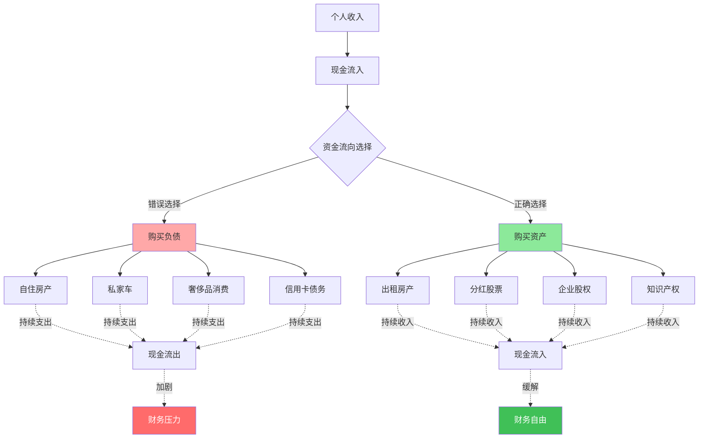

# 知识图谱图片描述：《穷爸爸富爸爸》底层逻辑结构

## 图谱一：财商知识树（Tree Diagram）

以"财商"为根节点，展开《穷爸爸富爸爸》核心概念层级结构。

**视觉说明**：采用自上而下的树状结构，根节点用粗体大框，四个主分支用不同颜色区分（建议：蓝/绿/橙/紫），子节点逐级缩小。整体呈现"一棵大树"的视觉效果，象征财商知识的生长与扩展。

---

## 图谱二：老鼠赛跑循环网络（Network Diagram）

展示中产阶级"老鼠赛跑"的闭环循环，揭示恐惧与贪婪的驱动机制。

**视觉说明**：采用环形布局，形成一个完整的闭环。"恐惧"和"贪婪"两个节点用醒目的暖色调标注，作为循环的驱动力。"购买负债"节点用冷色调突出，暗示这是问题的核心。箭头方向清晰展示循环的流向。

---

## 图谱三：人生财务路径对比（Path Diagram）

对比"穷人路径"与"富人路径"的分叉与走向差异。

**视觉说明**：采用并列双路径设计，上下对照。"穷人路径"用灰色渐弱色调，表示价值递减；"富人路径"用绿色渐强色调，表示价值递增。每个节点标注评分数字（1-5），直观呈现两种路径的财富积累趋势。

---

## 图谱四：资产与负债关系图（Graph Diagram）

展示资产与负债如何影响个人现金流量，以及两者之间的动态关系。

**视觉说明**：采用分叉后对比的布局，左侧"负债路径"用红色系标注，右侧"资产路径"用绿色系标注。中间"资金流向选择"节点是关键分叉点，用黄色高亮。底部"财务压力"与"财务自由"两个终点形成鲜明对比。虚线箭头表示现金的流向效果。

---

## 图谱使用建议

**排版布局**：
- 四张图谱依次纵向排列，每张之间留足空白间距
- 每张图谱上方标注序号和标题，下方附简短解读文字
- 图谱配色建议：主色调使用深蓝（信任感）+ 绿色（财富）+ 红色（警示）

**移动端适配**：
- Mermaid 渲染后确保宽度不超过手机屏幕，字号不小于 12px
- 复杂节点文字控制在 6 个汉字以内，避免溢出
- 箭头方向优先使用从上到下（TD）或从左到右（LR），减少交叉

**配色方案参考**：
- 资产/正向：绿色系 #40c057、#8ce99a
- 负债/负向：红色系 #ff6b6b、#ffa8a8
- 中性/选择：蓝色系 #4dabf7、#74c0fc
- 强调/警示：橙色系 #ffa94d、#ffc078
