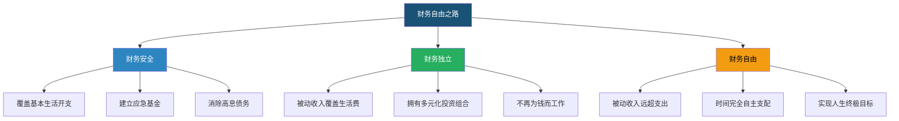
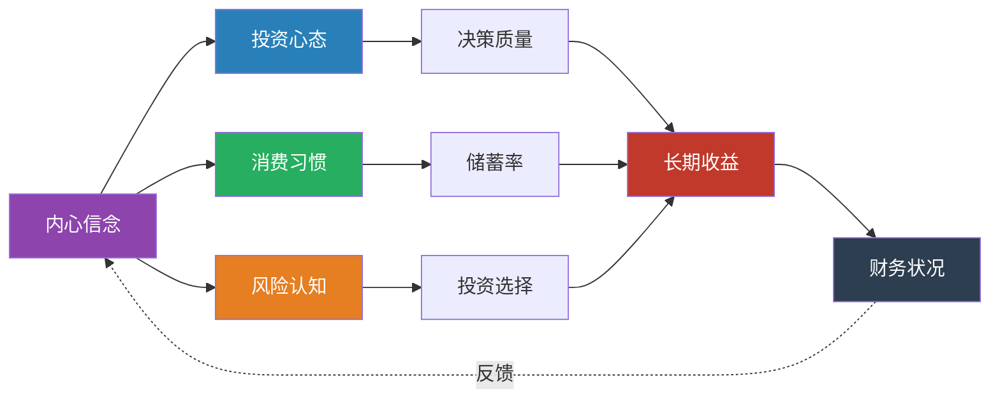
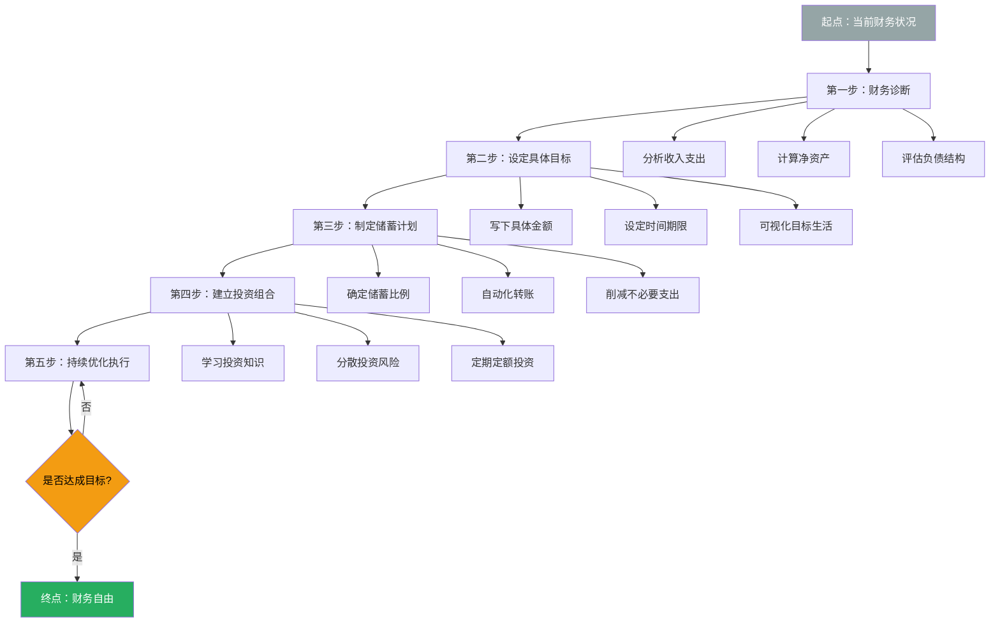
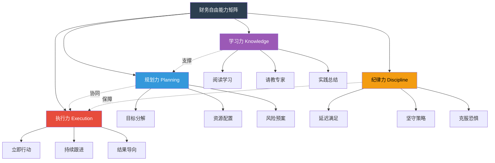

# 知识图谱图片描述

> 财务自由之路知识图谱 | Mermaid 可视化

---

## 图一：财务自由目标层级图（树状图）

展示从基础财务安全到终极财务自由的目标递进关系。

**图一说明**：这棵树展示了财务自由的三个阶段，每个阶段都有明确的可量化标准。从底层的财务安全到中层的财务独立，再到顶层的财务自由，每一层都是下一层的基础。

---

## 图二：投资心态与行为网络图（关系网）

展示信念、心态、行为与财务结果之间的相互影响关系。

**图二说明**：这张网络图揭示了财务表现的根本驱动因素。内心信念是起点，它影响心态、消费习惯和风险认知，进而影响决策质量、储蓄率和投资选择，最终决定长期收益和财务状况。而财务状况又会反过来强化或改变内心信念，形成闭环。

---

## 图三：财务自由实施路径图（路径图）

展示从零开始到实现财务自由的具体执行步骤。

**图三说明**：这是一条从起点到终点的清晰路径。关键节点包括财务诊断、目标设定、储蓄计划、投资组合建立和持续优化。决策点提醒我们，财务自由是一个迭代过程，需要不断评估和调整。

---

## 图四：财务自由能力矩阵图（多维关系图）

展示实现财务自由所需的四大能力维度及其交叉关系。

**图四说明**：财务自由不是单一能力可以实现的，而是规划力、执行力、学习力和纪律力四维能力的综合体现。规划力决定方向，执行力决定速度，学习力决定高度，纪律力决定能否走完全程。四者相互协同，缺一不可。

---

*图表说明：以上四张图分别从目标层级、心态网络、实施路径、能力矩阵四个维度，全面展示了财务自由之路的核心逻辑。*
