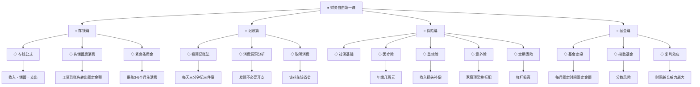
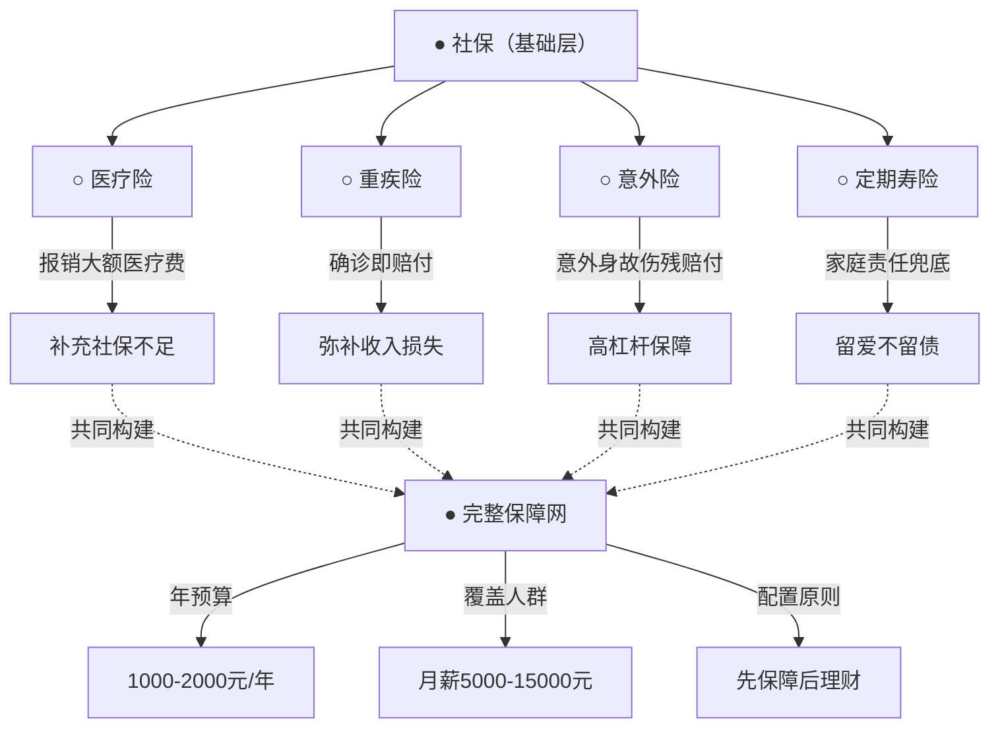

# 《财务自由第一课》知识图谱图片描述

## 图一：财务自由知识体系树

这张图以树状结构展示了财务自由的完整知识体系，从根部到枝叶层层展开。



**视觉说明：** 根节点在最上方，用深色粗体突出"财务自由第一课"。四个主分支分别用不同颜色区分：存钱篇用绿色，记账篇用蓝色，保险篇用橙色，基金篇用紫色。叶子节点字体稍小，保持层级清晰。整体背景为浅灰白色，适合手机阅读。

---

## 图二：月光族自救路径图

这张图以流程路径的形式，展示了一个月光族如何通过五个步骤实现财务自救。


**视觉说明：** 从左到右的水平流程图，起点"月光族"用红色标记，终点"财务自由之路"用绿色标记，中间步骤用黄色渐变。箭头上方标注每一步的关键行动，节点内部标注达成的状态。整体风格简洁明快，适合在公众号文章中作为引导图使用。

---

## 图三：保险配置网络关系图

这张图以网络结构展示了不同保险类型之间的关联和各自的核心功能。



**视觉说明：** 社保位于顶部中心，作为基础层向下延伸四个分支。四种保险各自连接到其核心功能，再通过虚线汇聚到"完整保障网"节点。底部三个信息框展示预算、人群和配置原则。虚线表示关联关系，实线表示层级关系。配色以蓝色系为主，体现保险的专业和稳重感。

---

## 图四：基金定投复利增长曲线图

这张图以折线图的形式，展示基金定投在复利作用下的财富增长轨迹。

```mermaid
xychart-beta
    title "基金定投复利增长曲线（月投1000元，年化8%）"
    x-axis "年份" 0 --> 25 --> 5
    y-axis "累计金额（万元）" 0 --> 70 --> 10
    line "累计投入本金" [0, 1.2, 2.4, 3.6, 4.8, 6.0, 7.2, 8.4, 9.6, 10.8, 12.0, 13.2, 14.4, 15.6, 16.8, 18.0, 19.2, 20.4, 21.6, 22.8, 24.0, 25.2, 26.4, 27.6, 28.8, 30.0]
    line "累计本息总额" [0, 1.2, 2.5, 3.9, 5.4, 7.0, 8.8, 10.7, 12.8, 15.1, 17.5, 20.2, 23.1, 26.2, 29.6, 33.3, 37.2, 41.5, 46.1, 51.1, 56.5, 62.3, 68.6, 75.4, 82.8, 90.8]
```

**视觉说明：** 横轴为年份（0到25年），纵轴为累计金额（0到70万元）。两条折线：蓝色实线代表累计投入本金，呈线性增长；红色虚线代表累计本息总额，呈加速上升的复利曲线。两条线之间的区域用浅色填充，直观展示复利收益的规模。图中标注关键节点：第10年本息约20万，第20年本息约56万，第25年本息约90万。背景为白色网格，数字清晰易读，适合手机端竖屏浏览。

---

## 图谱使用建议

以上四张图分别对应知识体系梳理、行动路径引导、保险配置说明和复利效果展示。在公众号排版时，建议每张图之间间隔20像素，图下方配以简短文字说明。图片宽度设置为640像素，适配大部分手机屏幕。配色方案建议统一使用蓝、绿、橙三色系，保持视觉一致性。
