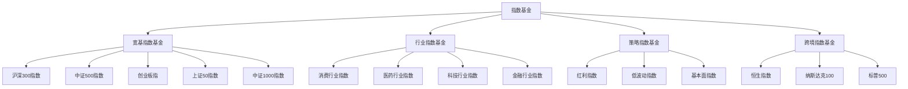
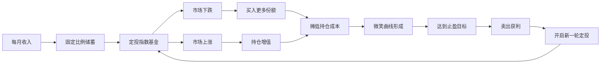
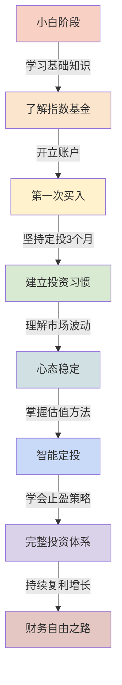
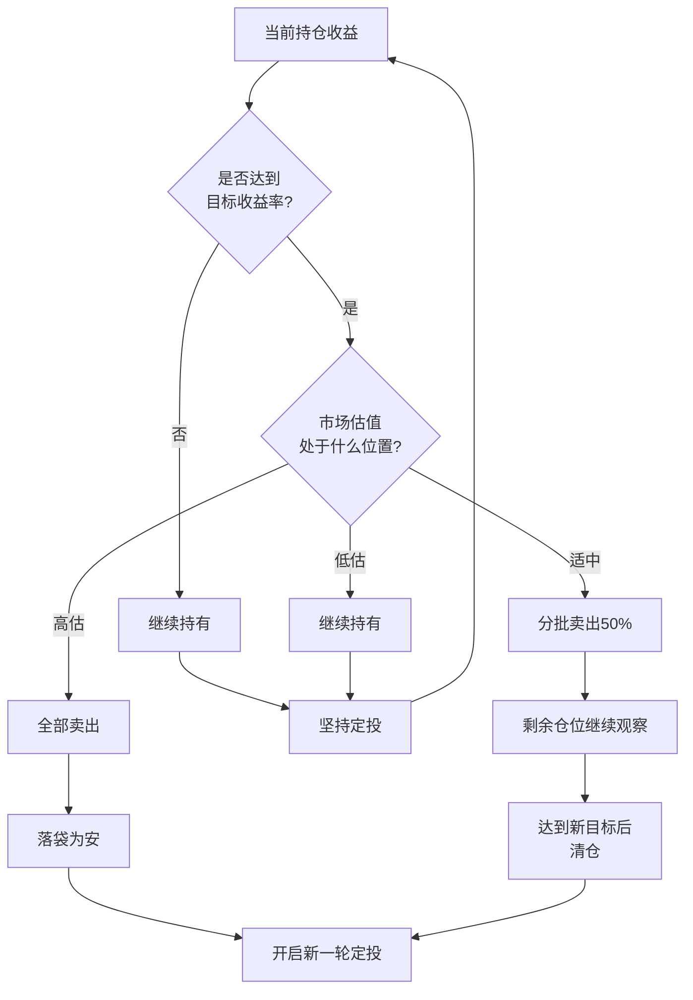

# 指数基金投资知识图谱：一张图看懂投资全貌

> 用四张图，把《指数基金投资指南》的核心逻辑说清楚。

---

## ◆ 图一：指数基金家族树

这张图展示了指数基金的主要分类和常见品种，帮助读者建立整体认知框架。

**图谱说明：**
指数基金按投资范围可分为四大类。宽基指数覆盖面广，风险分散，适合新手入门。行业指数聚焦特定领域，波动更大，适合有一定经验的投资者。策略指数基于特定规则筛选，跨境指数则帮助实现全球资产配置。

选择指数基金时，建议新手从宽基指数开始。沪深 300 代表大盘蓝筹，中证 500 代表中盘成长，两者搭配可以覆盖 A 股市场的大部分机会。

---

## ◆ 图二：定投策略网络图

这张图揭示了定投策略中各要素之间的关联关系，展示了一个完整的投资生态系统。

**图谱说明：**
定投是一个自我强化的循环系统。市场下跌不是风险，而是积累便宜筹码的机会。随着成本不断摊低，一旦市场回升，收益会以更快的速度积累。达到止盈点后卖出，再重新开始，形成财富增长的飞轮。

这个循环的核心在于坚持。很多人在市场下跌时停止定投，恰恰错过了最便宜的筹码。记住，下跌才是定投最好的朋友。

---

## ◆ 图三：投资者成长路径

这张图描绘了一个普通投资者从入门到成熟的能力进阶路线。

**图谱说明：**
投资能力的提升是循序渐进的。从了解基本概念开始，到开立账户完成第一次买入，再到养成定投习惯、理解市场波动，最终掌握估值方法和止盈策略。每个阶段都需要时间积累，不可跨越。

大多数人在前三个阶段就会放弃。所以，能够走到第五阶段的人，已经超越了绝大多数投资者。

---

## ◆ 图四：止盈决策图

这张图展示了不同市场环境下止盈策略的选择逻辑。

**图谱说明：**
止盈不是一刀切的操作。即使达到目标收益率，也要结合市场估值综合判断。低估时继续持有可以享受更多涨幅，高估时果断卖出避免利润回吐。分批卖出是一种平衡策略，既锁定部分收益，又保留上涨空间。

估值判断是止盈的核心技能。学会看 PE 百分位，了解当前市场处于历史什么位置，是每一个成熟投资者必备的能力。

---

## ○ 图谱使用建议

- 第一张图用于选基，帮你理清指数基金的分类体系
- 第二张图用于理解定投机制，建立长期投资的信心
- 第三张图用于自我定位，明确当前所处的投资阶段
- 第四张图用于实战操作，指导具体的止盈决策

四张图相互关联，构成了完整的指数基金投资知识体系。

建议把这四张图保存下来，在投资决策遇到困难时，随时翻阅。它们会帮你回归理性，做出正确的判断。

---

## ○ 如何阅读这些图谱

阅读图谱时，建议按照以下顺序：

首先，看第一张家族树，了解指数基金有哪些品种，你可以根据自身风险偏好选择合适的类型。

其次，看第二张网络图，理解定投的运作机制。这张图是四张图的核心，看懂了它，你就理解了指数基金投资的全部逻辑。

然后，看第三张成长路径图，给自己定位。看看自己处于哪个阶段，下一步该往哪里走。

最后，看第四张止盈决策图，这是最实用的一张。每次准备卖出时，都可以对照这张图，做出理性的决策。

四张图从认知到行动，构成了一个完整的闭环。

---

*本图谱是「人类文明经典阅读计划」系列配套内容，建议收藏保存，投资时随时查阅。*
