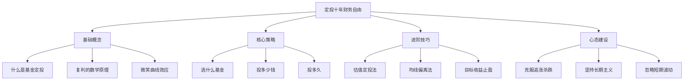
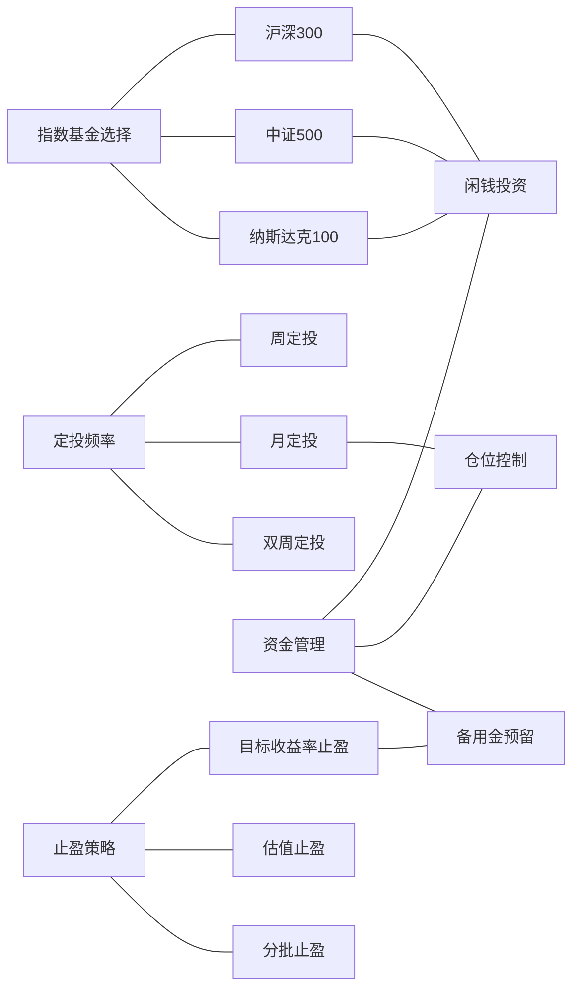
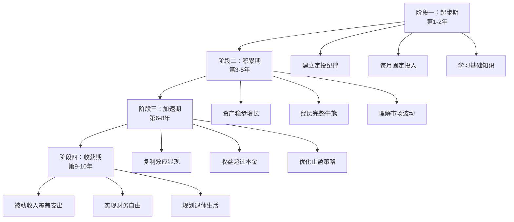
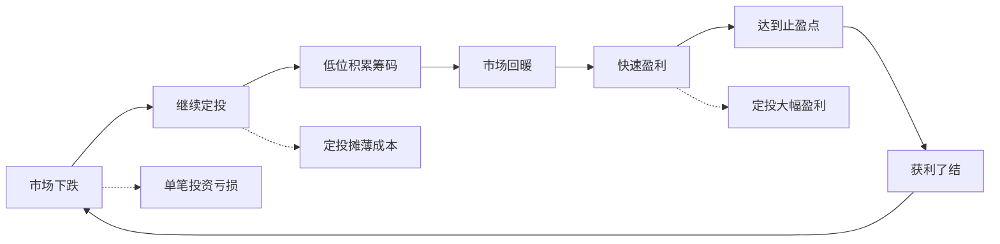

# 知识图谱图片描述

本文档描述《定投十年财务自由》知识图谱中使用的4张Mermaid图，用于生成配套图片。

## 图一：定投知识体系树状图

展示定投策略的核心知识层级结构，从基础概念到进阶应用。

## 图二：定投策略网络关系图

展示定投各要素之间的关联关系，帮助理解策略的系统性。

## 图三：财务自由路径图

展示从开始定投到实现财务自由的完整时间路径。

## 图四：微笑曲线示意图

展示定投在完整市场周期中的收益变化特征。

