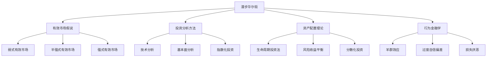
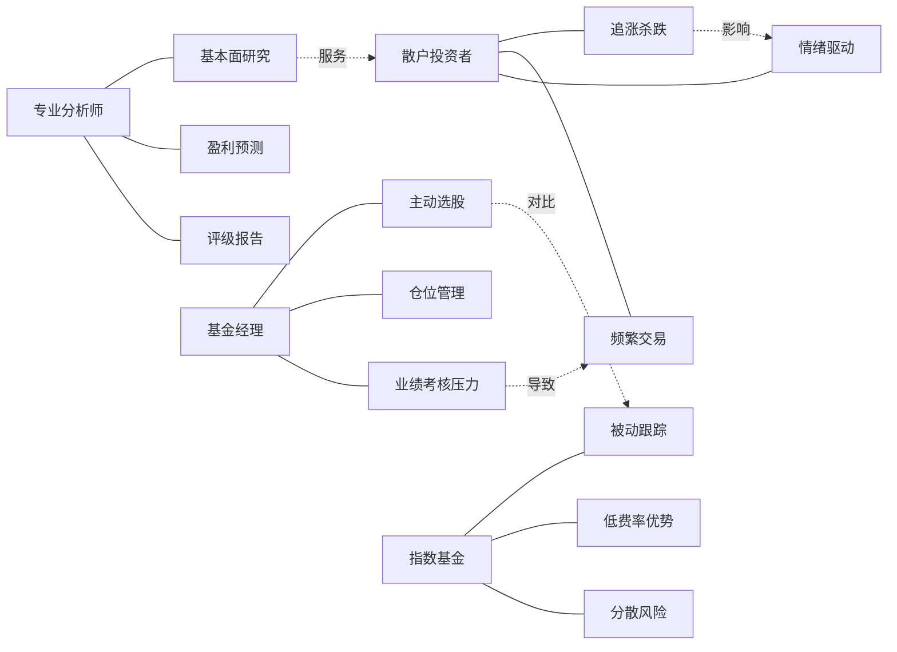
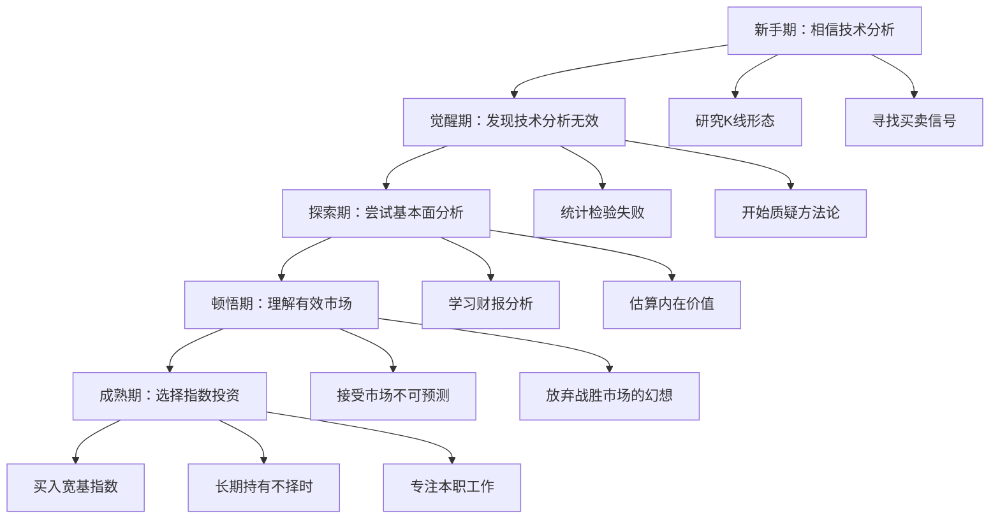
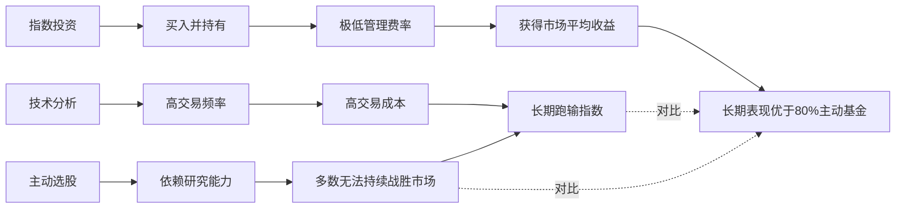

# 知识图谱图片描述

本文档描述《漫步华尔街》知识图谱中使用的4张Mermaid图，用于生成配套图片。

## 图一：投资理论体系树状图

展示书中涉及的投资理论流派和核心概念层级。

## 图二：市场参与者关系网络图

展示市场中各类参与者及其行为模式的关联。

## 图三：投资者成长路径图

展示从投资新手到成熟投资者的认知升级路径。

## 图四：投资策略对比图

对比不同投资策略的长期表现和特征。

