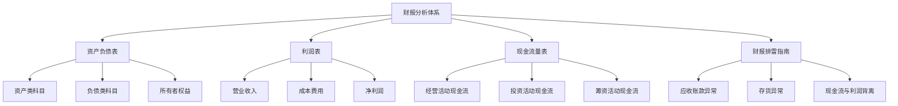
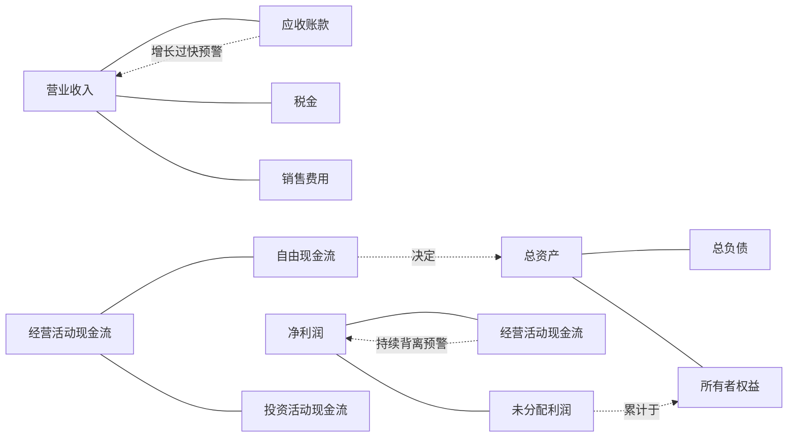
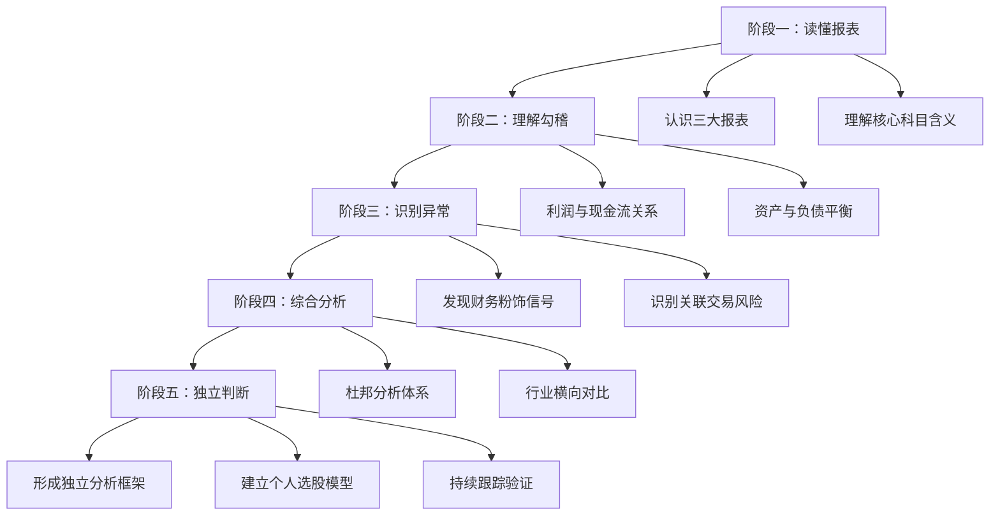
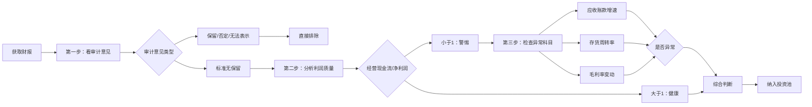

# 知识图谱图片描述

本文档描述《手把手教你读财报》知识图谱中使用的4张Mermaid图，用于生成配套图片。

## 图一：三大报表知识体系树状图

展示财务报表分析的核心知识框架。

## 图二：财报科目勾稽关系网络图

展示三大报表核心科目之间的内在关联。

## 图三：财报分析能力成长路径图

展示从财报小白到财报高手的学习路径。

## 图四：财报健康度诊断流程图

展示从拿到一份财报到得出投资判断的完整流程。

