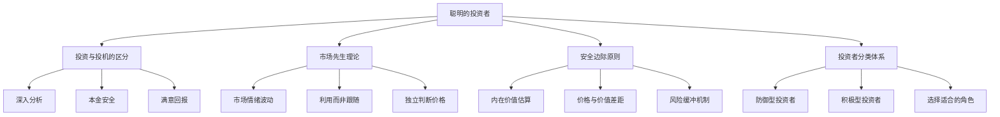
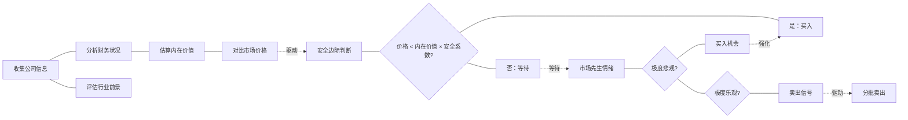
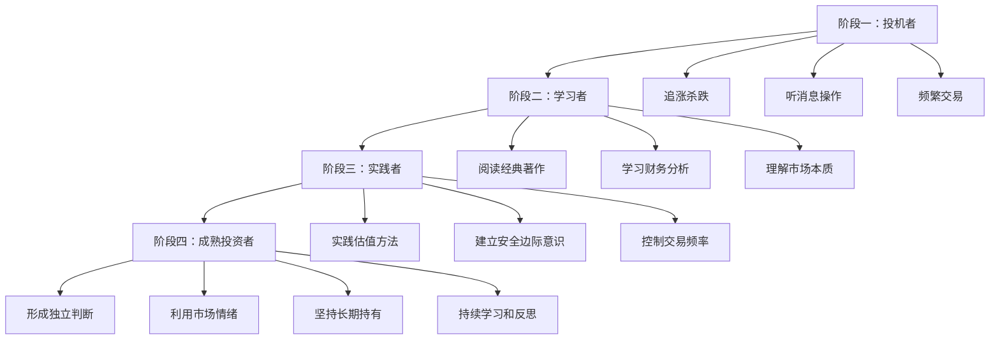
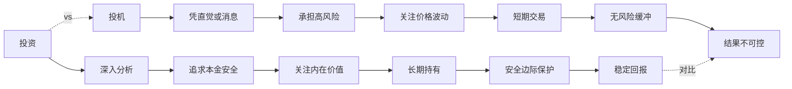

# 知识图谱图片描述

本文档描述《聪明的投资者》知识图谱中使用的4张Mermaid图，用于生成配套图片。

## 图一：价值投资体系树状图

展示格雷厄姆价值投资理论的完整知识架构。

## 图二：投资决策逻辑网络图

展示从信息获取到投资决策的完整逻辑链条。

## 图三：投资者成长路径图

展示从投机者到价值投资者的认知升级路径。

## 图四：投资与投机对比图

展示投资与投机在关键维度上的本质区别。

