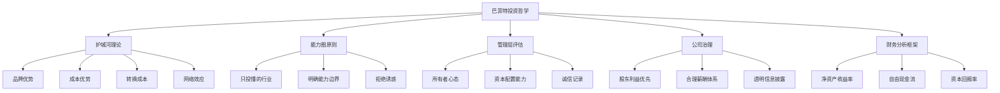
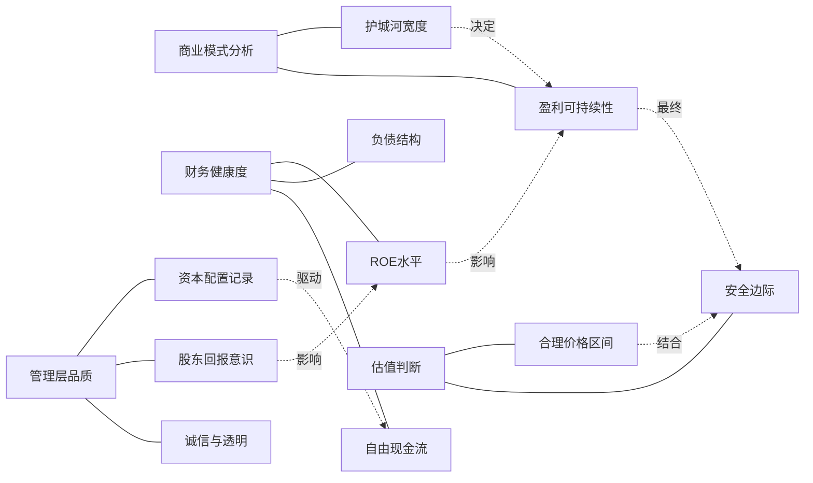
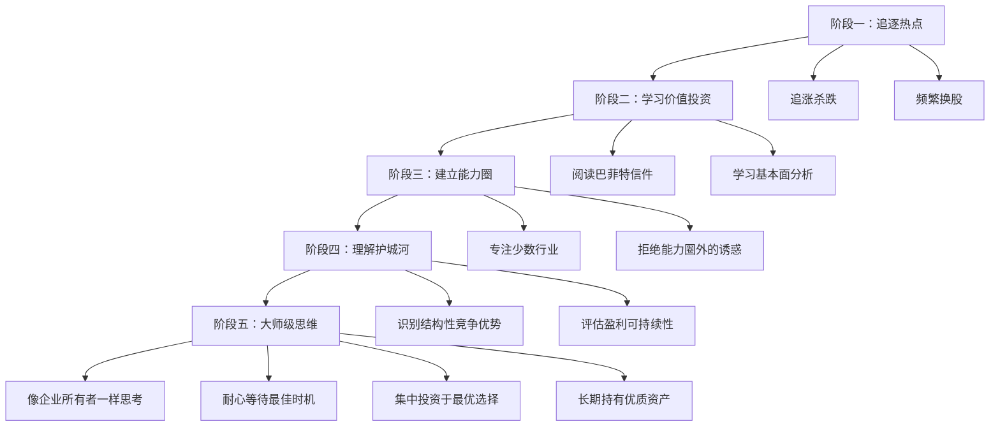
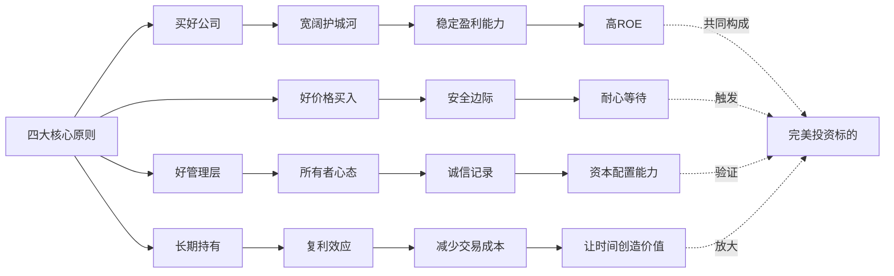

# 知识图谱图片描述

本文档描述《巴菲特致股东的信》知识图谱中使用的4张Mermaid图，用于生成配套图片。

## 图一：巴菲特投资哲学体系树状图

展示巴菲特投资思想的完整知识架构。

## 图二：企业评估逻辑网络图

展示巴菲特评估一家企业时的多维分析框架。

## 图三：投资能力成长路径图

展示从新手到巴菲特式投资者的认知升级路径。

## 图四：巴菲特投资原则体系图

展示巴菲特核心投资原则及其内在逻辑关系。

