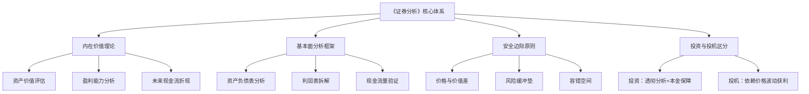
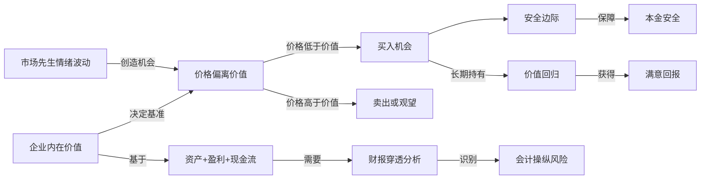
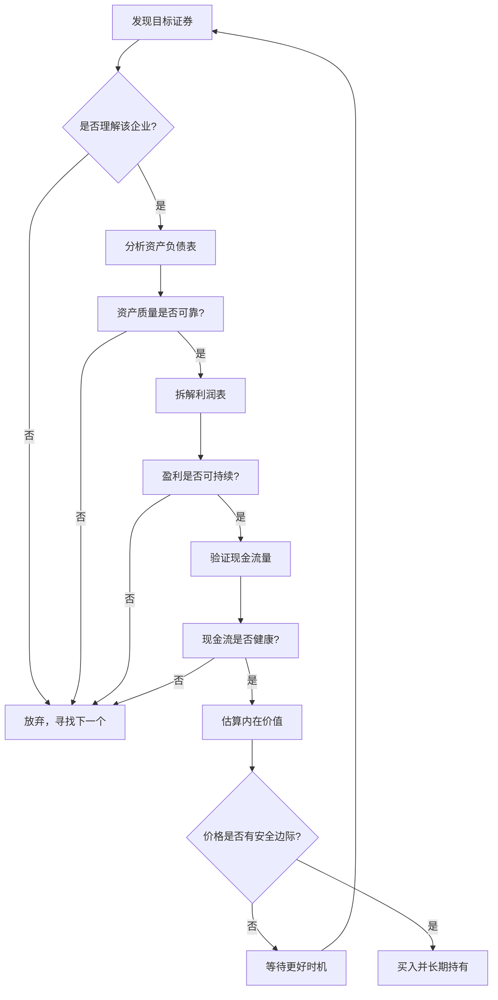
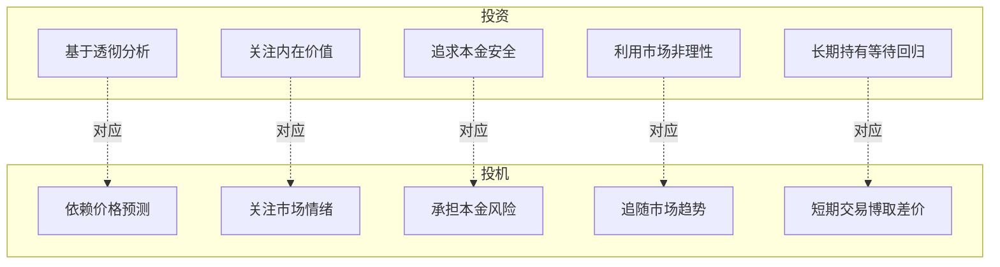

# 知识图谱图片描述 - 《证券分析》

---

## 图一：证券分析核心框架树状图

**用途**：展示《证券分析》全书的知识体系结构

**Mermaid 代码**：

**布局说明**：根节点在顶部，四层分支结构，每个主分支用不同颜色区分，文字使用简体中文。

---

## 图二：价值投资逻辑网络图

**用途**：展示格雷厄姆价值投资各要素之间的关联关系

**Mermaid 代码**：

**布局说明**：从左到右的逻辑流向，用箭头标注关系说明，核心概念用粗框突出。

---

## 图三：证券分析决策路径图

**用途**：展示投资者面对一只证券时的完整分析决策流程

**Mermaid 代码**：

**布局说明**：自上而下的决策树，菱形表示判断节点，矩形表示行动节点，拒绝路径统一汇总到"放弃"。

---

## 图四：投资与投机对比图

**用途**：对比投资与投机在核心要素上的本质差异

**Mermaid 代码**：

**布局说明**：左右两列对比结构，左侧投资为绿色系，右侧投机为红色系，虚线连接对应要素。
