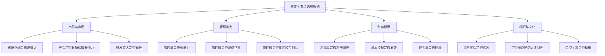
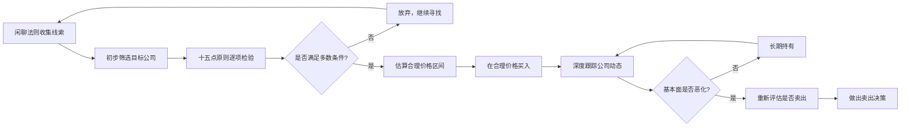
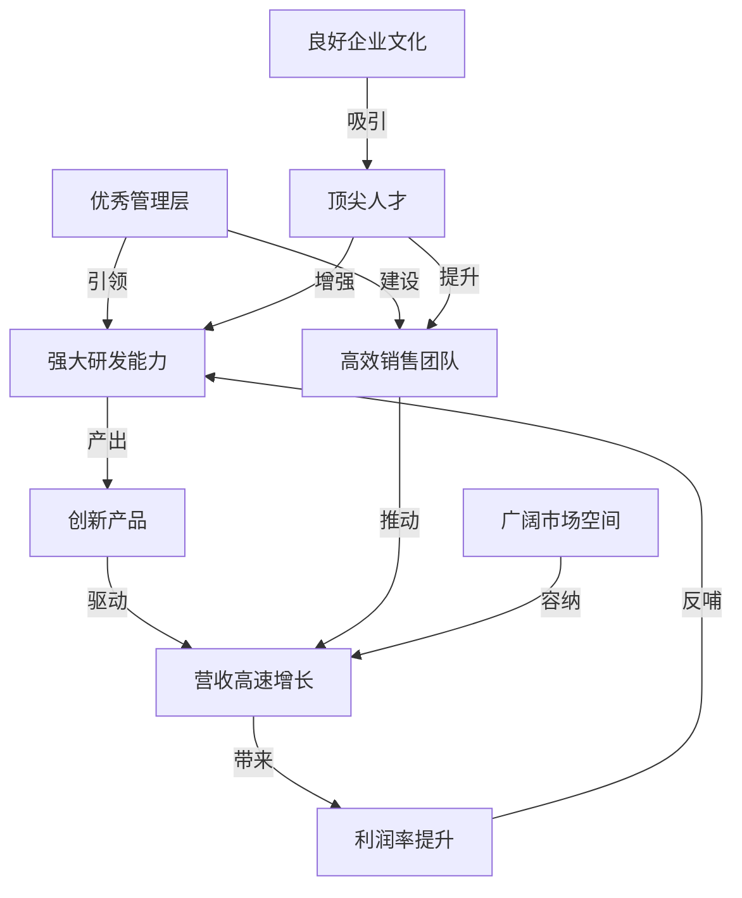
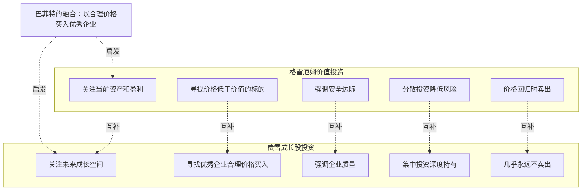

# 知识图谱图片描述 - 《怎样选择成长股》

---

## 图一：十五点选股原则树状图

**用途**：系统展示费雪十五点选股原则的分类结构

**Mermaid 代码**：

**布局说明**：根节点居中顶部，四大分类为第一层分支，每个分类下三到四个具体原则，整体呈树状展开。

---

## 图二：成长股发现与持有路径图

**用途**：展示从发现线索到长期持有的完整投资流程

**Mermaid 代码**：

**布局说明**：从左到右的线性流程，包含反馈循环，关键决策节点用菱形标识。

---

## 图三：成长型公司特征网络图

**用途**：展示优秀成长型公司各特征之间的关联与协同效应

**Mermaid 代码**：

**布局说明**：展示正向飞轮效应，研发到产品到营收到利润形成闭环，管理层和人才作为核心驱动力。

---

## 图四：价值投资与成长投资对比图

**用途**：对比格雷厄姆价值投资与费雪成长股投资的核心差异与互补关系

**Mermaid 代码**：

**布局说明**：左右两列对比，底部汇聚为巴菲特的融合理念，展示两种投资范式的互补性。
