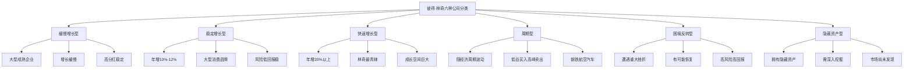
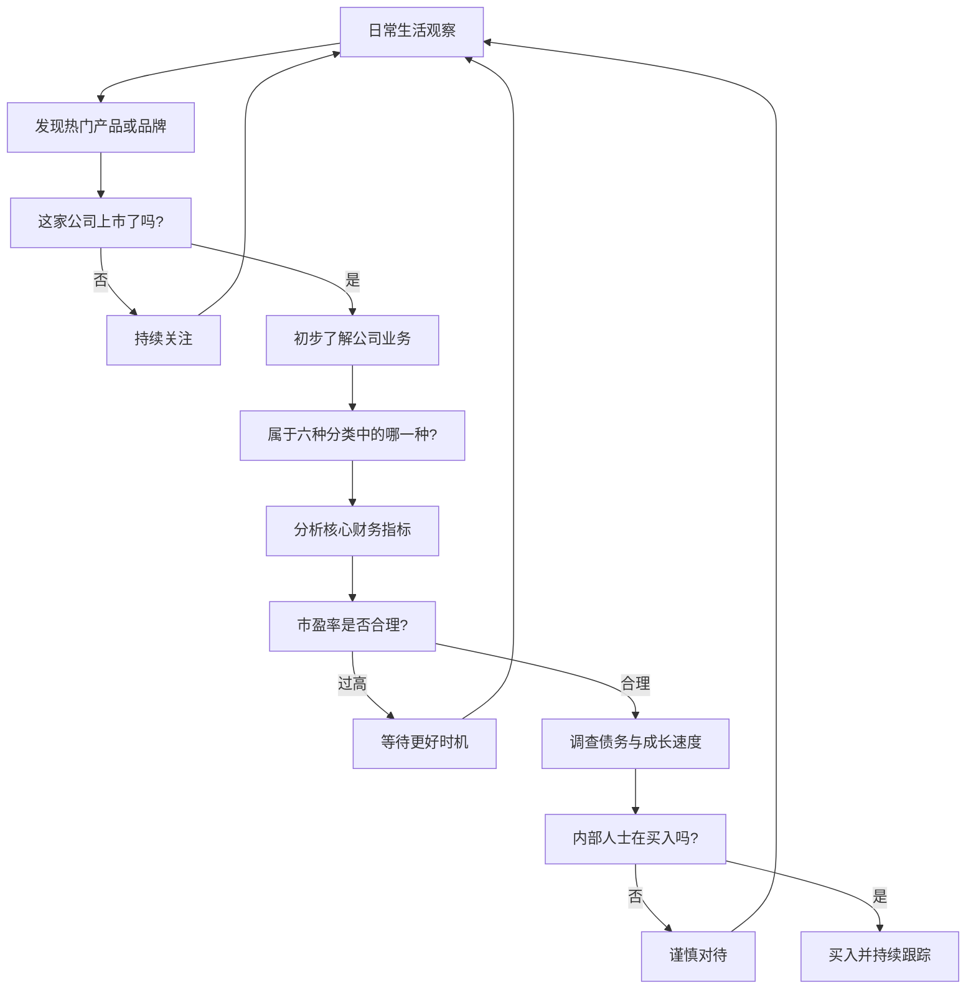
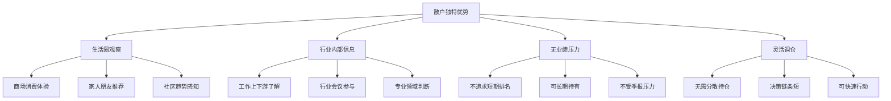
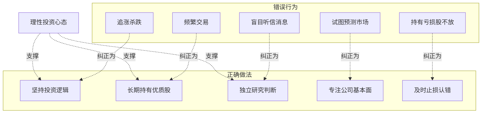

# 知识图谱图片描述 - 《彼得·林奇的成功投资》

---

## 图一：六种公司分类树状图

**用途**：展示彼得·林奇的六种公司分类及其特征

**Mermaid 代码**：

**布局说明**：根节点居中顶部，六大分类均匀展开，每个分类下三个关键特征。

---

## 图二：生活选股路径图

**用途**：展示从生活观察到投资决策的完整流程

**Mermaid 代码**：

**布局说明**：自上而下的决策流程，关键判断节点用菱形，多个反馈回路引导重新观察。

---

## 图三：散户优势网络图

**用途**：展示散户投资者相对于机构投资者的独特优势网络

**Mermaid 代码**：

**布局说明**：中心辐射结构，散户优势为中心节点，四大优势向四周展开。

---

## 图四：投资心理陷阱对比图

**用途**：展示散户常见心理陷阱与正确做法的对比

**Mermaid 代码**：

**布局说明**：左右对比结构，左侧红色系标注错误行为，右侧绿色系标注正确做法，底部汇聚到理性心态。
